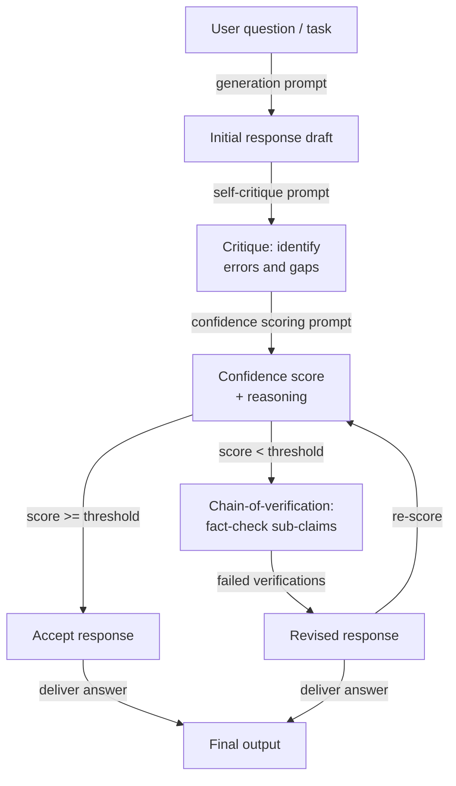

# Auto-évaluation et calibration

## Définition

L'auto-évaluation réfère au prompting d'un modèle de langage pour critiquer, vérifier ou évaluer sa propre sortie précédemment générée. Plutôt que de traiter la première réponse du modèle comme définitive, une étape d'auto-évaluation demande au modèle d'agir comme son propre relecteur — vérifiant les erreurs factuelles, les inconsistances logiques, le raisonnement incomplet ou le non-respect des instructions — puis soit de signaler les problèmes, soit de générer une réponse améliorée. Le modèle utilise les mêmes poids et la même fenêtre de contexte pour les deux rôles, ce qui est à la fois une force (aucun modèle supplémentaire n'est nécessaire) et une limitation fondamentale (le modèle peut avoir des angles morts systématiques qu'il ne peut pas détecter lui-même).

La calibration est la dimension quantitative plus étroite de l'auto-évaluation. Un modèle est *bien calibré* si sa confiance exprimée correspond à sa précision empirique : quand il dit être confiant à 80%, il devrait être correct environ 80% du temps. La plupart des LLM sont mal calibrés par défaut — ils expriment une haute confiance même sur des questions auxquelles ils répondent incorrectement, un phénomène connu sous le nom de *surconfiance* ou *dépassement épistémique*. Les techniques de calibration invitent le modèle à produire un score de confiance numérique explicite avec chaque réponse, et le système peut ensuite utiliser ce score pour acheminer les réponses incertaines vers la révision humaine, déclencher des étapes de vérification supplémentaires, ou s'abstenir de répondre complètement.

Ensemble, l'auto-évaluation et la calibration adressent deux modes de défaillance distincts mais liés. L'auto-évaluation adresse *l'exactitude* : le modèle a produit une réponse, mais est-elle correcte ? La calibration adresse *la conscience de l'incertitude* : le modèle sait-il quand il ne sait pas ? Les deux sont nécessaires pour déployer les LLM dans des contextes à enjeux élevés. Un modèle qui attrape ses propres erreurs est plus fiable ; un modèle qui sait ce qu'il ne sait pas est plus digne de confiance. Les techniques couvertes ici — auto-critique, score de confiance et chaîne de vérification — sont des composantes de plus en plus standards des pipelines LLM de production.

## Fonctionnement



### Auto-critique

L'auto-critique est la méthode d'auto-évaluation la plus simple. Après avoir généré une réponse initiale, vous ajoutez un second prompt qui demande au modèle de revoir sa propre sortie selon des critères explicites. De bons prompts d'auto-critique sont *spécifiques* sur ce qu'il faut vérifier : exactitude factuelle, cohérence logique, exhaustivité, respect des instructions, ton ou sécurité. Les prompts vagues comme « Cette réponse est-elle bonne ? » produisent des critiques superficielles et creuses. Les prompts spécifiques comme « Listez toutes les affirmations factuelles dans la réponse dont vous êtes moins que 90% certain, et expliquez pourquoi » produisent un retour d'information actionnable.

La qualité de l'auto-critique s'améliore substantiellement quand vous instruisez le modèle d'adopter une posture adversariale — de chercher activement des problèmes plutôt que de confirmer que la réponse est correcte. Des formules comme « Remettez en question chaque affirmation clé », « Trouvez au moins un défaut » et « À quoi un sceptique s'opposerait-il ? » biaisent le modèle vers une critique utile plutôt que vers la validation. L'IA constitutionnelle (Anthropic, 2022) systématise ceci en définissant un ensemble de « principes » que le modèle doit vérifier dans la réponse avant de réviser — créant effectivement une rubrique de critique structurée qui peut être auditée.

Un mode de défaillance critique de l'auto-critique est la *validation sycophante* : le modèle loue sa propre réponse et ne trouve aucun problème, surtout lorsque la réponse originale semblait déjà plausible mais était incorrecte. C'est le plus prononcé dans les modèles plus petits et le moins prononcé dans les modèles qui ont été fine-tunés avec des données de critique. Les atténuations incluent : utiliser une instance de modèle séparée pour la critique, injecter des erreurs délibérées dans le brouillon pour tester si l'étape de critique les attrape, et exiger que la critique soit une liste structurée plutôt qu'une prose libre (rendant « aucun problème » une affirmation plus difficile à défendre).

### Calibration et score de confiance

Les prompts de score de confiance demandent au modèle de produire une probabilité explicite ou une note ordinale avec chaque réponse. Une version minimale est une simple requête ajoutée au prompt de réponse : « Après votre réponse, indiquez votre confiance en pourcentage de 0 à 100, où 100 signifie que vous êtes certain et 0 que vous devinez. » Les versions plus sophistiquées demandent une décomposition par affirmation : « Pour chaque affirmation factuelle dans votre réponse, évaluez votre confiance (haute / moyenne / faible) et identifiez la source d'incertitude. »

Les scores de confiance numériques des LLM doivent être traités avec scepticisme. Les probabilités verbalisées brutes ne sont pas bien calibrées au sens statistique — un modèle qui dit « 70% confiant » n'est pas systématiquement correct 70% du temps sur ces questions. Cependant, elles sont *monotoniquement utiles* : les questions où le modèle rapporte une faible confiance tendent à être plus difficiles et plus sujettes aux erreurs que les questions où il rapporte une haute confiance. Cela signifie que les scores de confiance verbalisés sont utiles pour le *classement* et le *routage* (envoyer les réponses à faible confiance en révision) même s'ils ne sont pas utiles pour une estimation exacte de probabilité.

La calibration peut être améliorée après coup par mise à l'échelle de température ou mise à l'échelle de Platt appliquée aux log-probabilités du modèle, mais cela nécessite un ensemble de données étiqueté. Au niveau du prompt, vous pouvez améliorer la calibration relative en demandant au modèle de comparer sa confiance avec des questions de référence de difficulté connue (« Je suis aussi confiant que je le serais sur la capitale de la France vs une date historique obscure »).

### Chaîne de vérification

La chaîne de vérification (CoVe, Dhuliawala et al., 2023) structure l'auto-évaluation comme un pipeline de vérification multi-étapes : générer une réponse de base, puis planifier explicitement un ensemble de questions de vérification qui confirmeraient ou réfuteraient les affirmations clés dans cette réponse, répondre à ces questions de vérification indépendamment (sans consulter la réponse originale pour réduire le biais de confirmation), et finalement produire une réponse révisée informée par les résultats de vérification. Cette décomposition est importante car elle force le modèle à séparer la *génération d'affirmations* de la *vérification d'affirmations*, réduisant la chance que la même erreur de raisonnement se propage à travers les deux étapes.

Les questions de vérification devraient être atomiques — chacune devrait tester une seule sous-affirmation spécifique. Par exemple, si la réponse de base affirme « Python 3.10 a introduit le pattern matching structurel et l'opérateur walrus », les questions de vérification devraient être : « Dans quelle version de Python le pattern matching structurel a-t-il été introduit ? » et « Dans quelle version de Python l'opérateur walrus a-t-il été introduit ? » Répondre à ces questions indépendamment fait souvent apparaître des erreurs factuelles que la réponse originale affirmait avec confiance.

## Quand utiliser / Quand NE PAS utiliser

| Utiliser quand | Éviter quand |
|----------------|--------------|
| La tâche est à enjeux élevés et l'exactitude factuelle est critique (médical, juridique, financier) | La latence est une contrainte forte — l'auto-évaluation ajoute au moins un aller-retour d'inférence complet |
| Vous voulez un signal d'incertitude intégré sans modèle évaluateur séparé | Le domaine du modèle est un domaine où l'auto-évaluation est systématiquement peu fiable (par ex., événements très récents au-delà de la coupure d'entraînement) |
| La qualité des sorties est très variable selon les runs et vous avez besoin d'un mécanisme de filtrage | La tâche est simple et bien contrainte — la surcharge d'auto-évaluation dépasse le bénéfice de précision |
| Vous avez besoin d'acheminer automatiquement les réponses incertaines vers la révision humaine | Le modèle est trop petit pour produire des auto-critiques fiables (< 7B paramètres produit généralement une auto-évaluation médiocre) |
| Les réponses contiennent plusieurs affirmations factuelles indépendantes qui peuvent être vérifiées atomiquement | Vous avez besoin d'une calibration exacte des probabilités — les scores de confiance verbalisés ne sont pas calibrés statistiquement |
| Construire un pipeline où le modèle doit détecter ses propres hallucinations | La génération originale est déjà à la précision plafond — l'auto-critique ajoute du coût sans gain de précision |

## Comparaisons

| Critère | Auto-évaluation | Self-consistency | Évaluation externe |
|---------|----------------|-----------------|---------------------|
| Appels de modèle supplémentaires | 1–3 (critique, score, vérifier) | N (typiquement 10–40) | 1 (évaluateur séparé) |
| Nécessite un modèle séparé | Non — le même modèle se révise lui-même | Non | Oui — typiquement un modèle plus fort ou spécialisé |
| Attrape les erreurs factuelles | Oui, si l'auto-critique est bien promptée | Partiellement — les faits inconsistants peuvent survivre au vote majoritaire | Oui, plus de manière fiable |
| Fournit un score d'incertitude | Oui — évaluation de confiance explicite | Implicite — la dispersion des votes est un proxy de confiance | Oui — l'évaluateur peut produire un score |
| Réduit l'hallucination | Oui, surtout avec CoVe | Partiellement — le vote réduit mais n'élimine pas l'hallucination | Plus de manière fiable, mais ajoute du coût et de la latence |
| Effort d'implémentation | Modéré — nécessite une conception soigneuse du prompt de critique | Faible — échantillonner N fois et voter | Élevé — nécessite un prompt d'évaluateur, un appel API séparé, possiblement un modèle séparé |
| Meilleur cas d'utilisation | QA à enjeux élevés en tour unique, génération factuelle | Math et raisonnement multi-étapes | Pipelines d'entreprise avec des exigences d'exactitude fortes |

## Exemples de code

### Auto-évaluation avec étape de critique via SDK Anthropic

```python
# Self-evaluation pipeline: generate → critique → score → revise
# pip install anthropic

import os
from anthropic import Anthropic

client = Anthropic(api_key=os.environ["ANTHROPIC_API_KEY"])
MODEL = "claude-opus-4-5"


def generate_initial(question: str) -> str:
    """Step 1: Generate an initial response."""
    response = client.messages.create(
        model=MODEL,
        max_tokens=512,
        messages=[{"role": "user", "content": question}],
    )
    return response.content[0].text.strip()


def critique_response(question: str, response: str) -> str:
    """Step 2: Critique the initial response for errors and gaps."""
    prompt = f"""You are a rigorous fact-checker and critic. Review the response below and identify:
1. Any factual claims you are less than fully confident about
2. Logical inconsistencies or gaps in reasoning
3. Missing context that would be important for the user

Question: {question}

Response to critique:
{response}

Provide a structured critique. If you find no issues, you must still explain why you believe the response is correct. Do not simply validate the response."""

    critique = client.messages.create(
        model=MODEL,
        max_tokens=512,
        messages=[{"role": "user", "content": prompt}],
    )
    return critique.content[0].text.strip()


def score_confidence(question: str, response: str, critique: str) -> dict:
    """Step 3: Produce an explicit confidence score based on the critique."""
    prompt = f"""Given the question, the response, and the critique below, assign a confidence score.

Question: {question}

Response:
{response}

Critique:
{critique}

Output in this exact format:
CONFIDENCE: [integer 0-100]
REASONING: [one sentence explaining the score]
SHOULD_REVISE: [yes/no]"""

    result = client.messages.create(
        model=MODEL,
        max_tokens=128,
        messages=[{"role": "user", "content": prompt}],
    )
    text = result.content[0].text.strip()

    # Parse structured output
    confidence, reasoning, should_revise = None, "", False
    for line in text.splitlines():
        if line.startswith("CONFIDENCE:"):
            try:
                confidence = int(line.split(":", 1)[1].strip())
            except ValueError:
                pass
        elif line.startswith("REASONING:"):
            reasoning = line.split(":", 1)[1].strip()
        elif line.startswith("SHOULD_REVISE:"):
            should_revise = "yes" in line.lower()

    return {"confidence": confidence, "reasoning": reasoning, "should_revise": should_revise}


def revise_response(question: str, initial: str, critique: str) -> str:
    """Step 4: Produce a revised response informed by the critique."""
    prompt = f"""Revise the response below to address the issues identified in the critique.
Preserve correct information. Be explicit about any remaining uncertainty.

Question: {question}

Original response:
{initial}

Critique to address:
{critique}

Revised response:"""

    revised = client.messages.create(
        model=MODEL,
        max_tokens=512,
        messages=[{"role": "user", "content": prompt}],
    )
    return revised.content[0].text.strip()


def self_evaluate(question: str, confidence_threshold: int = 75) -> dict:
    """Full self-evaluation pipeline: generate, critique, score, conditionally revise."""
    print("=== Step 1: Generating initial response ===")
    initial = generate_initial(question)
    print(initial[:200], "...\n" if len(initial) > 200 else "\n")

    print("=== Step 2: Critiquing response ===")
    critique = critique_response(question, initial)
    print(critique[:200], "...\n" if len(critique) > 200 else "\n")

    print("=== Step 3: Scoring confidence ===")
    score = score_confidence(question, initial, critique)
    print(f"Confidence : {score['confidence']}")
    print(f"Reasoning  : {score['reasoning']}")
    print(f"Revise?    : {score['should_revise']}\n")

    final = initial
    if score["should_revise"] or (score["confidence"] is not None and score["confidence"] < confidence_threshold):
        print("=== Step 4: Revising response ===")
        final = revise_response(question, initial, critique)
        print(final[:200], "...\n" if len(final) > 200 else "\n")
    else:
        print("=== Step 4: Skipped — confidence above threshold ===\n")

    return {
        "question": question,
        "initial_response": initial,
        "critique": critique,
        "confidence_score": score,
        "final_response": final,
        "was_revised": final != initial,
    }


if __name__ == "__main__":
    q = ("What were the main causes of the 2008 financial crisis, "
         "and which regulatory changes were enacted in response?")
    result = self_evaluate(q, confidence_threshold=80)
    print("=== Final answer ===")
    print(result["final_response"])
    print(f"\nRevised: {result['was_revised']}")
    print(f"Confidence: {result['confidence_score']['confidence']}")
```

### Chaîne de vérification pour les affirmations factuelles

```python
# Chain-of-Verification (CoVe): decompose claims, verify independently, revise
# pip install anthropic

import os
from anthropic import Anthropic

client = Anthropic(api_key=os.environ["ANTHROPIC_API_KEY"])
MODEL = "claude-opus-4-5"


def extract_verification_questions(response: str) -> list[str]:
    """Generate atomic verification questions for each factual claim."""
    prompt = f"""Read the response below and generate a list of atomic verification questions
— one per distinct factual claim. Each question should be answerable independently
without referring to the original response.

Response:
{response}

Output as a numbered list of questions only. No preamble."""

    result = client.messages.create(
        model=MODEL,
        max_tokens=400,
        messages=[{"role": "user", "content": prompt}],
    )
    text = result.content[0].text.strip()
    questions = []
    for line in text.splitlines():
        line = line.strip()
        if line and line[0].isdigit():
            # Strip leading number and punctuation
            q = line.lstrip("0123456789.)- ").strip()
            if q:
                questions.append(q)
    return questions


def verify_claim(question: str) -> dict:
    """Answer a single verification question independently."""
    prompt = f"""Answer the following question as accurately as possible.
If you are uncertain, say so explicitly and explain why.

Question: {question}

Answer:"""

    result = client.messages.create(
        model=MODEL,
        max_tokens=150,
        messages=[{"role": "user", "content": prompt}],
    )
    answer = result.content[0].text.strip()
    uncertain = any(w in answer.lower() for w in ("uncertain", "unsure", "not sure", "don't know", "unclear"))
    return {"question": question, "answer": answer, "uncertain": uncertain}


def revise_with_verifications(original_response: str, verifications: list[dict]) -> str:
    """Produce a revised response informed by independent verification results."""
    verification_block = "\n".join(
        f"Q: {v['question']}\nA: {v['answer']}\n" for v in verifications
    )
    prompt = f"""Revise the response below using the independent verification answers provided.
Correct any inaccuracies. Where verifications indicate uncertainty, acknowledge that uncertainty explicitly.

Original response:
{original_response}

Independent verifications:
{verification_block}

Revised response:"""

    result = client.messages.create(
        model=MODEL,
        max_tokens=600,
        messages=[{"role": "user", "content": prompt}],
    )
    return result.content[0].text.strip()


def chain_of_verification(question: str) -> dict:
    """Full CoVe pipeline for a factual question."""
    # Step 1: Baseline response
    baseline = client.messages.create(
        model=MODEL,
        max_tokens=400,
        messages=[{"role": "user", "content": question}],
    ).content[0].text.strip()

    # Step 2: Plan verification questions
    vqs = extract_verification_questions(baseline)
    print(f"Generated {len(vqs)} verification questions.")

    # Step 3: Answer each verification question independently
    verifications = [verify_claim(q) for q in vqs]
    uncertain_count = sum(1 for v in verifications if v["uncertain"])
    print(f"Uncertain claims: {uncertain_count}/{len(verifications)}")

    # Step 4: Revise using verification results
    revised = revise_with_verifications(baseline, verifications)

    return {
        "question": question,
        "baseline": baseline,
        "verification_questions": vqs,
        "verifications": verifications,
        "revised": revised,
        "uncertain_claims": uncertain_count,
    }


if __name__ == "__main__":
    q = "Summarize the key milestones in the development of transformer models from 2017 to 2023."
    result = chain_of_verification(q)
    print("\n=== Baseline ===")
    print(result["baseline"])
    print("\n=== Revised (after CoVe) ===")
    print(result["revised"])
    print(f"\nUncertain claims flagged: {result['uncertain_claims']}/{len(result['verifications'])}")
```

## Ressources pratiques

- [Self-Refine: Iterative Refinement with Self-Feedback (Madaan et al., 2023)](https://arxiv.org/abs/2303.17651) — Introduit et évalue le raffinement itératif par auto-critique et révision sur sept tâches de génération de texte diverses ; la référence fondatrice pour les pipelines d'auto-évaluation.
- [Chain-of-Verification Reduces Hallucination in Large Language Models (Dhuliawala et al., 2023)](https://arxiv.org/abs/2309.11495) — Propose CoVe, l'approche de planification de vérification structurée décrite dans cet article, avec des expériences sur le QA basé sur des listes et la génération longue.
- [Constitutional AI: Harmlessness from AI Feedback (Bai et al., 2022)](https://arxiv.org/abs/2212.08073) — Démontre l'auto-critique systématique contre un ensemble défini de principes à grande échelle ; le précédent de production pour des rubriques d'auto-évaluation structurées.
- [Language Models (Mostly) Know What They Know (Kadavath et al., 2022)](https://arxiv.org/abs/2207.05221) — Étudie si les LLM peuvent rapporter avec précision leur propre incertitude ; montre que la calibration est possible mais imparfaite, fournissant la base empirique pour les techniques de score de confiance.
- [Calibration of Large Language Models Using Their Generations (Kapoor et al., 2024)](https://arxiv.org/abs/2403.07221) — Passe en revue les méthodes de calibration post-hoc incluant la confiance verbalisée et les compare aux baselines de log-probabilité sur les familles GPT-4 et Claude.

## Voir aussi

- [Prompt engineering](/docs/prompt-engineering)
- [Self-consistency](/docs/prompt-engineering/self-consistency)
- [Techniques de débiaisage](/docs/prompt-engineering/debiasing-techniques)
- [Métriques d'évaluation](/docs/evaluation-metrics)
