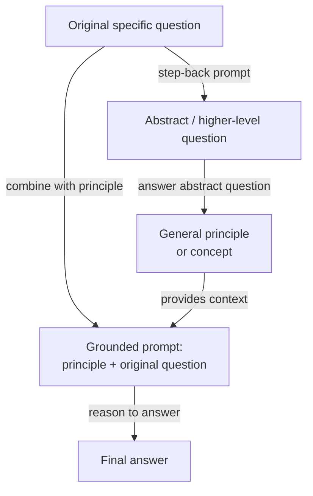

# Step-back prompting

## Définition

Le step-back prompting est une technique de prompting en deux étapes introduite par Zheng et al. (2023) chez Google DeepMind. L'idée centrale est trompeusement simple : avant de demander au modèle de répondre à une question spécifique, potentiellement difficile, lui demander d'abord une version plus abstraite et de niveau supérieur de la même question — puis utiliser la réponse du modèle à cette question abstraite comme contexte pour répondre à l'originale. La technique est fondée sur l'observation que les LLM échouent souvent sur des questions factuelles ou de raisonnement spécifiques non pas parce qu'ils manquent des connaissances pertinentes, mais parce que la spécificité de la question active le mauvais « contexte de récupération » dans les représentations internes du modèle. Prendre du recul vers un niveau d'abstraction plus élevé active des connaissances plus larges et plus fiables, qui ancrent ensuite la réponse finale.

L'intuition derrière le step-back prompting s'inspire de la façon dont les experts abordent les problèmes difficiles. Un physicien à qui on demande « Que se passe-t-il pour la pression d'un gaz si la température est augmentée à volume constant ? » pourrait d'abord rappeler la loi des gaz parfaits (PV = nRT) comme arrière-plan général avant de l'appliquer au cas spécifique — plutôt que de sauter directement à une réponse qui risque de confondre les variables. Le step-back prompting instruit le modèle de faire de même : générer un principe général ou un concept qui sous-tend la question spécifique, puis raisonner à partir de ce principe vers la réponse. Cela ajoute effectivement une étape d'échafaudage conceptuel qui réduit la chance que la correspondance de pattern superficielle mène à une mauvaise réponse.

Dans l'article original, le step-back prompting est démontré avec des exemples few-shot qui apprennent au modèle comment « prendre du recul » de manière appropriée pour un domaine donné. Pour les questions de physique, la question abstraite demande typiquement la loi ou le principe physique pertinent. Pour les questions d'histoire, elle demande le contexte historique plus large. Pour les questions médicales, elle demande la physiologie pertinente. La technique est agnostique au modèle et ne nécessite pas de fine-tuning — c'est purement une intervention au niveau du prompt. Sur les benchmarks MMLU et TimeQA, le step-back prompting surpasse à la fois la chaîne de pensée standard et les baselines augmentés de récupération sur les questions difficiles et intensives en connaissances.

## Fonctionnement



### Étape 1 — Génération de la question abstraite

La première étape est d'inviter le modèle à identifier une question de niveau supérieur qui subsume l'originale. Cela se fait typiquement avec un prompt few-shot contenant des exemples spécifiques au domaine de paires (question spécifique, question abstraite). Par exemple, si la question originale est « Quel est le point de fusion de l'arséniure de gallium ? », la question abstraite pourrait être « Quelles sont les propriétés thermodynamiques et cristallographiques des semi-conducteurs III-V ? » La question abstraite devrait être suffisamment générale pour activer des connaissances pertinentes larges, mais pas si générale qu'elle soit non informative. Trouver le bon niveau d'abstraction est le principal défi d'ingénierie de prompt, et les exemples few-shot sont essentiels pour orienter le modèle vers le niveau d'abstraction approprié pour un domaine donné.

### Étape 2 — Réponse à la question abstraite

Avec la question abstraite générée, le modèle y répond. Cette réponse prend typiquement la forme d'un principe général, d'une définition, d'une loi physique ou d'un résumé de contexte d'arrière-plan pertinent. La propriété clé de cette étape est que la question abstraite est généralement plus facile pour le modèle à répondre de manière fiable que la question spécifique originale — elle active des représentations bien apprises et ancrées factuellement plutôt que des cas limites ou des faits numériques spécifiques plus sujets aux hallucinations. La réponse à la question abstraite devient un bloc de contexte qui contraint et informe l'étape de raisonnement finale.

### Étape 3 — Réponse à la question originale en utilisant l'abstraction comme contexte

La dernière étape combine le principe abstrait avec la question spécifique originale dans un seul prompt : « Étant donné ce contexte : [réponse abstraite], répondez à la question spécifique : [question originale]. » Le modèle raisonne maintenant à partir d'une base conceptuelle solide plutôt que de tenter la récupération directe d'un fait spécifique. Cela réduit le risque d'hallucination sur les questions intensives en faits et améliore la cohérence logique du raisonnement multi-étapes. Dans l'article original, cette dernière étape utilise également la chaîne de pensée, rendant le step-back prompting composable avec le CoT : l'étape d'abstraction ancre le raisonnement, et le CoT le rend explicite.

## Quand utiliser / Quand NE PAS utiliser

| Utiliser quand | Éviter quand |
|----------------|--------------|
| La question nécessite des connaissances factuelles spécifiques où le modèle est sujet aux hallucinations | Questions simples où le prompting direct fonctionne déjà de manière fiable |
| Le domaine a une hiérarchie claire des principes généraux aux instances spécifiques (physique, chimie, histoire) | La question abstraite est difficile à définir — tâches sans distinction naturelle général/spécifique |
| Le modèle répond de manière inconsistante aux questions spécifiques mais est fiable sur les principes généraux | La latence est critique — deux appels LLM doublent le temps de réponse |
| Vous voulez réduire l'hallucination sur les benchmarks intensifs en connaissances sans RAG | La question est purement mathématique ou symbolique — le CoT seul est généralement suffisant |
| Des exemples few-shot pour le domaine sont disponibles pour apprendre au modèle comment prendre du recul | Le budget de tokens est serré — la réponse abstraite ajoute des tokens au prompt final |

## Comparaisons

| Critère | Step-back prompting | Chaîne de pensée (CoT) | Self-consistency |
|---------|--------------------|-----------------------|-----------------|
| Nombre d'appels LLM | 2 (abstrait + final) | 1 | N (typiquement 10–40) |
| Mécanisme central | Abstraction vers ancrage vers raisonnement | Raisonnement étape par étape explicite | Plusieurs chemins indépendants + vote majoritaire |
| Bénéfice principal | Réduit l'hallucination sur les questions intensives en connaissances | Améliore le raisonnement logique multi-étapes | Réduit la variance dans les résultats de raisonnement |
| Coût | 2x référence | 1x référence | Nx référence |
| Nécessite des exemples few-shot | Oui — pour enseigner le comportement de step-back | Oui — pour les meilleurs résultats | Oui — prompt CoT few-shot comme prompt de base |
| Meilleur type de tâche | QA intensif en connaissances, science, histoire | Math, logique, code | Math, raisonnement symbolique, QA factuel |
| Composable avec CoT | Oui — recommandé de combiner les deux | N/A | Oui — le prompt de base utilise le CoT |
| Note | Complémentaire à la self-consistency ; les deux peuvent être empilés pour des gains supplémentaires | Référence plus simple — essayer avant le step-back | Plus cher ; utiliser quand la haute précision justifie le coût Nx |

## Exemples de code

### Step-back prompting avec OpenAI — implémentation en deux appels

```python
# Step-back prompting: abstraction-then-answer, two API calls
# pip install openai

import os
from openai import OpenAI

client = OpenAI(api_key=os.environ["OPENAI_API_KEY"])

STEP_BACK_FEW_SHOT = """Help identify a broader abstract question underpinning a specific one.

Original: At what temperature does gallium arsenide melt?
Step-back: What are the thermodynamic properties of III-V semiconductors?

Original: What was the immediate cause of the US entering World War I?
Step-back: What geopolitical tensions shaped US foreign policy before WWI?

Original: Patient has peripheral edema, elevated JVP, orthopnea. Diagnosis?
Step-back: What are the hallmark signs of right-sided and left-sided heart failure?

Original: {question}
Step-back:"""

GROUNDED = """Using the background context below, answer the specific question step by step.

Background (general principles):
{background}

Specific question:
{question}

Let's think step by step:"""


def generate_step_back(question: str) -> str:
    resp = client.chat.completions.create(
        model="gpt-4o",
        messages=[{"role": "user", "content": STEP_BACK_FEW_SHOT.format(question=question)}],
        temperature=0, max_tokens=150,
    )
    return resp.choices[0].message.content.strip()


def answer_abstract(abstract_q: str) -> str:
    resp = client.chat.completions.create(
        model="gpt-4o",
        messages=[
            {"role": "system", "content": "Answer with accurate background principles (3-5 sentences)."},
            {"role": "user", "content": abstract_q},
        ],
        temperature=0, max_tokens=300,
    )
    return resp.choices[0].message.content.strip()


def answer_with_step_back(question: str) -> str:
    abstract_q = generate_step_back(question)
    background  = answer_abstract(abstract_q)
    resp = client.chat.completions.create(
        model="gpt-4o",
        messages=[{"role": "user", "content": GROUNDED.format(
            background=background, question=question)}],
        temperature=0, max_tokens=500,
    )
    return resp.choices[0].message.content.strip()


if __name__ == "__main__":
    q = "Why did Soviet collectivization in the early 1930s lead to famine in Ukraine?"
    print(answer_with_step_back(q))
```

### Step-back prompting avec Anthropic — appel unique avec sortie structurée

```python
# Step-back prompting in one Anthropic call: structured three-part format
# pip install anthropic

import os
import anthropic

client = anthropic.Anthropic(api_key=os.environ["ANTHROPIC_API_KEY"])

SYSTEM = """You are an expert reasoning assistant. For each question, respond in three parts:

## Abstract question:
A broader, general question capturing the underlying principle.

## Background context:
Answer the abstract question with relevant principles and definitions (3-5 sentences).

## Final answer:
Use the background to reason step-by-step to the specific answer."""

EXAMPLE = [
    {"role": "user", "content": "Ideal gas: 2 mol, 300 K, 0.05 m^3. What is the pressure?"},
    {"role": "assistant", "content": """## Abstract question:
What is the ideal gas law and how does it relate P, V, n, and T?

## Background context:
PV = nRT, where P is pressure (Pa), V is volume (m^3), n is moles, R = 8.314 J/mol/K, T is Kelvin. Rearranged: P = nRT / V.

## Final answer:
P = (2 x 8.314 x 300) / 0.05 = 99,768 Pa (about 0.985 atm)."""},
]


def step_back(question: str) -> str:
    response = client.messages.create(
        model="claude-opus-4-5",
        max_tokens=800,
        system=SYSTEM,
        messages=EXAMPLE + [{"role": "user", "content": question}],
    )
    return response.content[0].text


if __name__ == "__main__":
    q = "A patient is given furosemide. How does it cause hypokalemia?"
    print(step_back(q))
```

## Ressources pratiques

- [Take a Step Back: Evoking Reasoning via Abstraction in Large Language Models (Zheng et al., 2023)](https://arxiv.org/abs/2310.06117) — Article original de Google DeepMind avec benchmarks sur MMLU, TimeQA et MedQA.
- [Chain-of-Thought Prompting Elicits Reasoning in Large Language Models (Wei et al., 2022)](https://arxiv.org/abs/2201.11903) — L'article CoT sur lequel le step-back prompting se base et est évalué.
- [Anthropic — Vue d'ensemble du prompt engineering](https://docs.anthropic.com/en/docs/build-with-claude/prompt-engineering/overview) — Couvre la structuration des system prompts et la conception d'exemples few-shot.
- [OpenAI — Guide de prompt engineering](https://platform.openai.com/docs/guides/prompt-engineering) — Conseils pratiques sur le prompting few-shot, les stratégies de raisonnement et la structure des sorties.

## Voir aussi

- [Prompt engineering](/docs/prompt-engineering)
- [Chaîne de pensée (CoT)](/docs/reasoning-patterns/cot)
- [Self-consistency](/docs/prompt-engineering/self-consistency)
