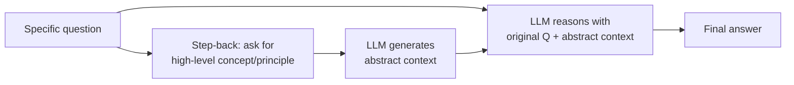

# Prompting par recul

## Définition

Le prompting par recul est une technique de prompting en deux étapes développée par DeepMind dans laquelle le LLM est d'abord invité à générer une question ou un principe de haut niveau ("faire un pas en arrière") avant de résoudre la question d'origine spécifique. Cette abstraction intentionnelle force le modèle à récupérer des concepts, des principes ou des procédures généraux pertinents — le plaçant dans un état de connaissance qui améliore le raisonnement subséquent et réduit les erreurs factuelles.

Par exemple, au lieu de demander directement "Quelle est la température d'un corps au repos d'une étoile de neutrons ?", le prompting par recul insère d'abord une étape d'abstraction : "Quels principes physiques régissent la température d'une étoile de neutrons ?" Le modèle génère ensuite une discussion sur les principes de physique des étoiles à neutrons compactes avant de répondre à la question spécifique. La réponse finale est conditionnée à la fois par la question originale et par le contexte abstrait généré, ce qui donne souvent des réponses plus précises et mieux raisonnées.

## Comment ça fonctionne



### Étape 1 : Question de recul

Construire ou générer une version plus générale et abstraite de la question. Cela peut être fait manuellement ("Avant de répondre, identifie d'abord les principes ou concepts généraux pertinents") ou généré dynamiquement par le même modèle avec un méta-prompt : "Quelle est la question de niveau supérieur dont cette question est un cas spécifique ?"

### Étape 2 : Récupération du contexte abstrait

Demander au LLM de répondre d'abord à la question abstraite. Cette réponse sert de contexte de raisonnement — elle active des connaissances pertinentes et établit le cadre conceptuel approprié.

### Étape 3 : Répondre à la question originale

Fournir le contexte abstrait généré avec la question originale et demander la réponse finale. Le modèle maintenant dispose d'un contexte d'échafaudage riche pour guider son raisonnement.

## Quand utiliser / Quand NE PAS utiliser

| Scénario | Recommandé | Éviter |
|----------|------------|--------|
| Questions scientifiques ou techniques nécessitant une connaissance de premier principe | Oui — l'abstraction récupère des concepts pertinents | Questions simples de recherche de faits — surcoût inutile |
| Résolution de problèmes mathématiques multi-étapes | Oui — identifie d'abord le type de problème et la stratégie | Tâches créatives — l'abstraction peut étouffer la nouveauté |
| QR basée sur des documents longs | Oui — le recul aide à identifier des passages de documents pertinents | Quand la latence est critique — deux appels LLM augmentent le temps de réponse |
| Raisonnement juridique ou médical | Oui — récupère les principes pertinents avant les détails de cas | Quand les questions générales pourraient conduire à un contexte trompeur |

## Exemples de code

### Prompting par recul à deux étapes

```python
# Step-back prompting: two-step abstraction then answer
# pip install openai

import os
from openai import OpenAI

client = OpenAI(api_key=os.environ["OPENAI_API_KEY"])

STEP_BACK_META = (
    "You are an expert at identifying the high-level concept or principle "
    "behind a specific question. Given a specific question, generate the "
    "most relevant high-level question that, when answered, would provide "
    "the conceptual foundation needed to answer the original question."
)

ANSWER_SYSTEM = (
    "You are an expert assistant. Use the provided background knowledge "
    "to give a thorough, accurate answer to the question."
)


def step_back_question(specific_question: str) -> str:
    """Generate the abstract/high-level version of the question."""
    resp = client.chat.completions.create(
        model="gpt-4o",
        messages=[
            {"role": "system", "content": STEP_BACK_META},
            {"role": "user", "content": specific_question},
        ],
        temperature=0,
        max_tokens=150,
    )
    return resp.choices[0].message.content.strip()


def get_abstract_context(abstract_question: str) -> str:
    """Answer the abstract question to get background knowledge."""
    resp = client.chat.completions.create(
        model="gpt-4o",
        messages=[
            {"role": "user", "content": abstract_question},
        ],
        temperature=0,
        max_tokens=400,
    )
    return resp.choices[0].message.content.strip()


def answer_with_step_back(specific_question: str) -> dict:
    """Full step-back pipeline."""
    abstract_q = step_back_question(specific_question)
    context = get_abstract_context(abstract_q)

    final_prompt = (
        f"Background knowledge:\n{context}\n\n"
        f"Now answer this specific question using the background above:\n{specific_question}"
    )
    resp = client.chat.completions.create(
        model="gpt-4o",
        messages=[
            {"role": "system", "content": ANSWER_SYSTEM},
            {"role": "user", "content": final_prompt},
        ],
        temperature=0,
        max_tokens=400,
    )
    return {
        "original_question": specific_question,
        "step_back_question": abstract_q,
        "abstract_context": context,
        "final_answer": resp.choices[0].message.content.strip(),
    }


if __name__ == "__main__":
    question = (
        "If the temperature inside a gas cloud collapses to form a star "
        "rises above 10 million Kelvin, what nuclear process begins?"
    )
    result = answer_with_step_back(question)
    print(f"Original:      {result['original_question']}")
    print(f"\nStep-back Q:   {result['step_back_question']}")
    print(f"\nContext:\n{result['abstract_context']}")
    print(f"\nFinal answer:\n{result['final_answer']}")
```

### Prompting par recul avec Anthropic

```python
# Step-back prompting with Anthropic
# pip install anthropic

import os
import anthropic

client = anthropic.Anthropic(api_key=os.environ["ANTHROPIC_API_KEY"])


def step_back_pipeline(question: str) -> str:
    # Step 1: Generate abstract question
    abstract_resp = client.messages.create(
        model="claude-opus-4-5",
        max_tokens=150,
        system=(
            "Given a specific question, write the most relevant general/abstract "
            "question whose answer would provide helpful background for answering "
            "the specific question. Output only the abstract question."
        ),
        messages=[{"role": "user", "content": question}],
        temperature=0,
    )
    abstract_q = abstract_resp.content[0].text.strip()

    # Step 2: Answer abstract question
    context_resp = client.messages.create(
        model="claude-opus-4-5",
        max_tokens=400,
        messages=[{"role": "user", "content": abstract_q}],
        temperature=0,
    )
    context = context_resp.content[0].text.strip()

    # Step 3: Answer original with context
    final_resp = client.messages.create(
        model="claude-opus-4-5",
        max_tokens=400,
        system="Use the provided background knowledge to answer the question accurately.",
        messages=[
            {
                "role": "user",
                "content": (
                    f"Background knowledge:\n{context}\n\n"
                    f"Question: {question}"
                ),
            }
        ],
        temperature=0,
    )
    print(f"Abstract question: {abstract_q}\n")
    print(f"Background context:\n{context}\n")
    return final_resp.content[0].text.strip()


if __name__ == "__main__":
    q = "What happened to the economy of Weimar Germany in 1923?"
    answer = step_back_pipeline(q)
    print(f"Final answer:\n{answer}")
```

## Ressources pratiques

- [Zheng et al., 2023 — Take a Step Back (DeepMind)](https://arxiv.org/abs/2310.06117) — Article original présentant le prompting par recul avec une évaluation sur STEM, connaissance du monde et raisonnement — montre des gains significatifs par rapport à la CoT directe et DECOMP
- [Wei et al., 2022 — Chain-of-Thought Prompting](https://arxiv.org/abs/2201.11903) — Travail fondateur sur les prompts de raisonnement dont le prompting par recul s'inspire et s'améliore
- [Press et al., 2022 — Measuring and Narrowing the Compositionality Gap](https://arxiv.org/abs/2210.03350) — Prompting par décomposition (Least-to-Most), une technique complémentaire d'abstraction

## Voir aussi

- [Ingénierie des prompts](/docs/prompt-engineering)
- [Chaîne de pensée](/docs/reasoning-patterns/cot)
- [Autocohérence](/docs/prompt-engineering/self-consistency)
- [Prompts système, de rôle et contextuels](/docs/prompt-engineering/system-role-contextual-prompting)
- [LLMs](/docs/llms)
