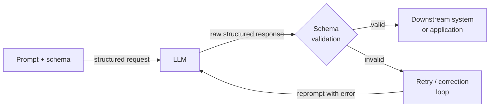

# Sorties structurées

## Définition

Les sorties structurées désignent la pratique de contraindre ou guider un LLM pour produire des données lisibles par machine — le plus souvent du JSON — plutôt que de la prose libre. Dans un pipeline de production, le fossé entre un LLM qui retourne une réponse correcte et celui qui retourne une réponse correcte dans un format analysable est le fossé entre une démo jouet et un système déployable. Un service en aval qui doit extraire un nom de produit, une étiquette de sentiment ou une liste d'éléments d'action ne peut pas fonctionner de manière fiable sur du texte non structuré ; il a besoin d'une forme garantie qu'il peut désérialiser, valider et router.

L'évolution des techniques de sortie structurée suit la maturation des API LLM. Les premiers systèmes s'appuyaient sur des instructions de prompt fragiles (« répondez uniquement avec du JSON valide ») combinées à l'analyse par regex et des boucles de réessai. Cette approche se brisait chaque fois que le modèle ajoutait un préambule explicatif, encadrait le JSON dans un bloc de code markdown, ou violait subtilement le schéma dans des cas limites. La génération suivante a introduit l'appel de fonctions (OpenAI, mi-2023) et l'utilisation d'outils (Anthropic), qui déplacent la définition du schéma hors du prompt et dans un paramètre API de premier ordre, permettant au modèle d'être explicitement entraîné et contraint sur le contrat de sortie. Plus récemment, les fournisseurs ont introduit le décodage contraint par grammaire stricte qui fait de la conformité au schéma une garantie forte au niveau des tokens, pas une instruction de prompt souple.

Comprendre quelle technique appliquer — et pourquoi — importe pour quiconque construit des pipelines qui dépendent des sorties LLM. Le mode JSON est le point d'entrée le plus simple mais ne fournit aucune validation de schéma. L'appel de fonctions / l'utilisation d'outils fournit un schéma typé et une analyse structurée dans la réponse API, mais nécessite de définir les schémas d'outils à l'avance. Les bibliothèques d'extraction basées sur Pydantic (Instructor, analyseurs de sortie LangChain) se situent au-dessus de la couche API et ajoutent la validation au niveau Python, la réessai automatique sur les violations de schéma et la définition ergonomique de modèles. Le bon choix dépend de la complexité du schéma cible, de la criticité de la validation et de la quantité de logique de réessai/correction que vous souhaitez que la bibliothèque gère pour vous.

## Fonctionnement



### Mode JSON

Le mode JSON est le mécanisme de sortie structurée le plus basique. Quand il est activé, le modèle est contraint à produire uniquement du JSON valide comme sortie de niveau supérieur. Dans l'API d'OpenAI cela est activé en définissant `response_format={"type": "json_object"}` sur la requête ; dans l'API d'Anthropic un effet similaire peut être obtenu en préremplissant le tour assistant avec `{`. Le mode JSON garantit la validité syntaxique (la sortie peut toujours être analysée par `json.loads`), mais il ne valide pas contre un schéma — le modèle pourrait retourner `{"result": "yes"}` quand vous attendiez `{"score": 0.87, "label": "positive", "confidence": 0.92}`. Vous devez ajouter la validation de schéma (par ex. avec Pydantic ou `jsonschema`) comme étape séparée, et implémenter la logique de réessai pour les non-conformités de schéma. Le mode JSON est le mieux adapté aux structures simples et plates où le risque de dérive de schéma est faible.

### Appel de fonctions et utilisation d'outils

L'appel de fonctions (OpenAI) et l'utilisation d'outils (Anthropic) représentent un pas qualitatif en avant. Au lieu d'intégrer le schéma de sortie dans le system prompt, vous le déclarez comme définition d'outil ou de fonction avec un objet JSON Schema. L'API retourne la sortie du modèle comme un bloc `tool_use` structuré avec un dict `input` analysé, séparé de tout contenu textuel. Ce découplage est significatif : le texte et les données structurées vivent dans différentes parties de la réponse, et l'API elle-même gère l'analyse JSON. Vous obtenez des annotations de type pour chaque champ, la sémantique des champs requis vs optionnels, les contraintes d'enum et la prise en charge des objets imbriqués — tous appliqués par le schéma au niveau API. Le mode strict d'OpenAI (2024) va plus loin en activant le décodage contraint, faisant de la conformité au schéma une garantie forte. L'utilisation d'outils est le bon choix pour extraire des données structurées de documents, remplir des enregistrements de base de données ou piloter des appels API en aval avec des arguments typés.

### Extraction basée sur schéma avec Pydantic

Des bibliothèques comme [Instructor](https://github.com/jxnl/instructor) et les analyseurs de sortie LangChain enveloppent l'API d'appel de fonctions / utilisation d'outils avec une interface Pydantic-first. Vous définissez votre schéma de sortie comme une sous-classe `pydantic.BaseModel` et passez la classe de modèle à la bibliothèque ; elle génère automatiquement le JSON Schema pour la définition d'outil, appelle l'API, valide la réponse contre votre modèle, et réessaie avec le retour d'erreur de validation si le schéma est violé. Cette approche est la plus ergonomique pour les praticiens Python car la sortie est un objet Python entièrement typé — pas un dict brut — avec validation de champs, valeurs par défaut et prise en charge de modèles imbriqués. Le réessai automatique avec contexte d'erreur réduit drastiquement le taux de violations de schéma silencieuses. Le coût est une dépendance de bibliothèque supplémentaire et une utilisation de tokens légèrement plus élevée quand les erreurs de validation déclenchent des messages de réessai.

## Quand utiliser / Quand NE PAS utiliser

| Utiliser quand | Éviter quand |
|----------------|--------------|
| La sortie LLM doit être consommée programmatiquement (réponse API, insertion en base de données, déclencheur de workflow) | La sortie est lue uniquement par des humains et aucune analyse en aval n'est nécessaire |
| Vous avez besoin d'un objet Python typé et validé plutôt qu'une chaîne brute | Le schéma est si simple (chaîne ou nombre unique) que le texte brut est plus facile à analyser |
| Construire des pipelines où les violations de schéma causeraient une corruption silencieuse des données | La latence est extrêmement serrée et vous ne pouvez pas vous permettre la surcharge des boucles de réessai |
| L'extraction implique des structures imbriquées, des tableaux ou des champs contraints par enum | Vous êtes en prototypage précoce et le schéma de sortie n'est pas encore stable |
| Vous avez besoin d'un comportement d'extraction reproductible et testable selon les versions du modèle | Le modèle que vous utilisez a une prise en charge médiocre de l'utilisation d'outils / appel de fonctions |

## Exemples de code

### OpenAI — Mode JSON avec validation Pydantic

```python
# Structured extraction with OpenAI JSON mode + Pydantic validation
# pip install openai pydantic

import json, os
from pydantic import BaseModel, ValidationError
from openai import OpenAI

client = OpenAI(api_key=os.environ["OPENAI_API_KEY"])


class SentimentResult(BaseModel):
    label: str       # "positive" | "negative" | "neutral"
    score: float     # 0.0 - 1.0
    key_phrases: list[str]


def extract_sentiment(text: str, max_retries: int = 3) -> SentimentResult:
    system = (
        "You are a sentiment analysis engine. Respond ONLY with valid JSON: "
        '{"label": "positive"|"negative"|"neutral", "score": <float>, "key_phrases": [...]}'
    )
    for attempt in range(max_retries):
        resp = client.chat.completions.create(
            model="gpt-4o-mini",
            response_format={"type": "json_object"},
            messages=[{"role": "system", "content": system},
                      {"role": "user", "content": f"Analyze: {text}"}],
            temperature=0,
        )
        try:
            return SentimentResult(**json.loads(resp.choices[0].message.content))
        except (json.JSONDecodeError, ValidationError) as e:
            if attempt == max_retries - 1:
                raise RuntimeError(f"Validation failed: {e}") from e
    raise RuntimeError("Unreachable")


if __name__ == "__main__":
    r = extract_sentiment("The model is fast, but docs leave much to be desired.")
    print(r.label, r.score, r.key_phrases)
```

### OpenAI — Appel de fonctions avec schéma strict

```python
# Structured extraction with OpenAI function calling (strict mode)
# pip install openai

import os, json
from openai import OpenAI

client = OpenAI(api_key=os.environ["OPENAI_API_KEY"])

TOOL = {
    "type": "function",
    "function": {
        "name": "extract_product_info",
        "description": "Extract structured product info from a description.",
        "strict": True,
        "parameters": {
            "type": "object",
            "properties": {
                "product_name": {"type": "string"},
                "price_usd":    {"type": "number"},
                "features":     {"type": "array", "items": {"type": "string"}},
                "in_stock":     {"type": "boolean"},
            },
            "required": ["product_name", "price_usd", "features", "in_stock"],
            "additionalProperties": False,
        },
    },
}


def extract_product(description: str) -> dict:
    resp = client.chat.completions.create(
        model="gpt-4o",
        tools=[TOOL],
        tool_choice={"type": "function", "function": {"name": "extract_product_info"}},
        messages=[{"role": "system", "content": "Extract product information."},
                  {"role": "user", "content": description}],
        temperature=0,
    )
    return json.loads(resp.choices[0].message.tool_calls[0].function.arguments)


if __name__ == "__main__":
    desc = ("AcmePro X200 headphones — ships now at $149.99. "
            "Features: 40-hour battery, ANC, USB-C charging.")
    print(json.dumps(extract_product(desc), indent=2))
```

### Anthropic — Utilisation d'outils pour l'extraction structurée

```python
# Structured extraction with Anthropic tool use
# pip install anthropic pydantic

import os
from pydantic import BaseModel
import anthropic

client = anthropic.Anthropic(api_key=os.environ["ANTHROPIC_API_KEY"])

TOOL = {
    "name": "extract_meeting_notes",
    "description": "Extract structured meeting notes. Always call this tool.",
    "input_schema": {
        "type": "object",
        "properties": {
            "summary": {"type": "string"},
            "action_items": {
                "type": "array",
                "items": {
                    "type": "object",
                    "properties": {
                        "owner":    {"type": "string"},
                        "task":     {"type": "string"},
                        "due_date": {"type": "string"},
                    },
                    "required": ["owner", "task", "due_date"],
                },
            },
            "decisions": {"type": "array", "items": {"type": "string"}},
        },
        "required": ["summary", "action_items", "decisions"],
    },
}


class ActionItem(BaseModel):
    owner: str
    task: str
    due_date: str | None


class MeetingNotes(BaseModel):
    summary: str
    action_items: list[ActionItem]
    decisions: list[str]


def extract_meeting_notes(transcript: str) -> MeetingNotes:
    resp = client.messages.create(
        model="claude-opus-4-5",
        max_tokens=1024,
        tools=[TOOL],
        tool_choice={"type": "tool", "name": "extract_meeting_notes"},
        messages=[{"role": "user", "content": f"Extract notes:\n\n{transcript}"}],
    )
    for block in resp.content:
        if block.type == "tool_use":
            return MeetingNotes(**block.input)
    raise RuntimeError("No tool_use block")


if __name__ == "__main__":
    notes = extract_meeting_notes("""
        Alice: New pricing model starts Q3. Bob: I'll update the pricing page by June 15.
        Carol: I'll brief legal by end of week. Alice: We dropped the free tier.
    """)
    print("Summary:", notes.summary)
    print("Decisions:", notes.decisions)
    for item in notes.action_items:
        print(f"  [{item.owner}] {item.task} — due {item.due_date}")
```

## Comparaisons

| Critère | Mode JSON | Appel de fonctions / Utilisation d'outils | Basé sur Pydantic (Instructor) |
|---------|-----------|------------------------------------------|--------------------------------|
| Application du schéma | Syntaxique uniquement (JSON valide, pas de schéma) | Structurel (champs, types, requis) | Structurel + sémantique (validateurs, contraintes de champs) |
| Surface API | Paramètre `response_format` | Paramètres `tools` + `tool_choice` | Enveloppeur de bibliothèque sur les outils |
| Type de sortie | Chaîne brute nécessitant `json.loads` | Dict analysé dans les arguments d'appel d'outil | Instance de modèle Pydantic typée |
| Réessai en cas d'échec | Manuel — doit implémenter soi-même | Manuel | Automatique — la bibliothèque gère le réessai avec contexte d'erreur |
| Schémas imbriqués | Possible mais sujet aux erreurs | Bien pris en charge via JSON Schema | Premier ordre via BaseModel imbriqué |
| Idéal pour | Structures simples et plates ; prototypage rapide | Extraction de production et dispatch API typé | Schémas complexes avec besoins de validation au niveau Python |

## Ressources pratiques

- [OpenAI — Guide des sorties structurées](https://platform.openai.com/docs/guides/structured-outputs) — Guide officiel couvrant le mode JSON, l'appel de fonctions et le mode strict avec décodage contraint.
- [Anthropic — Documentation sur l'utilisation d'outils](https://docs.anthropic.com/en/docs/build-with-claude/tool-use) — Référence complète pour définir les schémas d'outils et gérer les blocs tool_use dans les réponses Claude.
- [Bibliothèque Instructor (jxnl/instructor)](https://github.com/jxnl/instructor) — La bibliothèque la plus largement utilisée pour l'extraction structurée Pydantic-first ; prend en charge OpenAI, Anthropic et d'autres backends.
- [Documentation Pydantic](https://docs.pydantic.dev/) — Référence essentielle pour définir les schémas, validateurs et modèles imbriqués utilisés dans les pipelines d'extraction.

## Voir aussi

- [Prompt engineering](/docs/prompt-engineering)
- [LLMs](/docs/llms)
- [Agents](/docs/agents)
