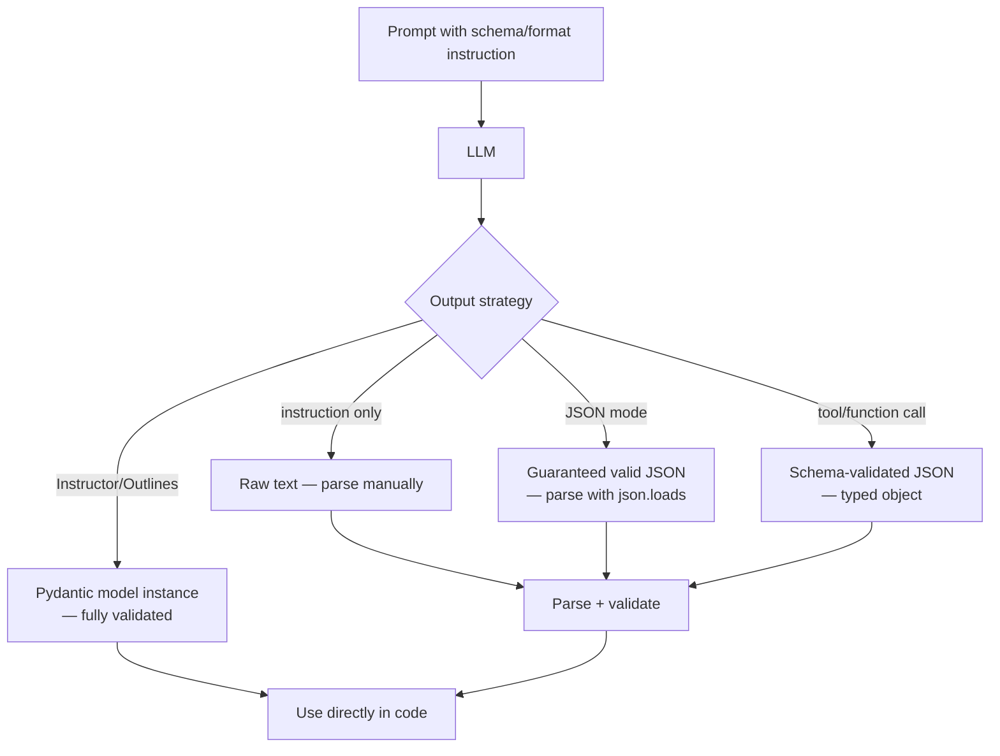

# Sorties structurées

## Définition

Les sorties structurées désignent les techniques qui contraignent ou guident un LLM à produire du texte dans un format prévisible et lisible par machine — le plus souvent JSON, XML, CSV, Markdown ou du code — plutôt que du texte libre. Les systèmes de production qui alimentent les sorties LLM directement dans des bases de données, des interfaces utilisateur ou des pipelines en aval ont besoin d'un format fiable ; des sorties imprévisibles ou mal formées provoquent des pannes d'analyse, une dégradation silencieuse ou des interruptions de service.

Les approches pour obtenir des sorties structurées forment un spectre d'effort et de fiabilité. Au niveau le plus simple, l'**instruction de prompt** demande au modèle de "répondre en JSON" ou de "remplir ce template" — facile à implémenter mais sujet à des violations de format sous les cas limites. Le **mode JSON** (OpenAI) et les **sorties structurées** (OpenAI, Anthropic) contraignent le décodage au niveau de la tokenisation pour garantir la conformité JSON. La **définition de schéma** (via les outils/fonctions d'OpenAI ou le `tool_choice` d'Anthropic) lie le modèle à un schéma JSON spécifique, permettant une intégration de type sécurisé. Enfin, des bibliothèques comme **Instructor** et **Outlines** fournissent des interfaces Python idiomatiques sur ces fonctionnalités, s'intégrant avec Pydantic pour la validation du schéma.

## Comment ça fonctionne



### Instruction de format dans le prompt

La manière la plus directe de guider le format est de l'instruire dans le prompt. Inclure un exemple du format souhaité, spécifier le schéma en prose ou fournir un template à remplir. Ajouter une séquence d'arrêt sur le délimiteur de fermeture (ex. `</json>`) pour éviter le texte supplémentaire après l'objet. Cette approche fonctionne sur n'importe quel modèle mais échoue parfois sur des cas d'entrée complexes ou inattendus.

### Mode JSON et sorties structurées

OpenAI's `response_format={"type": "json_object"}` garantit que chaque token généré continue un JSON valide — le modèle ne peut pas produire de JSON mal formé. `response_format={"type": "json_schema", "json_schema": {...}}` va plus loin en appliquant un schéma spécifique. Anthropic prend en charge une fonctionnalité similaire via `tool_use` : définir un outil avec un schéma JSON et le forcer avec `tool_choice`, ce qui oblige le modèle à remplir les arguments de l'outil conformément au schéma.

### Instructor et Pydantic

**Instructor** est une bibliothèque Python qui enveloppe les SDK OpenAI et Anthropic, vous permettant de définir le format de sortie comme un modèle Pydantic et d'obtenir en retour une instance entièrement validée. Elle gère les retries, la validation et la correction d'erreurs automatiquement. C'est actuellement l'une des approches les plus ergonomiques pour les sorties structurées dans du code Python de production.

## Quand utiliser / Quand NE PAS utiliser

| Scénario | Approche recommandée | Éviter |
|----------|----------------------|--------|
| Extraction de données pour ingestion dans base de données | Sorties structurées / mode JSON + Pydantic | Analyse de texte libre — fragile et non maintenable |
| Remplissage de formulaire UI alimenté par LLM | Définition de schéma via appel de fonction/outil | Confiance dans l'instruction seule pour des entrées utilisateur arbitraires |
| Génération de code | Séquences d'arrêt sur des délimiteurs de code ; extraire le contenu entre balises | Obtenir toute la réponse — le prose avant/après le code gêne l'exécution |
| Pipelines d'agents avec raisonnement structuré | Sorties structurées pour les actions ; texte libre pour le raisonnement | Forcer la structure pour les sorties de raisonnement intermédiaire — dégrade les CoT |
| Prototypage rapide | Instruction de prompt avec séquences d'arrêt | Ingénierie excessive avec des schémas complets pour une expérimentation à usage unique |

## Exemples de code

### Mode JSON OpenAI et sorties structurées

```python
# OpenAI JSON mode and structured outputs
# pip install openai pydantic

import os, json
from openai import OpenAI
from pydantic import BaseModel

client = OpenAI(api_key=os.environ["OPENAI_API_KEY"])

# --- Approach 1: JSON mode (valid JSON guaranteed, no schema enforcement) ---
resp = client.chat.completions.create(
    model="gpt-4o",
    messages=[
        {
            "role": "system",
            "content": "Extract information and return as JSON with keys: name, date, location.",
        },
        {
            "role": "user",
            "content": "The React Summit conference will be held in Amsterdam on June 13, 2025.",
        },
    ],
    response_format={"type": "json_object"},
    temperature=0,
)
data = json.loads(resp.choices[0].message.content)
print(data)  # {'name': 'React Summit', 'date': 'June 13, 2025', 'location': 'Amsterdam'}


# --- Approach 2: Structured outputs with Pydantic schema ---
class EventExtraction(BaseModel):
    name: str
    date: str
    location: str
    is_virtual: bool


completion = client.beta.chat.completions.parse(
    model="gpt-4o",
    messages=[
        {"role": "system", "content": "Extract event information from the text."},
        {
            "role": "user",
            "content": "PyCon US will be in Pittsburgh, PA on May 14-22, 2025. It is in-person.",
        },
    ],
    response_format=EventExtraction,
)
event = completion.choices[0].message.parsed
print(event.name, event.location, event.is_virtual)
```

### Sorties structurées Anthropic via appel d'outil

```python
# Anthropic structured outputs via tool_use
# pip install anthropic

import os, json
import anthropic

client = anthropic.Anthropic(api_key=os.environ["ANTHROPIC_API_KEY"])

extract_tool = {
    "name": "extract_product_info",
    "description": "Extract structured product information from text",
    "input_schema": {
        "type": "object",
        "properties": {
            "product_name": {"type": "string"},
            "price_usd": {"type": "number"},
            "in_stock": {"type": "boolean"},
            "categories": {
                "type": "array",
                "items": {"type": "string"},
            },
        },
        "required": ["product_name", "price_usd", "in_stock", "categories"],
    },
}

resp = client.messages.create(
    model="claude-opus-4-5",
    max_tokens=512,
    tools=[extract_tool],
    tool_choice={"type": "tool", "name": "extract_product_info"},
    messages=[
        {
            "role": "user",
            "content": (
                "The UltraBook Pro 15 laptop is priced at $1,299.99. "
                "It is currently available. Categories: electronics, laptops, productivity."
            ),
        }
    ],
)

tool_use_block = next(b for b in resp.content if b.type == "tool_use")
product = tool_use_block.input
print(json.dumps(product, indent=2))
```

### Instructor avec Pydantic

```python
# Instructor library for ergonomic structured outputs
# pip install instructor openai pydantic

import os
import instructor
from openai import OpenAI
from pydantic import BaseModel, Field

client = instructor.from_openai(OpenAI(api_key=os.environ["OPENAI_API_KEY"]))


class Person(BaseModel):
    name: str
    age: int = Field(ge=0, le=150)
    occupation: str
    city: str


class PeopleList(BaseModel):
    people: list[Person]


text = (
    "Dr. Sarah Chen, 34, is a neurologist based in Boston. "
    "Her colleague James O'Brien, 41, is a radiologist in the same hospital."
)

result = client.chat.completions.create(
    model="gpt-4o",
    messages=[
        {"role": "user", "content": f"Extract all people from: {text}"},
    ],
    response_model=PeopleList,
)

for person in result.people:
    print(f"{person.name}, {person.age}, {person.occupation}, {person.city}")
```

## Ressources pratiques

- [Documentation OpenAI — Sorties structurées](https://platform.openai.com/docs/guides/structured-outputs) — Guide officiel pour le mode JSON, les sorties structurées basées sur le schéma et les appels de fonctions
- [Documentation Anthropic — Utilisation d'outils](https://docs.anthropic.com/en/docs/build-with-claude/tool-use) — Référence pour utiliser `tool_use` d'Anthropic pour extraire des sorties structurées avec des schémas
- [Bibliothèque Instructor](https://python.useinstructor.com/) — Bibliothèque Python qui encapsule les SDK LLM populaires pour les sorties Pydantic ; inclut retries, streaming et correction d'erreurs
- [Outlines](https://github.com/outlines-dev/outlines) — Génération de texte structurée via contraintes de FSM et guidage au niveau des logits ; supporte JSON, regex et grammaires personnalisées
- [LangChain — Parseurs de sortie](https://python.langchain.com/docs/concepts/output_parsers/) — Abstraction pour analyser les sorties LLM en types Python, incluant les parseurs Pydantic, JSON et CSV

## Voir aussi

- [Ingénierie des prompts](/docs/prompt-engineering)
- [Nombre maximal de tokens et séquences d'arrêt](/docs/prompt-engineering/max-tokens-stop-sequences)
- [Prompts système, de rôle et contextuels](/docs/prompt-engineering/system-role-contextual-prompting)
- [Agents IA](/docs/agents)
- [LLMs](/docs/llms)
