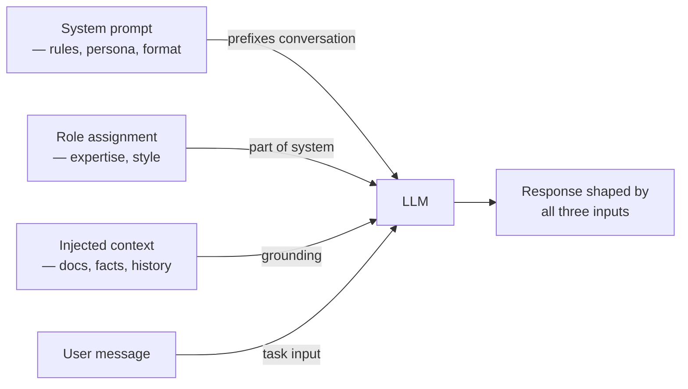

# Prompts système, de rôle et contextuels

## Définition

Les prompts système, les prompts de rôle et les prompts contextuels sont trois types d'entrées structurées complémentaires qui guident le comportement du LLM avant que l'utilisateur ne pose une question. Ensemble, ils forment la "mise en scène" d'une interaction LLM, établissant la personnalité, les règles et les connaissances fondamentales du modèle.

Le **prompt système** est un message passé dans un champ spécial (le rôle `system` dans les API OpenAI et Anthropic) qui précède la conversation. Il définit des règles persistantes, des contraintes, des limites de sécurité ou des instructions de tâche qui s'appliquent à toute la conversation. Contrairement aux messages utilisateur, le prompt système est généralement invisible pour l'utilisateur final et ne peut pas être facilement remplacé par des instructions de conversation.

Le **prompting de rôle** est le sous-ensemble du prompting système qui demande au modèle d'adopter un persona spécifique — "Tu es un ingénieur DevOps expert spécialisé en Kubernetes" ou "Tu es un professeur de mathématiques du lycée patient." Assigner un rôle aligne les connaissances, le style de communication et les valeurs implicites du modèle sur la tâche cible, souvent améliorant la précision et la cohérence du ton.

Le **prompting contextuel** injecte des informations de base pertinentes — extraits de documents, contenu de base de connaissances, historique de conversation, résultats d'appels d'API — directement dans le prompt. C'est la colonne vertébrale de la génération augmentée par récupération (RAG) et des systèmes d'agents : le modèle ne sait que ce que vous lui dites dans le contexte plus ses connaissances de préentraînement.

## Comment ça fonctionne



### Prompts système

Un prompt système efficace contient généralement :
- **Persona ou rôle** : qui est le modèle
- **Tâche ou domaine** : ce que le modèle fait
- **Règles de comportement** : ce que le modèle devrait et ne devrait pas faire
- **Instructions de format de sortie** : comment le modèle devrait formater les réponses
- **Limites** : ce que le modèle refuse ou redirige

Les prompts système sont persistants sur la conversation — ils définissent le comportement par défaut pour chaque tour. Gardez-les concis mais complets ; des prompts système trop longs peuvent diluer l'attention sur les messages utilisateur critiques.

### Prompting de rôle

La recherche montre que les attributions de rôle affectent les sorties LLM de manière mesurable. "Tu es un expert en cybersécurité" avant de poser une question de sécurité produit des réponses différentes (souvent plus précises et nuancées) que de demander sans contexte de rôle. L'effet est plus fort pour les sujets à forte expertise où le modèle a des connaissances de domaine différenciées. Pour les tâches créatives, les attributions de rôle aident à maintenir la cohérence du ton sur de longs contenus.

### Injection de contexte

L'injection de contexte est la technique de fournir des faits, des documents ou des données au modèle dans le prompt, complétant ses connaissances de préentraînement. Pour les RAG, cela signifie récupérer des passages pertinents et les inclure comme contexte avant la question. Pour les agents, cela signifie inclure les résultats d'appels d'outils précédents ou l'état de la session. Les pratiques clés : prioriser le contexte récent et le plus pertinent, tronquer les documents longs, et instruire explicitement le modèle sur la façon d'utiliser le contexte ("Réponds uniquement en utilisant les informations fournies").

## Quand utiliser / Quand NE PAS utiliser

| Scénario | Approche recommandée | Éviter |
|----------|----------------------|--------|
| Chatbot d'assistance client de production | Prompt système détaillé avec restrictions + persona | Aucun prompt système — le comportement est imprévisible et non guidé |
| Tuteur éducatif | Rôle de persona enseignant + niveau de l'apprenant dans le prompt système | Ignorer l'audience cible — le style de communication sera mal adapté |
| QR basée sur des documents | Injecter les passages de document récupérés comme contexte | Demander des faits du document sans les fournir — hallucinations garanties |
| Analyse de code ou révision | Prompt système avec le langage et les standards pertinents | Prompt système générique — perd les conventions spécifiques au domaine |
| Prototypage rapide / exploration | Prompt système minimal | Prompt système excessivement ingéniéré — ralentit l'itération |

## Exemples de code

### Prompts système et de rôle avec OpenAI

```python
# System and role prompting with OpenAI
# pip install openai

import os
from openai import OpenAI

client = OpenAI(api_key=os.environ["OPENAI_API_KEY"])

# --- Role + Behavioral system prompt ---
SYSTEM_DEVOPS = """You are a senior DevOps engineer with 10 years of experience
in Kubernetes, Terraform, and CI/CD pipelines.

Rules:
- Provide concrete, production-ready answers
- Always mention security considerations where relevant
- Format code examples with appropriate language tags
- If a question is ambiguous, ask one clarifying question before answering
- Never suggest deprecated tools or practices"""


def ask_devops(question: str) -> str:
    resp = client.chat.completions.create(
        model="gpt-4o",
        messages=[
            {"role": "system", "content": SYSTEM_DEVOPS},
            {"role": "user", "content": question},
        ],
        temperature=0.2,
        max_tokens=600,
    )
    return resp.choices[0].message.content.strip()


# --- Contextual prompting: inject retrieved document ---
SYSTEM_QA = (
    "You are a helpful assistant. Answer questions using ONLY the provided context. "
    "If the answer is not in the context, say 'I don't have that information.'"
)


def answer_from_context(context: str, question: str) -> str:
    user_message = f"Context:\n{context}\n\nQuestion: {question}"
    resp = client.chat.completions.create(
        model="gpt-4o",
        messages=[
            {"role": "system", "content": SYSTEM_QA},
            {"role": "user", "content": user_message},
        ],
        temperature=0,
        max_tokens=300,
    )
    return resp.choices[0].message.content.strip()


if __name__ == "__main__":
    # Role prompting
    answer = ask_devops("What's the safest way to store Kubernetes secrets?")
    print("DevOps answer:", answer[:200], "...")

    # Contextual prompting
    doc = (
        "Our company's data retention policy states that customer PII must be "
        "deleted within 90 days of account closure. Backups are retained for 30 days. "
        "Logs are kept for 12 months for compliance purposes."
    )
    qa_answer = answer_from_context(doc, "How long are customer logs retained?")
    print("\nDoc-grounded answer:", qa_answer)
```

### Prompts système et contextuels avec Anthropic

```python
# System and contextual prompting with Anthropic
# pip install anthropic

import os
import anthropic

client = anthropic.Anthropic(api_key=os.environ["ANTHROPIC_API_KEY"])

SYSTEM_TUTOR = """You are a patient and encouraging mathematics tutor for high school students.

Guidelines:
- Always explain the underlying concept before solving
- Use simple language, avoid jargon unless you define it
- Show all steps clearly, numbered
- End every explanation with a check-for-understanding question
- If the student seems confused, offer an analogy or real-world example"""

SYSTEM_ANALYST = (
    "You are a data analyst. Analyze the provided data and give concise, "
    "actionable insights. Format your response as: "
    "1) Key Finding, 2) Supporting Evidence, 3) Recommended Action."
)


def tutor_explain(problem: str) -> str:
    resp = client.messages.create(
        model="claude-opus-4-5",
        max_tokens=600,
        system=SYSTEM_TUTOR,
        messages=[{"role": "user", "content": problem}],
        temperature=0.4,
    )
    return resp.content[0].text.strip()


def analyze_data(data_summary: str, question: str) -> str:
    resp = client.messages.create(
        model="claude-opus-4-5",
        max_tokens=400,
        system=SYSTEM_ANALYST,
        messages=[
            {
                "role": "user",
                "content": f"Data summary:\n{data_summary}\n\nAnalysis question: {question}",
            }
        ],
        temperature=0,
    )
    return resp.content[0].text.strip()


if __name__ == "__main__":
    explanation = tutor_explain("How do I solve a quadratic equation using the quadratic formula?")
    print("Tutor explanation:\n", explanation[:300], "...\n")

    data = (
        "Q1 revenue: $1.2M (target $1.0M). Q2 revenue: $0.9M (target $1.1M). "
        "Top product: Widget A (40% of revenue). Churn rate increased from 5% to 8%."
    )
    analysis = analyze_data(data, "What should leadership focus on next quarter?")
    print("Analysis:\n", analysis)
```

## Ressources pratiques

- [OpenAI — Guide d'ingénierie des prompts](https://platform.openai.com/docs/guides/prompt-engineering) — Meilleures pratiques officielles incluant comment structurer les messages système
- [Anthropic — Guide de prompting](https://docs.anthropic.com/en/docs/build-with-claude/prompt-engineering/overview) — Directives et exemples d'Anthropic pour les messages système avec les modèles Claude
- [DAIR.AI — Guide d'ingénierie des prompts](https://www.promptingguide.ai/) — Guide maintenu par la communauté couvrant les techniques de prompting zero-shot, few-shot, CoT et système
- [Lilian Weng — Ingénierie des prompts](https://lilianweng.github.io/posts/2023-03-15-prompt-engineering/) — Article de blog approfondi couvrant les techniques incluant les exemples système et contextuels avec évaluation empirique

## Voir aussi

- [Ingénierie des prompts](/docs/prompt-engineering)
- [Nombre maximal de tokens et séquences d'arrêt](/docs/prompt-engineering/max-tokens-stop-sequences)
- [Sorties structurées](/docs/prompt-engineering/structured-outputs)
- [RAG](/docs/rag)
- [Agents IA](/docs/agents)
- [LLMs](/docs/llms)
