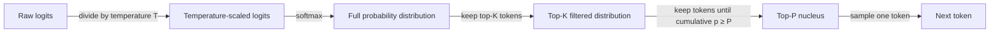

# Température, Top-K, Top-P

## Définition

La température, Top-K et Top-P sont des paramètres d'échantillonnage qui contrôlent comment un LLM sélectionne le prochain token lors de la génération de texte. Après que le modèle calcule une distribution de probabilité sur l'ensemble de son vocabulaire (via softmax sur les logits), ces paramètres déterminent quels tokens sont candidats à la sélection et quelle est la probabilité de choisir chaque candidat. Ensemble, ils régissent le compromis entre déterminisme et diversité : les valeurs faibles rendent le modèle prévisible et ciblé, les valeurs élevées le rendent créatif et varié.

La **température** redimensionne les logits bruts avant l'étape softmax, aplatissant ou affinant efficacement la distribution de probabilité. Une température de 1,0 laisse la distribution inchangée. Les valeurs inférieures à 1,0 rendent la distribution plus prononcée — le modèle choisit presque toujours le token de plus haute probabilité. Les valeurs supérieures à 1,0 aplatissent la distribution — davantage de tokens deviennent des candidats plausibles, produisant des sorties plus surprenantes et variées. À la température 0, la génération devient déterministe (décodage argmax).

**Top-K** et **Top-P** sont des stratégies de troncature appliquées après la mise à l'échelle de la température. Top-K ne conserve que les K tokens les plus probables et redistribue la masse de probabilité parmi eux, en éliminant tous les autres. Top-P (aussi appelé échantillonnage nucléaire) sélectionne dynamiquement le plus petit ensemble de tokens dont la masse de probabilité cumulée atteint un seuil P, puis échantillonne dans cet ensemble. Top-P est généralement préféré à Top-K car la taille de l'ensemble de candidats s'adapte à la forme de la distribution : quand le modèle est confiant, le noyau est petit ; quand le modèle est incertain, le noyau s'élargit pour inclure davantage d'alternatives.

## Comment ça fonctionne



Les paramètres sont appliqués séquentiellement : d'abord la mise à l'échelle de la température, puis la troncature Top-K, puis la sélection du noyau Top-P, puis l'échantillonnage. En pratique, la plupart des API appliquent seulement température + Top-P (la valeur par défaut d'OpenAI) ou température + Top-K (la valeur par défaut d'Anthropic) ; appliquer à la fois Top-K et Top-P est possible mais inhabituel.

### Température

La température `T` divise chaque logit brut `z_i` avant le softmax : `p_i = softmax(z / T)`. Quand `T < 1`, les différences de logits sont amplifiées — le token de plus haute probabilité obtient une part encore plus grande de la masse de probabilité. Quand `T > 1`, les différences de logits diminuent — la masse de probabilité se répartit plus uniformément. Préréglages courants : `T = 0` pour les tâches d'extraction déterministe, `T = 0,2–0,4` pour les Q&R factuelles, `T = 0,7–1,0` pour l'écriture créative, `T > 1,0` pour une diversité maximale (bien que la qualité se dégrade à des valeurs extrêmes).

### Top-K

L'échantillonnage Top-K restreint le groupe de candidats aux K tokens ayant la plus haute probabilité après la mise à l'échelle de la température. Tous les tokens hors du top K se voient attribuer une probabilité nulle avant la renormalisation. La limitation clé est que K est fixe indépendamment de l'aspect de la distribution : quand le modèle est très confiant, même K=50 pourrait inclure de nombreux tokens à probabilité quasi nulle qui introduisent du bruit ; quand le modèle est incertain, un K faible pourrait éliminer des alternatives raisonnables. L'API d'Anthropic expose `top_k` comme paramètre direct ; l'API d'OpenAI ne le supporte pas nativement.

### Top-P (échantillonnage nucléaire)

L'échantillonnage Top-P construit l'ensemble de candidats dynamiquement. En partant du token le plus probable et en descendant, les tokens sont ajoutés au noyau jusqu'à ce que leur probabilité cumulée atteigne le seuil P. Seuls les tokens dans le noyau sont considérés pour l'échantillonnage. Avec `P = 0,9`, le modèle échantillonne parmi les tokens qui représentent collectivement 90 % de la masse de probabilité. Parce que le noyau se contracte quand le modèle est confiant (quelques tokens dominent) et s'élargit quand il est incertain (la masse de probabilité est diffuse), Top-P s'adapte naturellement à l'état interne du modèle. Top-P est supporté par les API d'OpenAI (`top_p`) et d'Anthropic (`top_p`).

## Quand utiliser / Quand NE PAS utiliser

| Scénario | Paramètres recommandés | Éviter |
|----------|------------------------|--------|
| Q&R factuelles, extraction de données, classification | `temperature=0–0,2`, `top_p=1,0` pour une sortie quasi déterministe | Température élevée ; introduit des hallucinations et des erreurs de format |
| Écriture créative, brainstorming, idéation | `temperature=0,8–1,0`, `top_p=0,95` pour des sorties diverses et novatrices | Temperature=0 ; produit un texte répétitif et prévisible |
| Génération de code | `temperature=0,2–0,4`, `top_p=0,95` ; une certaine variation aide à éviter les optima locaux | Température \> 0,8 ; les erreurs de syntaxe et la dérive logique augmentent |
| Autocohérence (chemins de raisonnement multiples) | `temperature=0,6–1,0` ; la diversité est intentionnelle | Temperature=0 ; tous les chemins seraient identiques, ce qui va à l'encontre du but |
| Extraction de sortie structurée (JSON, tableaux) | `temperature=0`, `top_p=1,0` pour une stricte conformité au schéma | Top-P \< 0,9 combiné à une température élevée ; les violations de schéma augmentent |
| Dialogue / chatbots | `temperature=0,5–0,7`, `top_p=0,9` ; équilibre cohérence et naturel | Température extrême dans un sens ou dans l'autre ; trop robotique ou trop incohérent |

## Exemples de code

### OpenAI — température et Top-P

```python
# OpenAI API call with temperature and top_p
# pip install openai

import os
from openai import OpenAI

client = OpenAI(api_key=os.environ["OPENAI_API_KEY"])


def generate(prompt: str, temperature: float = 0.7, top_p: float = 0.95) -> str:
    """Generate text with configurable sampling parameters."""
    response = client.chat.completions.create(
        model="gpt-4o",
        messages=[{"role": "user", "content": prompt}],
        temperature=temperature,
        top_p=top_p,
        max_tokens=512,
    )
    return response.choices[0].message.content


if __name__ == "__main__":
    # Deterministic factual extraction
    factual = generate(
        "List the three primary colors.",
        temperature=0.0,
        top_p=1.0,
    )
    print("Factual:", factual)

    # Creative brainstorming
    creative = generate(
        "Suggest five unusual names for a café that serves only breakfast.",
        temperature=0.9,
        top_p=0.95,
    )
    print("Creative:", creative)
```

### Anthropic — température et Top-K

```python
# Anthropic API call with temperature and top_k
# pip install anthropic

import os
import anthropic

client = anthropic.Anthropic(api_key=os.environ["ANTHROPIC_API_KEY"])


def generate(prompt: str, temperature: float = 0.7, top_k: int = 50) -> str:
    """Generate text with configurable temperature and top-k sampling."""
    message = client.messages.create(
        model="claude-opus-4-5",
        max_tokens=512,
        temperature=temperature,
        top_k=top_k,
        messages=[{"role": "user", "content": prompt}],
    )
    return message.content[0].text


if __name__ == "__main__":
    # Near-deterministic output for structured tasks
    deterministic = generate(
        "Translate 'hello world' into French, German, and Japanese.",
        temperature=0.0,
        top_k=1,
    )
    print("Deterministic:", deterministic)

    # Creative output with broader candidate pool
    creative = generate(
        "Write the opening sentence of a science fiction novel set on Europa.",
        temperature=1.0,
        top_k=250,
    )
    print("Creative:", creative)
```

## Ressources pratiques

- [OpenAI — Référence API : température et top_p](https://platform.openai.com/docs/api-reference/chat/create) — Documentation officielle des paramètres avec plages valides et valeurs par défaut
- [Anthropic — Référence API : température, top_k, top_p](https://docs.anthropic.com/en/api/messages) — Référence des paramètres d'Anthropic incluant top_k (non disponible dans OpenAI)
- [L'article Nucleus Sampling (Holtzman et al., 2020)](https://arxiv.org/abs/1904.09751) — Article original introduisant l'échantillonnage Top-P / nucléaire avec motivation et résultats empiriques
- [Hugging Face — Stratégies de génération de texte](https://huggingface.co/docs/transformers/generation_strategies) — Guide complet des stratégies d'échantillonnage incluant greedy, beam search, température, Top-K et Top-P
- [Lilian Weng — Génération de texte contrôlable](https://lilianweng.github.io/posts/2021-01-02-controllable-text-generation/) — Article de blog approfondi sur les méthodes d'échantillonnage dans le contexte de la génération contrôlable

## Voir aussi

- [Ingénierie des prompts](/docs/prompt-engineering)
- [Nombre maximal de tokens et séquences d'arrêt](/docs/prompt-engineering/max-tokens-stop-sequences)
- [Sorties structurées](/docs/prompt-engineering/structured-outputs)
- [Autocohérence](/docs/prompt-engineering/self-consistency)
- [Chaîne de pensée](/docs/reasoning-patterns/cot)
- [LLMs](/docs/llms)
