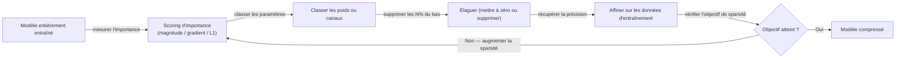
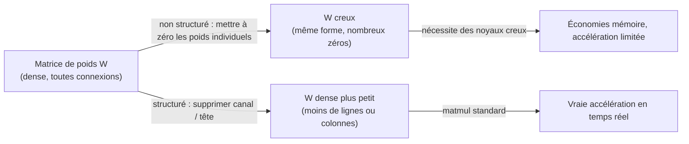

# Élagage (Pruning)

## Définition

L'élagage est une technique de [compression de modèle](/docs/model-compression) qui supprime les composants redondants ou peu importants d'un réseau de neurones entraîné pour réduire sa taille, son empreinte mémoire et son coût de calcul. L'idée centrale est que la plupart des réseaux de neurones sont sur-paramétrés : de nombreux poids contribuent négligemment aux prédictions du modèle et peuvent être mis à zéro ou supprimés sans affecter substantiellement la précision. En identifiant et éliminant ces paramètres redondants, l'élagage produit des modèles plus petits et moins coûteux adaptés au déploiement en périphérie ou en production.

Deux approches fondamentalement différentes existent. L'**élagage non structuré** supprime des connexions de poids individuelles quelle que soit leur position dans la matrice de poids, résultant en des tenseurs creux. Bien que les poids creux réduisent le nombre de paramètres et le stockage, le matériel dense standard (unités de multiplication matricielle GPU) ne s'accélère pas automatiquement — l'accélération sparse nécessite des noyaux sparse spécialisés ou du matériel dédié. L'**élagage structuré**, en revanche, supprime des blocs réguliers entiers : des neurones individuels, des canaux de sortie convolutifs, des têtes d'attention ou des couches de transformateur. Parce que le modèle résultant a une architecture dense plus petite, il atteint de vraies accélérations en temps réel sur le matériel standard sans runtime conscient de la sparsité.

L'élagage est le plus efficace quand il est combiné avec d'autres techniques de [compression de modèle](/docs/model-compression). Un pipeline courant est : entraîner un modèle complet → distiller dans un étudiant plus petit (voir [distillation de connaissances](/docs/knowledge-distillation)) → appliquer l'élagage structuré → affiner → quantifier. L'approche multi-étapes exploite les forces complémentaires de chaque technique et produit des modèles significativement plus petits et plus rapides que ce qu'atteint n'importe quelle méthode seule.

## Comment ça fonctionne

### Pipeline d'élagage itératif



### Non structuré vs structuré



### Méthodes de scoring d'importance

| Méthode | Définition du score | Avantages | Inconvénients |
|--------|-----------------|------|------|
| Magnitude | Valeur absolue du poids | Rapide, pas de données nécessaires | Peut supprimer des poids importants mais petits |
| Basé sur le gradient | Poids × gradient | Basé sur les données, plus précis | Nécessite un passage arrière |
| Développement de Taylor | Sensibilité à la perte au premier ordre | Bon compromis précision-sparsité | Computationnellement plus lourd |
| Masque appris | Masque binaire entraîné avec L0/L1 | Adaptatif au modèle | Nécessite une régularisation au moment de l'entraînement |

## Quand utiliser / Quand NE PAS utiliser

| Scénario | Utiliser l'élagage | NE PAS utiliser l'élagage |
|----------|------------|-------------------|
| Besoin d'une vraie accélération en temps réel sur le matériel standard | Oui — l'élagage structuré l'atteint | |
| Grand transformateur avec de nombreuses têtes d'attention redondantes | Oui — élagage des têtes avec coût minimal en précision | |
| Combinaison avec la quantification pour une compression maximale | Oui — élaguer d'abord, puis quantifier | |
| Réduction du stockage sans accélération matérielle requise | Oui — l'élagage non structuré réduit la taille du fichier modèle | |
| Très petits modèles où chaque paramètre compte | | Le budget de compression peut ne pas justifier l'effort |
| Modèles sans accès aux données d'entraînement pour l'affinement | | L'élagage en un coup sans affinement dégrade significativement la précision |

## Avantages et inconvénients

| Avantages | Inconvénients |
|------|------|
| L'élagage structuré atteint de vraies accélérations matérielles | L'élagage non structuré fournit une accélération limitée sans matériel sparse |
| Peut cibler des goulots d'étranglement spécifiques (têtes, canaux, couches) | L'affinement après élagage nécessite des données d'entraînement et du calcul |
| Réduit la taille du fichier modèle pour le stockage et le transfert | Les cycles itératifs élagage + affinement sont chronophages |
| Complémentaire à la quantification et à la distillation | Supprimer trop de paramètres peut causer une perte de précision irrécupérable |

## Exemples de code

```python
# Élagage structuré de canaux avec PyTorch
import torch
import torch.nn.utils.prune as prune

model = MyCNNModel()
model.load_state_dict(torch.load("model.pt"))

# Élagage non structuré L1 : supprimer 30% des poids dans une couche Conv2d par magnitude
prune.l1_unstructured(model.conv1, name="weight", amount=0.3)

# Vérifier la sparsité
sparsity = float(torch.sum(model.conv1.weight == 0)) / model.conv1.weight.numel()
print(f"Sparsité dans conv1 : {sparsity:.1%}")

# Rendre l'élagage permanent (supprimer le masque, garder les poids à zéro)
prune.remove(model.conv1, "weight")

# Élagage non structuré global sur toutes les couches Conv2d
parameters_to_prune = [
    (module, "weight")
    for module in model.modules()
    if isinstance(module, torch.nn.Conv2d)
]
prune.global_unstructured(
    parameters_to_prune,
    pruning_method=prune.L1Unstructured,
    amount=0.4,  # supprimer 40% des poids globalement
)

# Après élagage : affiner pour 1–3 époques pour récupérer la précision
optimizer = torch.optim.Adam(model.parameters(), lr=1e-4)
# ... boucle d'entraînement standard
```

## Ressources pratiques

- [TensorFlow — Guide d'élagage](https://www.tensorflow.org/model_optimization/guide/pruning) — Élagage par magnitude basé sur Keras avec affinement
- [PyTorch — Tutoriel d'élagage](https://pytorch.org/tutorials/intermediate/pruning_tutorial.html) — Élagage non structuré et structuré avec `torch.nn.utils.prune`
- [Article SparseGPT](https://arxiv.org/abs/2301.00774) — Élagage en un coup pour les grands modèles de langage sans réentraînement
- [Article Wanda](https://arxiv.org/abs/2306.11695) — Élagage LLM simple sans calibration utilisant les magnitudes de poids et d'activations

## Voir aussi

- [Compression de modèle](/docs/model-compression)
- [Distillation de connaissances](/docs/knowledge-distillation)
