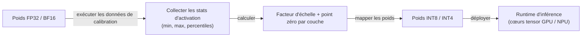
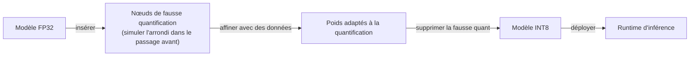

# Quantification

## Définition

La quantification est le processus de représentation des poids des réseaux de neurones — et optionnellement des activations — dans une précision numérique inférieure au format d'entraînement original (généralement FP32 ou BF16). En mappant les valeurs à virgule flottante vers une plage entière discrète (INT8, INT4, INT2), la quantification réduit la mémoire du modèle de 2–8x et permet une inférence plus rapide sur le matériel avec des unités de calcul entier telles que les cœurs tensor GPU, les NPU et les accélérateurs d'inférence dédiés.

En pratique, la quantification est la technique de [compression de modèle](/docs/model-compression) la plus couramment appliquée pour les [LLM](/docs/llms) car elle ne nécessite pas de changements d'architecture, fonctionne après l'entraînement et offre des réductions de mémoire suffisantes pour passer d'un matériel de niveau serveur à du matériel grand public. Un modèle de 70B paramètres en FP16 nécessite environ 140 Go de VRAM ; le même modèle quantifié en INT4 tient dans environ 35 Go, le rendant exécutable sur un poste de travail à double GPU. Le coût en précision est généralement faible (1–3% sur les benchmarks en aval) pour INT8, et gérable pour INT4 avec des méthodes conscientes de la calibration.

La quantification existe sur un spectre d'approches : la **quantification post-entraînement (PTQ)** applique la conversion après l'entraînement en utilisant un petit ensemble de données de calibration, tandis que la **quantification consciente de l'entraînement (QAT)** affine le modèle avec une quantification simulée pour que les poids apprennent à être robustes à la réduction de précision. Les schémas de quantification LLM modernes comme GPTQ, AWQ et GGUF intègrent des stratégies de calibration et d'empaquetage qui vont au-delà du simple arrondi des poids, préservant la précision même à la précision INT4.

## Comment ça fonctionne

### Quantification post-entraînement (PTQ)



### Quantification consciente de l'entraînement (QAT)



### Schémas de quantification courants

| Schéma | Précision | Méthode | Idéal pour |
|--------|-----------|--------|---------|
| INT8 dynamique | INT8 | Quantifier les activations au runtime | Inférence CPU, NLP |
| INT8 statique | INT8 | Calibrer les activations hors ligne | Service GPU à faible latence |
| GPTQ | INT4 | Quantification de poids du second ordre | Service LLM sur GPU grand public |
| AWQ | INT4 | Quantification de poids consciente des activations | Service LLM, faible perte de précision |
| GGUF (llama.cpp) | INT2–INT8 | Précision mixte par tenseur | Inférence locale sur CPU / Apple Silicon |
| QAT | INT8 | Entraîner avec quantification simulée | Précision maximale en INT8 |

## Quand utiliser / Quand NE PAS utiliser

| Scénario | Utiliser la quantification | NE PAS utiliser la quantification |
|----------|-----------------|------------------------|
| Exécuter un grand LLM sur un GPU grand public | Oui — INT4 réduit la mémoire de 4–8x | |
| Réduire la latence d'inférence en production | Oui — INT8 accélère le débit sur le matériel moderne | |
| Déployer des modèles sur du matériel mobile ou en périphérie | Oui — TFLite et ONNX prennent en charge INT8 nativement | |
| Précision maximale sur un serveur bien doté en ressources | | Servir en FP16 ou BF16 si la mémoire et le coût le permettent |
| Très petits modèles où la perte de précision est significative | | La distillation ou l'élagage peuvent être plus appropriés |
| Modèles avec des distributions d'activation inhabituelles | | PTQ standard peut échouer ; méthodes QAT ou conscientes des activations nécessaires |

## Avantages et inconvénients

| Avantages | Inconvénients |
|------|------|
| Grande réduction de mémoire (2–8x) avec une perte de précision minimale | La dégradation de précision augmente à des précisions agressives (INT2/INT3) |
| PTQ ne nécessite pas de réentraînement — rapide à appliquer | La qualité de la calibration affecte la précision ; nécessite des données représentatives |
| Largement pris en charge par les runtimes (TFLite, ONNX, vLLM) | Nécessite un support matériel pour les opérations entières pour voir les accélérations |
| Permet le déploiement de LLM sur le matériel grand public et en périphérie | La quantification des activations est plus difficile que la quantification des poids seulement |

## Exemples de code

```python
# Quantification post-entraînement statique INT8 avec PyTorch
import torch
import torch.quantization

model = MyModel()
model.load_state_dict(torch.load("model.pt"))
model.eval()  # passer en mode inférence

# Fusionner BatchNorm et Conv pour l'efficacité de quantification
model_fused = torch.quantization.fuse_modules(model, [["conv", "bn", "relu"]])

# Définir la configuration de quantification (fbgemm pour x86, qnnpack pour ARM/mobile)
model_fused.qconfig = torch.quantization.get_default_qconfig("fbgemm")
torch.quantization.prepare(model_fused, inplace=True)

# Passage de calibration — exécuter des données représentatives pour collecter les statistiques d'activation
with torch.no_grad():
    for x_batch, _ in calibration_loader:
        model_fused(x_batch)

# Convertir les poids et activations en INT8
quantized_model = torch.quantization.convert(model_fused, inplace=True)

# Vérifier la réduction de taille
original_params = sum(p.numel() for p in model.parameters())
quantized_params = sum(p.numel() for p in quantized_model.parameters())
print(f"Nombre de paramètres : {original_params:,} (pareil ; précision changée, pas le nombre)")
print("Modèle INT8 prêt — empreinte mémoire réduite d'environ 4x vs FP32")

# Sauvegarder le modèle quantifié
torch.save(quantized_model.state_dict(), "model_int8.pt")
```

## Ressources pratiques

- [PyTorch — Quantification](https://pytorch.org/docs/stable/quantization.html) — API PTQ, QAT et quantification dynamique
- [TensorFlow Lite — Guide de quantification](https://www.tensorflow.org/lite/performance/quantization) — Post-entraînement et QAT pour mobile
- [Article GPTQ](https://arxiv.org/abs/2210.17323) — Quantification post-entraînement précise pour les transformateurs génératifs pré-entraînés
- [Article AWQ](https://arxiv.org/abs/2306.00978) — Quantification de poids consciente des activations pour les LLM sur l'appareil
- [Format GGUF llama.cpp](https://github.com/ggerganov/llama.cpp) — Inférence locale avec précision mixte flexible par tenseur

## Voir aussi

- [Compression de modèle](/docs/model-compression)
- [Élagage](/docs/pruning)
- [Distillation de connaissances](/docs/knowledge-distillation)
- [Inférence locale](/docs/local-inference)
- [Raisonnement en périphérie](/docs/edge-reasoning)
- [Infrastructure](/docs/infrastructure)
