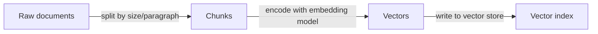
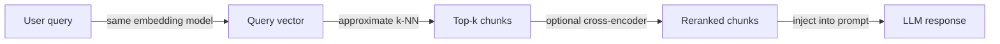

# Architecture RAG

## Définition

L'architecture RAG (Retrieval-Augmented Generation) définit comment les documents bruts sont transformés en connaissances récupérables et comment ces connaissances sont injectées dans un LLM au moment de l'inférence. La pipeline comporte deux phases principales : une phase d'**indexation** hors ligne qui traite et stocke les documents, et une phase de **récupération** en ligne qui récupère le contexte pertinent pour chaque requête utilisateur.

Les choix de conception dans cette architecture affectent directement la qualité, la latence et le coût du système final. La taille des fragments contrôle la quantité de contexte que chaque segment récupéré porte — les fragments plus petits sont plus précis mais peuvent manquer de contexte, tandis que les fragments plus grands réduisent le rappel de récupération. Le choix du modèle d'[embedding](/docs/rag/embeddings) détermine la signification sémantique de l'espace vectoriel, et l'utilisation de la récupération dense, dispersée ou hybride affecte la couverture pour les requêtes sémantiques et basées sur des mots-clés.

Les configurations avancées étendent la pipeline de base avec la réécriture de requêtes (reformulation avant l'embedding), la récupération multi-hop (chaînage de plusieurs récupérations), le reranking (un cross-encoder qui réévalue les candidats top-k) et l'extraction de citations (attribution des réponses aux fragments sources). Chaque extension ajoute de la latence et de la complexité mais peut améliorer significativement la qualité des réponses pour les cas d'usage exigeants. Voir [bases de données vectorielles](/docs/rag/vector-databases) pour les options d'indexation.

## Fonctionnement

### Phase d'indexation

Les documents sont ingérés, découpés en fragments et stockés dans un index vectoriel.



### Phase de récupération

Au moment de la requête, la requête est convertie en embedding, et les fragments similaires sont récupérés et éventuellement réordonnés.



**Fragment :** Les documents sont divisés en segments (par paragraphe, phrase ou nombre fixe de tokens) ; le chevauchement et les métadonnées peuvent être ajoutés à chaque fragment. **Incorporer et indexer :** Les fragments sont encodés en vecteurs via un modèle d'[embedding](/docs/rag/embeddings) et stockés dans une [base de données vectorielle](/docs/rag/vector-databases). **Requête :** La requête de l'utilisateur est incorporée avec le même encodeur ; **récupérer** obtient les k fragments les plus similaires via une recherche dense ou hybride. **Classer :** Un reranker optionnel (p. ex. cross-encoder) réévalue les meilleurs candidats avant qu'ils soient formatés dans le prompt du LLM.

## Quand utiliser / Quand NE PAS utiliser

| Scénario | Utiliser | Ne pas utiliser |
|---|---|---|
| La base de connaissances est grande et fréquemment mise à jour | Oui — chunking + indexation gère l'échelle | Non — le fine-tuning est coûteux à réentraîner |
| Les réponses ont besoin d'attribution des sources | Oui — les fragments portent des métadonnées de provenance | Non — la génération LLM vanilla perd l'attribution |
| Les requêtes sont très spécifiques aux mots-clés | Oui — la récupération hybride combine dense + dispersée | Non — la récupération purement dense peut manquer les correspondances exactes |
| Les connaissances tiennent dans la fenêtre de contexte | Peut-être — plus simple de remplir le prompt directement | Oui — pas besoin d'une couche de récupération |
| La latence en temps réel est critique | Avec optimisations — cache, modèles plus petits | Éviter le reranking + multi-hop avec des budgets de latence très faibles |

## Comparaisons

| Approche | Taille du fragment | Type de récupération | Reranker | Utilisation typique |
|---|---|---|---|---|
| RAG naïf | 512 tokens fixe | Dense uniquement | Aucun | Prototypage |
| RAG avancé | Sémantique / chevauchant | Hybride (dense + BM25) | Cross-encoder | Q&A de production |
| RAG modulaire | Variable, avec métadonnées | Hybride + filtres | Reranker appris | Recherche d'entreprise |
| RAG multi-hop | Petit pour la précision | Dense par hop | Optionnel | Raisonnement complexe |

## Avantages et inconvénients

| Avantages | Inconvénients |
|---|---|
| Maintient les connaissances à jour sans réentraînement | Ajoute une latence d'indexation et de récupération |
| Fournit une attribution des sources pour les réponses | La stratégie de découpage impacte significativement la qualité |
| Échelle à des millions de documents | Nécessite la maintenance d'un index vectoriel |
| Composable avec le reranking et le filtrage | Le désalignement requête-document peut nuire au rappel |

## Exemples de code

```python
from langchain_openai import OpenAIEmbeddings, ChatOpenAI
from langchain_community.vectorstores import Chroma
from langchain.text_splitter import RecursiveCharacterTextSplitter
from langchain.chains import RetrievalQA

# --- Indexing ---
splitter = RecursiveCharacterTextSplitter(chunk_size=512, chunk_overlap=64)
docs = splitter.create_documents([open("document.txt").read()])

embeddings = OpenAIEmbeddings()
vectorstore = Chroma.from_documents(docs, embeddings)

# --- Retrieval + Generation ---
retriever = vectorstore.as_retriever(search_kwargs={"k": 4})
qa_chain = RetrievalQA.from_chain_type(
    llm=ChatOpenAI(model="gpt-4o-mini"),
    retriever=retriever,
    return_source_documents=True,
)

result = qa_chain.invoke({"query": "What does the document say about X?"})
print(result["result"])
```

## Ressources pratiques

- [LangChain – RAG architecture](https://python.langchain.com/docs/use_cases/question_answering/) — Parcours RAG de bout en bout avec les composants LangChain
- [LlamaIndex – Document processing and indexing](https://docs.llamaindex.ai/en/stable/module_guides/loading/) — Pipelines d'ingestion, de découpage et d'indexation
- [Anthropic – RAG best practices](https://docs.anthropic.com/en/docs/build-with-claude/retrieval-augmented-generation) — Conseils et guide RAG spécifique à Claude

## Voir aussi

- [RAG](/docs/rag)
- [Bases de données vectorielles](/docs/rag/vector-databases)
- [Embeddings](/docs/rag/embeddings)
