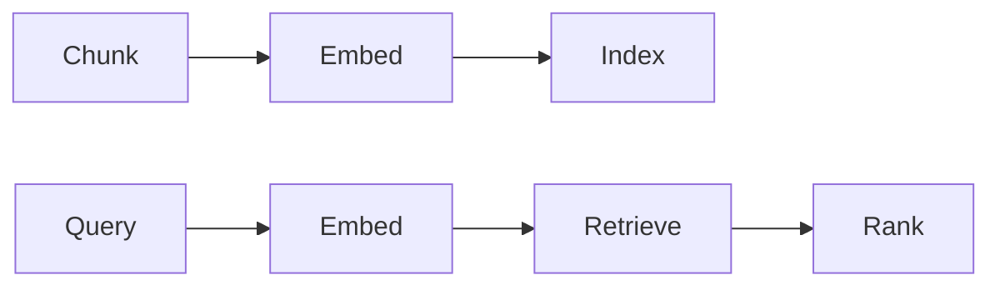

# Architecture RAG

## Définition

RAG architecture covers how you chunk documents, choose embeddings and vector stores, run récupération (dense, sparse, or hybrid), and combine context with the LLM (prompt conception, reranking).

Design choices here directly affect [RAG](/docs/rag) quality and latency. Trade-offs include chunk size (larger = more context per chunk, less precision), [embedding](/docs/rag/embeddings) model (quality vs cost), and whether to add a reranker or hybrid search. See [vector databases](/docs/rag/vector-databases) for indexing options.

## Comment ça fonctionne

**Découpage :** Les documents sont divisés en segments (par paragraphe, phrase ou taille fixe) ; le chevauchement et les métadonnées peuvent être ajoutés. **Embed** and **index:** Chunks are turned into vectors via an [embedding](/docs/rag/embeddings) model and stored in a [vector database](/docs/rag/vector-databases). **Query:** At query time the query is embedded; **retrieve** fetches the top-k similar chunks (dense search), optionally combined with keyword (sparse) for hybrid. **Rank:** An optional reranker (par ex. cross-encoder) rescores the top candidates. The chosen chunks are then formatted into the LLM prompt. Advanced setups add query rewriting, multi-hop récupération, and citation extraction.

## Cas d'utilisation

Architecture choices (chunking, récupération, reranking) directly affect answer quality and latency in production RAG.

- Designing chunking and indexing for long documents or codebases
- Choosing dense vs. sparse or hybrid récupération for domain data
- Adding reranking and citation for production RAG systems

## Documentation externe

- [LangChain – RAG architecture](https://python.langchain.com/docs/use_cases/question_answering/)
- [LlamaIndex – Document processing and indexing](https://docs.llamaindex.ai/en/stable/module_guides/loading/)

## Voir aussi

- [RAG](/docs/rag)
- [Vector databases](/docs/rag/vector-databases)
- [Embeddings](/docs/rag/embeddings)
