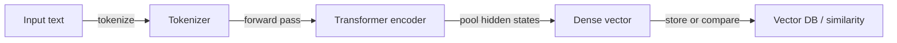
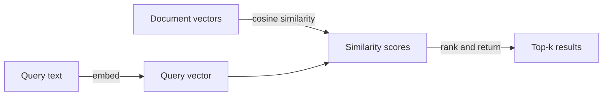

# Embeddings

## Définition

Les embeddings sont des vecteurs numériques denses de taille fixe qui encodent la signification sémantique du texte (ou d'autres modalités de données telles que les images et l'audio). Lorsque le texte est traité par un modèle encodeur, le contenu sémantiquement similaire produit des vecteurs qui sont géométriquement proches dans l'espace de haute dimension — ainsi des phrases comme « support client » et « bureau d'assistance » auront des vecteurs proches s'ils ont été entraînés sur des données similaires.

Ils constituent le pont entre le texte brut et les [bases de données vectorielles](/docs/rag/vector-databases). Les documents et les requêtes doivent être encodés avec le **même encodeur** pour que leurs vecteurs vivent dans le même espace et que des comparaisons de similarité significatives puissent être effectuées. La métrique de similarité la plus courante est la **similarité cosinus**, bien que le produit scalaire et la distance euclidienne soient également utilisés selon la configuration de l'index.

Le choix du modèle d'embedding est l'une des décisions ayant le plus fort impact dans un système [RAG](/docs/rag). Les facteurs incluent la dimensionnalité vectorielle (plus élevée = plus expressive mais plus de stockage), la fenêtre de contexte (combien de texte l'encodeur traite à la fois), la spécificité du domaine (un modèle juridique ou biomédical peut surpasser un modèle généraliste), le support multilingue et le coût (API vs. auto-hébergé). Les options populaires incluent OpenAI `text-embedding-3-large`, Cohere Embed et le `sentence-transformers` open-source. Voir [architecture RAG](/docs/rag/architecture) pour savoir comment les embeddings s'intègrent dans la pipeline complète.

## Fonctionnement

### Pipeline d'encodage



### Recherche de similarité



**Le texte** (une phrase, un paragraphe ou un fragment) est transmis à un **encodeur** (p. ex. embeddings OpenAI, Cohere ou sentence-transformers open-source). L'encodeur produit un **vecteur** de taille fixe (p. ex. 768 ou 1536 dimensions). L'entraînement utilise des objectifs contrastifs ou similaires pour que les textes sémantiquement liés obtiennent des vecteurs proches. Au moment de la requête, la similarité est calculée comme le cosinus ou le produit scalaire entre le vecteur de requête et les vecteurs de documents stockés. Les modèles peuvent être multilingues ou spécifiques à un domaine. Pour [RAG](/docs/rag), toujours utiliser le même encodeur pour les documents et les requêtes afin que les distances soient significatives.

## Quand utiliser / Quand NE PAS utiliser

| Scénario | Utiliser les embeddings | Ne pas utiliser les embeddings |
|---|---|---|
| Recherche sémantique (« trouver une signification similaire ») | Oui — les embeddings capturent l'intention sémantique | Non — recherche par mots-clés si une correspondance exacte de chaîne est nécessaire |
| Récupération multilingue | Oui — les encodeurs multilingues mappent les langues dans le même espace | Non — BM25 spécifique à la langue si vous n'avez qu'une seule langue |
| Courtes requêtes contre de longs documents | Oui — intégrer la requête et les documents fragmentés | Non — intégrer de longs documents entiers sans fragmentation perd en précision |
| Recherche exacte par ID ou champ structuré | Non — utiliser une BD relationnelle ou un filtre de métadonnées | Oui — les embeddings ne sont pas nécessaires pour une correspondance exacte |
| Faible latence, calcul limité | Considérer des modèles plus petits (p. ex. MiniLM) | Éviter les grands modèles basés sur API pour chaque requête |

## Comparaisons

| Modèle | Dimensions | Contexte | Multilingue | Coût | Meilleur pour |
|---|---|---|---|---|---|
| OpenAI `text-embedding-3-large` | 3072 | 8191 tokens | Oui | API (payant) | RAG de production haute précision |
| OpenAI `text-embedding-3-small` | 1536 | 8191 tokens | Oui | API (faible coût) | Apps sensibles aux coûts |
| Cohere Embed v3 | 1024 | 512 tokens | Oui | API (payant) | Reranking + récupération |
| `sentence-transformers/all-MiniLM-L6-v2` | 384 | 256 tokens | Non | Auto-hébergé (gratuit) | Faible latence ou hors ligne |
| `BAAI/bge-large-en-v1.5` | 1024 | 512 tokens | Non | Auto-hébergé (gratuit) | Open-source haute qualité |

## Avantages et inconvénients

| Avantages | Inconvénients |
|---|---|
| Capture la signification sémantique, pas seulement les mots-clés | L'espace vectoriel varie selon le modèle ; impossible de mélanger les encodeurs |
| Permet la récupération multilingue avec des modèles multilingues | La dimensionnalité augmente le coût de stockage et de calcul |
| Réutilisable : les mêmes vecteurs servent la recherche, le clustering, la déduplication | La qualité dépend fortement du choix du modèle et de son adéquation au domaine |
| Rapide au moment de la requête avec des index ANN | Pas d'interprétabilité — difficile de déboguer pourquoi un fragment a été retourné |

## Exemples de code

```python
from openai import OpenAI

client = OpenAI()

def embed(text: str) -> list[float]:
    response = client.embeddings.create(
        model="text-embedding-3-small",
        input=text,
    )
    return response.data[0].embedding

# Embed a document chunk and a query
doc_vec = embed("The refund policy allows returns within 30 days.")
query_vec = embed("How long do I have to return a product?")

# Cosine similarity (manual)
import numpy as np
def cosine_sim(a, b):
    a, b = np.array(a), np.array(b)
    return float(np.dot(a, b) / (np.linalg.norm(a) * np.linalg.norm(b)))

print(f"Similarity: {cosine_sim(doc_vec, query_vec):.4f}")
```

## Ressources pratiques

- [OpenAI – Embeddings guide](https://platform.openai.com/docs/guides/embeddings) — Utilisation de l'API, comparaison des modèles et bonnes pratiques
- [Hugging Face – Sentence Transformers](https://www.sbert.net/) — Modèles d'embedding open-source et benchmarks d'évaluation
- [MTEB leaderboard](https://huggingface.co/spaces/mteb/leaderboard) — Massive Text Embedding Benchmark pour comparer les modèles sur différentes tâches
- [Cohere – Embed API](https://docs.cohere.com/docs/embeddings) — Modèles d'embedding Cohere avec variantes optimisées pour la récupération

## Voir aussi

- [RAG](/docs/rag)
- [Bases de données vectorielles](/docs/rag/vector-databases)
- [Architecture RAG](/docs/rag/architecture)
- [Recherche sémantique](/docs/semantic-search)
