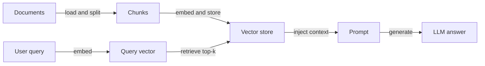
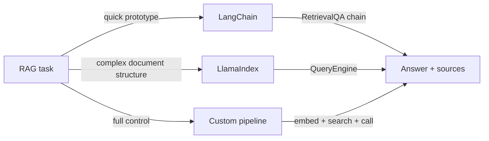

# Exemples de RAG

## Définition

Cette page rassemble des exemples concrets de RAG : Q&A simple, Q&A de documents et recherche hybride avec du code que vous pouvez adapter. Chaque exemple illustre un flux complet et exécutable, de l'ingestion de documents à la génération de réponses.

Chaque exemple suit le même flux [RAG](/docs/rag) — indexer des documents, incorporer la requête, récupérer, générer — mais avec différents frameworks ou options. L'objectif est de fournir des points de départ que vous pouvez intégrer dans votre propre projet et étendre. Ajustez le [découpage](/docs/rag/architecture), les [embeddings](/docs/rag/embeddings) et le [magasin vectoriel](/docs/rag/vector-databases) pour correspondre à votre volume de données, votre domaine et vos exigences de latence.

Le choix du bon exemple dépend de votre stack : LangChain convient bien aux prototypes rapides avec de nombreuses intégrations intégrées ; LlamaIndex excelle dans l'ingestion structurée de documents et les requêtes multi-index ; une pipeline personnalisée offre un contrôle maximal au prix de plus de code boilerplate. Les trois approches produisent la même sortie conceptuelle — contexte récupéré injecté dans un appel LLM.

## Fonctionnement

### Aperçu de la pipeline



### Sélection du framework



## Quand utiliser / Quand NE PAS utiliser

| Scénario | Utiliser ces exemples | Ne pas utiliser |
|---|---|---|
| Prototypage rapide d'un bot Q&A | Oui — l'exemple LangChain est minimal | Non — construire une pipeline personnalisée depuis zéro ajoute du temps inutile |
| App de production avec chunking personnalisé | Oui — exemple de pipeline personnalisée | Non — les valeurs par défaut du framework peuvent ne pas correspondre à votre stratégie de découpage |
| Recherche multi-documents sur des données structurées | Oui — exemple LlamaIndex | Non — la chaîne générique LangChain peut manquer la structure du document |
| Document unique qui tient dans la fenêtre de contexte | Non — passer le document directement | Oui — la pipeline de récupération est un overhead inutile |
| Recherche hybride (sémantique + mots-clés) | Oui — utiliser Chroma ou Weaviate avec BM25 | Non — la recherche mono-vecteur peut manquer les requêtes critiques par mots-clés |

## Exemples de code

### Exemple 1 : RAG minimal avec LangChain

```python
from langchain_openai import OpenAIEmbeddings, ChatOpenAI
from langchain_community.vectorstores import Chroma
from langchain.text_splitter import RecursiveCharacterTextSplitter
from langchain.chains import RetrievalQA
from langchain_community.document_loaders import TextLoader

# Load and chunk
loader = TextLoader("my_document.txt")
docs = loader.load()
splitter = RecursiveCharacterTextSplitter(chunk_size=500, chunk_overlap=50)
chunks = splitter.split_documents(docs)

# Index
vectorstore = Chroma.from_documents(chunks, OpenAIEmbeddings())

# Retrieve and generate
qa = RetrievalQA.from_chain_type(
    llm=ChatOpenAI(model="gpt-4o-mini"),
    retriever=vectorstore.as_retriever(search_kwargs={"k": 4}),
    return_source_documents=True,
)

result = qa.invoke({"query": "Summarize the main points."})
print(result["result"])
for doc in result["source_documents"]:
    print("Source:", doc.metadata)
```

### Exemple 2 : Q&A de documents avec LlamaIndex

```python
from llama_index.core import VectorStoreIndex, SimpleDirectoryReader

# Load all documents from a folder
documents = SimpleDirectoryReader("./docs_folder").load_data()

# Build index (embeds and stores automatically)
index = VectorStoreIndex.from_documents(documents)

# Query
query_engine = index.as_query_engine()
response = query_engine.query("What is the refund policy?")
print(response)
```

### Exemple 3 : recherche hybride (dense + mots-clés)

```python
from langchain_community.retrievers import BM25Retriever
from langchain.retrievers import EnsembleRetriever
from langchain_community.vectorstores import Chroma
from langchain_openai import OpenAIEmbeddings

# Dense retriever
vectorstore = Chroma.from_documents(chunks, OpenAIEmbeddings())
dense_retriever = vectorstore.as_retriever(search_kwargs={"k": 4})

# Sparse (BM25) retriever
bm25_retriever = BM25Retriever.from_documents(chunks)
bm25_retriever.k = 4

# Hybrid: combine both with equal weight
hybrid_retriever = EnsembleRetriever(
    retrievers=[bm25_retriever, dense_retriever],
    weights=[0.5, 0.5],
)

results = hybrid_retriever.invoke("product return window")
for r in results:
    print(r.page_content[:200])
```

## Ressources pratiques

- [LangChain – Question answering](https://python.langchain.com/docs/use_cases/question_answering/) — Parcours complet de RAG avec les composants LangChain
- [LlamaIndex – RAG tutorial](https://docs.llamaindex.ai/en/stable/getting_started/starter_example/) — Exemple de démarrage pour l'indexation et la requête de documents
- [Chroma – Quickstart](https://docs.trychroma.com/getting-started) — Configuration d'un magasin vectoriel local pour le développement
- [OpenAI Cookbook – RAG](https://cookbook.openai.com/examples/question_answering_using_embeddings) — Exemple RAG étape par étape avec les embeddings OpenAI

## Voir aussi

- [RAG](/docs/rag)
- [Architecture RAG](/docs/rag/architecture)
- [Tools: LangChain](/docs/tools/langchain)
- [Tools: LlamaIndex](/docs/tools/llamaindex)
