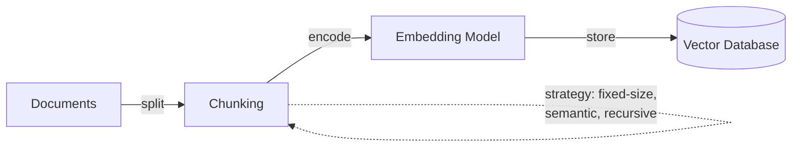
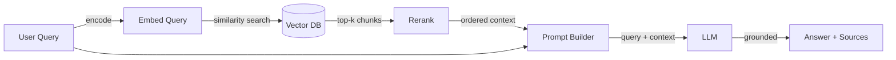

# Retrieval-augmented generation (RAG)

## Définition

La **génération augmentée par récupération (RAG)** est une technique qui augmente un grand modèle de langage avec une étape de récupération externe : à partir d'une requête utilisateur, le système récupère d'abord les documents pertinents d'une source de connaissances (généralement un magasin vectoriel ou un index de recherche), puis transmet ces documents comme contexte au LLM pour générer une réponse fondée. Cette approche réduit les hallucinations en ancrant la sortie du modèle dans des données réelles et vérifiables, plutôt que de s'appuyer uniquement sur les connaissances encodées lors du préentraînement.

RAG est apparu comme un compromis pratique entre deux extrêmes — utiliser un LLM généraliste sans connaissances du domaine, et affiner un modèle sur des données spécifiques au domaine. L'architecture RAG originale a été proposée par [Lewis et al. (2020)](https://arxiv.org/abs/2005.11401) chez Facebook AI, combinant un récupérateur (basé sur le Dense Passage Retrieval) avec un générateur séquence à séquence (BART). Depuis lors, le modèle a évolué vers un pattern architectural largement adopté avec de nombreuses variations dans les stratégies de découpage, les méthodes de récupération et les techniques de génération.

RAG est particulièrement important dans les environnements d'entreprise et de production car il permet aux organisations d'exploiter des données propriétaires ou fréquemment modifiées sans le coût et la complexité du fine-tuning des modèles. Il permet également la **citation de sources** — le système peut pointer vers les documents exacts qui ont informé sa réponse, ce qui est crucial pour la confiance, la conformité et l'auditabilité dans des domaines comme le droit, la santé et la finance.

## Fonctionnement

### Indexation (hors ligne)

Avant que RAG puisse répondre aux requêtes, votre base de connaissances doit être indexée. Les documents sont découpés en fragments (paragraphes, sections ou fenêtres glissantes), chaque fragment est converti en un vecteur dense à l'aide d'un [modèle d'embedding](/docs/rag/embeddings), et les vecteurs résultants sont stockés dans une [base de données vectorielle](/docs/rag/vector-databases). La stratégie de découpage impacte significativement la qualité de la récupération — des fragments trop grands diluent la pertinence, des fragments trop petits perdent le contexte.



### Récupération (au moment de la requête)

Lorsqu'un utilisateur envoie une requête, elle est convertie en embedding à l'aide du même modèle, et le système effectue une recherche de similarité (cosinus ou produit scalaire) contre la base de données vectorielle pour récupérer les k fragments les plus pertinents. Les pipelines RAG avancées ajoutent une étape de **reranking** après la récupération initiale pour améliorer la précision — un modèle cross-encoder note chaque fragment récupéré par rapport à la requête et les réordonne.

### Génération (au moment de la requête)

Les fragments récupérés sont injectés dans le prompt du LLM comme contexte, avec la requête originale. Le LLM génère une réponse fondée sur ce contexte. La conception du prompt compte ici — des instructions comme « Répondez en utilisant uniquement le contexte fourni » aident à réduire les hallucinations, tandis que « Si le contexte ne contient pas la réponse, dites-le » prévient la fabrication.



## Quand utiliser / Quand NE PAS utiliser

| Utiliser quand | Éviter quand |
|----------|------------|
| Les connaissances changent fréquemment (documents, FAQs, politiques) et le réentraînement est impraticable | Les connaissances sont statiques et suffisamment petites pour tenir entièrement dans la fenêtre de contexte du prompt |
| Des réponses ancrées dans des données privées ou spécifiques au domaine sont nécessaires | Le modèle doit apprendre un nouveau comportement ou style (le fine-tuning est préférable) |
| La citation de sources et l'auditabilité sont des exigences | La latence est extrêmement critique et l'étape de récupération ajoute un délai inacceptable |
| Les coûts doivent être maintenus bas — pas de calcul d'entraînement nécessaire | Le domaine nécessite un raisonnement sur l'ensemble du corpus, pas seulement sur les fragments récupérés |
| Plusieurs sources de données doivent être interrogées (RAG multi-index) | Les données sont principalement structurées/tabulaires (SQL ou requêtes structurées peuvent être plus appropriées) |

## Comparaisons

| Critère | RAG | Fine-tuning |
|----------|-----|-------------|
| Vitesse de mise à jour des connaissances | Instantanée (mettre à jour l'index) | Lente (réentraîner le modèle) |
| Coût | Faible (inférence + embedding) | Élevé (calcul d'entraînement + hébergement) |
| Contrôle des hallucinations | Fort (ancré dans les documents récupérés) | Modéré (dépend de la qualité des données d'entraînement) |
| Citation de sources | Native (les fragments récupérés sont traçables) | Non supporté |
| Comportement/style personnalisé | Limité | Fort |
| Complexité de configuration | Modérée (découpage + BD vectorielle + récupération) | Élevée (curation de données + pipeline d'entraînement) |

## Avantages et inconvénients

| Avantages | Inconvénients |
|------|------|
| Réduit les hallucinations en s'ancrant dans des données réelles | La qualité de récupération dépend fortement des choix de découpage et d'embedding |
| Pas besoin de réentraîner lorsque les connaissances changent | Ajoute de la latence à cause de l'étape de récupération |
| Permet la citation de sources pour la confiance et la conformité | Nécessite la maintenance d'une base de données vectorielle et d'une pipeline d'indexation |
| Fonctionne avec n'importe quel LLM (API ou auto-hébergé) | Les limites de la fenêtre de contexte restreignent le nombre de fragments pouvant être passés |
| Coût inférieur au fine-tuning pour la plupart des cas d'utilisation | « Garbage in, garbage out » — une mauvaise qualité de documents se propage aux réponses |

## Benchmarks

- [RAGAS](https://docs.ragas.io/) — Framework pour évaluer les pipelines RAG (fidélité, pertinence des réponses, précision/rappel du contexte)
- [MTEB Leaderboard](https://huggingface.co/spaces/mteb/leaderboard) — Benchmarks de modèles d'embedding pertinents pour la qualité de récupération RAG
- [RGB Benchmark](https://arxiv.org/abs/2309.01431) — Évaluation de la génération augmentée par récupération dans des scénarios de bruit, rejet, intégration et contrefactuels

## Exemples de code

### Pipeline RAG de base avec LangChain (Python)

```python
from langchain_community.vectorstores import Chroma
from langchain_openai import OpenAIEmbeddings, ChatOpenAI
from langchain_core.prompts import ChatPromptTemplate

# 1. Index documents (one-time or incremental)
embeddings = OpenAIEmbeddings(model="text-embedding-3-small")
vectorstore = Chroma.from_documents(documents, embeddings)

# 2. Retrieve relevant chunks
query = "What is retrieval-augmented generation?"
docs = vectorstore.similarity_search(query, k=4)
context = "\n\n".join(d.page_content for d in docs)

# 3. Generate grounded answer
prompt = ChatPromptTemplate.from_messages([
    ("system", "Answer using only the context below. If the context "
               "doesn't contain the answer, say 'I don't know'.\n\n{context}"),
    ("human", "{question}"),
])

llm = ChatOpenAI(model="gpt-4o")
chain = prompt | llm
answer = chain.invoke({"context": context, "question": query})
print(answer.content)
```

### RAG avec LlamaIndex (Python)

```python
from llama_index.core import VectorStoreIndex, SimpleDirectoryReader

# 1. Load and index documents
documents = SimpleDirectoryReader("./data").load_data()
index = VectorStoreIndex.from_documents(documents)

# 2. Query with built-in retrieval + generation
query_engine = index.as_query_engine(similarity_top_k=4)
response = query_engine.query("What is RAG?")
print(response)

# Access source nodes for citation
for node in response.source_nodes:
    print(f"Source: {node.metadata['file_name']} (score: {node.score:.3f})")
```

## Ressources pratiques

- [RAG paper — Lewis et al. (2020)](https://arxiv.org/abs/2005.11401) — L'article de recherche original introduisant la génération augmentée par récupération
- [LangChain RAG tutorial](https://python.langchain.com/docs/tutorials/rag/) — Guide étape par étape pour construire une pipeline RAG avec LangChain
- [LlamaIndex RAG guide](https://docs.llamaindex.ai/en/stable/understanding/rag/) — Documentation officielle LlamaIndex sur les concepts et l'implémentation RAG
- [Vertex AI RAG and grounding](https://cloud.google.com/vertex-ai/docs/generative-ai/grounding/overview) — RAG sur Google Cloud avec Vertex AI
- [Pinecone RAG guide](https://www.pinecone.io/learn/retrieval-augmented-generation/) — Guide pratique couvrant les stratégies de découpage, d'embedding et de récupération

## Voir aussi

- [Architecture RAG](/docs/rag/architecture)
- [Bases de données vectorielles](/docs/rag/vector-databases)
- [Embeddings](/docs/rag/embeddings)
- [Exemples RAG](/docs/rag/examples)
- [LLMs](/docs/llms)
- [LangChain](/docs/tools/langchain)
- [LlamaIndex](/docs/tools/llamaindex)
