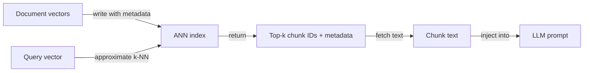
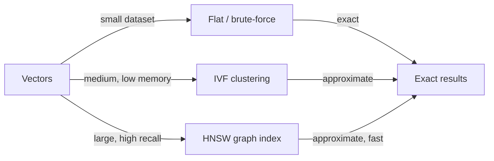

# Bases de données vectorielles

## Définition

Les bases de données vectorielles stockent des vecteurs de haute dimension ([embeddings](/docs/rag/embeddings)) et prennent en charge la recherche rapide par similarité en utilisant des algorithmes tels que le k-plus-proche-voisin (k-NN) et le voisin le plus proche approximatif (ANN). Elles constituent l'épine dorsale de la couche de récupération dans les systèmes [RAG](/docs/rag), permettant la recherche sémantique à l'échelle sur des millions de fragments de documents.

Elles se situent entre les [embeddings](/docs/rag/embeddings) (qui produisent les vecteurs) et le récupérateur [RAG](/docs/rag) (qui a besoin des k fragments les plus pertinents pour une requête donnée). Contrairement aux bases de données traditionnelles basées sur des mots-clés, les bases de données vectorielles mesurent la **distance sémantique** : « support client » peut correspondre à « bureau d'assistance » si le modèle d'embedding les place proches l'un de l'autre. La plupart des bases de données vectorielles prennent également en charge le filtrage de métadonnées — vous pouvez restreindre la récupération aux documents d'une certaine date, catégorie ou source.

Le choix de la bonne base de données vectorielle dépend de vos exigences : gérée vs. auto-hébergée, échelle (milliers vs. centaines de millions de vecteurs), capacités de filtrage des métadonnées, support de recherche hybride (dense + dispersée) et si vous avez besoin de multi-tenancy ou de contrôle d'accès. Voir [architecture RAG](/docs/rag/architecture) pour savoir comment l'index s'intègre dans la pipeline complète.

## Fonctionnement

### Indexation et interrogation



### Types d'index



Les documents sont [incorporés](/docs/rag/embeddings) et leurs vecteurs sont écrits dans un **index** (p. ex. HNSW, IVF ou plat pour les petits ensembles de données). Au moment de la requête, le **vecteur de requête** est comparé à l'index via **k-NN** (ou k-NN approximatif pour l'échelle) ; l'index renvoie les **top-k IDs** et éventuellement les métadonnées stockées. Vous récupérez ensuite les fragments correspondants et les transmettez au LLM. HNSW (Hierarchical Navigable Small World) est l'algorithme ANN le plus populaire — il offre un temps de requête sous-linéaire avec un rappel élevé. Les index plats sont exacts mais O(n) et ne conviennent qu'aux petits ensembles de données.

## Quand utiliser / Quand NE PAS utiliser

| Scénario | Utiliser une BD vectorielle | Ne pas utiliser une BD vectorielle |
|---|---|---|
| Recherche sémantique sur de grands corpus de documents | Oui — les index ANN gèrent l'échelle | Non — recherche par mots-clés si vous n'avez besoin que d'une correspondance exacte de phrase |
| RAG avec des millions de fragments | Oui — conçu spécifiquement pour l'échelle vectorielle | Non — les BD relationnelles avec pgvector peuvent suffire en dessous de ~1M vecteurs |
| Recherche hybride (sémantique + BM25) | Oui — Weaviate, Qdrant supportent le hybride nativement | Non — purement dense si vos requêtes sont toujours sémantiques |
| SaaS multi-tenant avec namespaces isolés | Oui — Pinecone et Weaviate supportent les namespaces | Non — FAISS auto-hébergé n'a pas de multi-tenancy |
| Développement offline, local | Oui — Chroma ou FAISS sans infra | Non — les BD cloud gérées ajoutent des coûts et une latence réseau pour le développement |

## Comparaisons

| Base de données | Hébergement | Échelle | Recherche hybride | Filtres de métadonnées | Meilleur pour |
|---|---|---|---|---|---|
| **Pinecone** | Cloud géré | Très grande (milliards) | Oui (dispersée + dense) | Oui | Production à grande échelle, sans gestion d'infra |
| **Chroma** | Auto-hébergé / embarqué | Petite–moyenne | Non (dense uniquement) | Oui | Développement local, prototypage, natif Python |
| **Weaviate** | Auto-hébergé ou cloud | Grande | Oui (BM25 + dense) | Oui | Production avec recherche hybride |
| **FAISS** | Auto-hébergé (bibliothèque) | Grande | Non | Non | Recherche, recherche par lots offline |
| **pgvector** | Extension PostgreSQL | Moyenne | Partiel (avec FTS) | Oui (SQL) | Équipes déjà sur Postgres |
| **Qdrant** | Auto-hébergé ou cloud | Grande | Oui | Oui | Faible latence, basé sur Rust, open-source |

## Avantages et inconvénients

| Avantages | Inconvénients |
|---|---|
| Temps de requête sous-linéaire avec les index ANN | ANN introduit un compromis de rappel vs. recherche exacte |
| Prend en charge la similarité sémantique out of the box | Le stockage vectoriel est coûteux à très haute dimensionnalité |
| Les filtres de métadonnées permettent de combiner des requêtes sémantiques + structurées | Les services gérés ajoutent des coûts cloud continus |
| Échelle horizontalement pour les grands corpus | Pas de compréhension native du texte — dépend de la qualité des embeddings |

## Exemples de code

```python
import chromadb
from openai import OpenAI

openai_client = OpenAI()
chroma_client = chromadb.Client()
collection = chroma_client.create_collection("my_docs")

# Helper: embed text
def embed(text: str) -> list[float]:
    return openai_client.embeddings.create(
        model="text-embedding-3-small",
        input=text,
    ).data[0].embedding

# Index documents
documents = [
    "Returns are accepted within 30 days of purchase.",
    "Shipping takes 3–5 business days.",
    "Contact support at support@example.com.",
]
collection.add(
    documents=documents,
    embeddings=[embed(d) for d in documents],
    ids=[f"doc_{i}" for i in range(len(documents))],
)

# Query
query = "What is the return window?"
results = collection.query(
    query_embeddings=[embed(query)],
    n_results=2,
)
for doc in results["documents"][0]:
    print(doc)
```

## Ressources pratiques

- [Chroma – Get started](https://docs.trychroma.com/getting-started) — Magasin vectoriel embarqué pour Python, idéal pour le développement local
- [Pinecone – Vector database docs](https://docs.pinecone.io/) — BD vectorielle cloud gérée avec options serverless et basées sur pods
- [Weaviate – Documentation](https://weaviate.io/developers/weaviate) — BD vectorielle open-source avec recherche hybride native
- [FAISS – GitHub](https://github.com/facebookresearch/faiss) — Bibliothèque Facebook AI Similarity Search pour l'indexation locale haute performance
- [pgvector – GitHub](https://github.com/pgvector/pgvector) — Extension de recherche de similarité vectorielle pour PostgreSQL

## Voir aussi

- [RAG](/docs/rag)
- [Embeddings](/docs/rag/embeddings)
- [Architecture RAG](/docs/rag/architecture)
- [Recherche sémantique](/docs/semantic-search)
