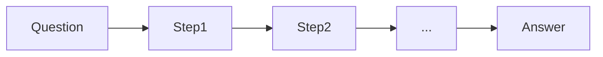

# Chaîne de pensée (CoT)

## Définition

Le prompting chain-of-thought (CoT) demande au modèle de produire des étapes de raisonnement intermédiaires before the final answer. This often improves accuracy on math, logic, and multi-step tasks.

C'est one of the simplest [raisonnement patterns](/docs/reasoning-patterns): pas d'outils ni de recherche, juste du prompting. Utilisez-le quand the task benefits from explicit steps (par ex. arithmetic, deduction) and you want to avoid [fine-tuning](/docs/llms/fine-tuning). For exploring multiple solution paths, see [tree of thoughts](/docs/reasoning-patterns/tot); for tool-using agents, see [ReAct](/docs/reasoning-patterns/react).

## Comment ça fonctionne

On donne au modèle une **question** (ou tâche) et on lui demande de raisonner étape par étape. Le modèle produit **Étape1**, **Étape2**, … (intermediate raisonnement) and then the **answer**. **Zero-shot CoT**: add “Let’s think étape par étape” (or similar) to the prompt. **Few-shot CoT**: include example (question, steps, answer) triples so the model mimics the format. The model generates the sequence in one pass; you can optionally parse the steps and verify or score them. Quality depends on [prompt engineering](/docs/prompt-engineering) and model capability.

## Cas d'utilisation

Chain-of-thought est plus utile quand la tâche bénéficie d'étapes intermédiaires explicites (mathématiques, logique, code).

- Math and arithmetic where intermediate steps improve accuracy
- Logic puzzles and multi-step deduction
- Code or conception raisonnement where showing steps aids debugging

## Documentation externe

- [Chain-of-Thought Prompting (Wei et al.)](https://arxiv.org/abs/2201.11903) — CoT paper
- [OpenAI – Prompt engineering](https://platform.openai.com/docs/guides/prompt-engineering) — Includes raisonnement and step-by-step guidance

## Voir aussi

- [Tree of thoughts](/docs/reasoning-patterns/tot)
- [Prompt engineering](/docs/prompt-engineering)
