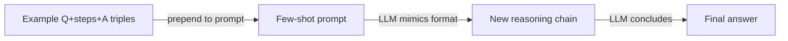

# Chaîne de pensée (CoT)

## Définition

Le prompting par chaîne de pensée (CoT) demande au modèle de produire des étapes de raisonnement intermédiaires avant la réponse finale. Cela améliore souvent la précision sur les tâches de mathématiques, de logique et à plusieurs étapes en forçant le modèle à rendre son raisonnement explicite plutôt que de sauter directement à une conclusion.

CoT fonctionne parce que les modèles de langage sont autoréggressifs : chaque token généré porte attention aux tokens précédents. En générant d'abord une chaîne d'étapes de raisonnement, le modèle conditionne essentiellement sa réponse finale sur un contexte plus structuré et élaboré — réduisant les erreurs causées par le saut d'étapes ou la formulation d'hypothèses implicites.

C'est l'un des [modèles de raisonnement](/docs/reasoning-patterns) les plus simples : pas d'outils ni de recherche, juste du prompting. Utilisez-le quand la tâche bénéficie d'étapes explicites (p. ex. arithmétique, déduction) et que vous voulez éviter le [fine-tuning](/docs/llms/fine-tuning). Pour explorer plusieurs chemins de solution, voir [arbre de pensées](/docs/reasoning-patterns/tot) ; pour les agents utilisant des outils, voir [ReAct](/docs/reasoning-patterns/react).

## Fonctionnement

### CoT sans exemple


### CoT avec exemples



On donne au modèle une **question** (ou tâche) et on lui demande de raisonner étape par étape. Le modèle produit **Étape 1**, **Étape 2**, … (raisonnement intermédiaire) puis la **réponse**. **CoT sans exemple** : ajouter « Réfléchissons étape par étape » (ou similaire) au prompt — pas d'exemples nécessaires. **CoT avec exemples** : inclure des triplets exemple (question, étapes, réponse) pour que le modèle imite le format. Le modèle génère la séquence complète en un seul passage ; vous pouvez optionnellement analyser les étapes et les vérifier ou les noter. La qualité dépend de l'[ingénierie de prompts](/docs/prompt-engineering) et de la capacité du modèle.

## Quand utiliser / Quand NE PAS utiliser

| Scénario | Utiliser CoT | Ne pas utiliser CoT |
|---|---|---|
| Arithmétique ou algèbre en plusieurs étapes | Oui — les étapes intermédiaires préviennent les erreurs de calcul | Non — les mathématiques simples à une étape n'en ont pas besoin |
| Déduction logique ou inférence | Oui — les étapes explicites rendent le raisonnement auditable | Non — les tâches de récupération de faits n'en bénéficient pas |
| Planification du code ou décisions de conception | Oui — écrire les étapes avant le code réduit les bugs | Non — générer du boilerplate depuis un modèle |
| Inférence à grand volume et faible latence | Non — les tokens supplémentaires augmentent le coût et la latence | Oui — éviter pour la classification ou l'extraction simple |
| Modèle avec un raisonnement intégré fort | Peut-être — les modèles plus récents raisonnent en interne (o1, o3) | Oui — forcer CoT explicite sur les modèles de réflexion ajoute de la redondance |

## Comparaisons

| Critère | CoT | Auto-cohérence | Prompting de recul |
|---|---|---|---|
| Idée centrale | Chaîne de raisonnement unique | Plusieurs chemins CoT + vote majoritaire | Question abstraite d'abord, puis réponse |
| Fiabilité | Modérée — un chemin peut errer | Élevée — le vote filtre les erreurs | Élevée — l'abstraction réduit la confusion |
| Coût (appels API) | 1 appel | N appels (typiquement 5–20) | 2 appels |
| Meilleur pour | Mathématiques, logique, tâches multi-étapes | Tâches avec des réponses vérifiables | Questions complexes avec beaucoup de connaissances |
| Combinabilité | Autonome ou comme bloc de construction | Construit sur CoT | Construit sur CoT |

## Avantages et inconvénients

| Avantages | Inconvénients |
|---|---|
| Simple à implémenter — juste de l'ingénierie de prompts | Augmente la longueur de sortie et le coût en tokens |
| Pas besoin de fine-tuning ou d'entraînement spécial | Le modèle peut générer des étapes plausibles mais incorrectes |
| Rend le raisonnement inspeciable et déboguable | N'aide pas avec les tâches qui nécessitent des informations externes |
| Fonctionne dans de nombreux domaines (mathématiques, logique, code) | Bénéfice moindre sur les petits modèles vs. les grands |

## Exemples de code

```python
from openai import OpenAI

client = OpenAI()

SYSTEM_PROMPT = (
    "You are a careful reasoning assistant. "
    "When solving problems, always show your reasoning step by step "
    "before giving the final answer."
)

def cot_query(question: str) -> str:
    response = client.chat.completions.create(
        model="gpt-4o-mini",
        messages=[
            {"role": "system", "content": SYSTEM_PROMPT},
            {"role": "user", "content": question},
        ],
    )
    return response.choices[0].message.content

# Few-shot example
FEW_SHOT = """
Q: Roger has 5 tennis balls. He buys 2 more cans of tennis balls. Each can has 3 balls. How many does he have?
A: Roger starts with 5 balls. He buys 2 cans × 3 balls = 6 balls. Total: 5 + 6 = 11 balls.

Q: {question}
A:"""

def few_shot_cot(question: str) -> str:
    response = client.chat.completions.create(
        model="gpt-4o-mini",
        messages=[{"role": "user", "content": FEW_SHOT.format(question=question)}],
    )
    return response.choices[0].message.content

print(cot_query("A store has 40 apples. They sell 15 and receive 3 new shipments of 10. How many are left?"))
```

## Ressources pratiques

- [Chain-of-Thought Prompting (Wei et al.)](https://arxiv.org/abs/2201.11903) — Article original introduisant le prompting CoT
- [OpenAI – Prompt engineering](https://platform.openai.com/docs/guides/prompt-engineering) — Inclut des conseils sur le raisonnement et le pas à pas
- [Self-consistency improves CoT (Wang et al.)](https://arxiv.org/abs/2203.11171) — Vote majoritaire sur plusieurs chemins CoT pour une plus grande fiabilité

## Voir aussi

- [Modèles de raisonnement](/docs/reasoning-patterns)
- [Arbre de pensées](/docs/reasoning-patterns/tot)
- [Ingénierie de prompts](/docs/prompt-engineering)
- [Auto-cohérence](/docs/prompt-engineering/self-consistency)
- [Prompting de recul](/docs/prompt-engineering/step-back-prompting)
