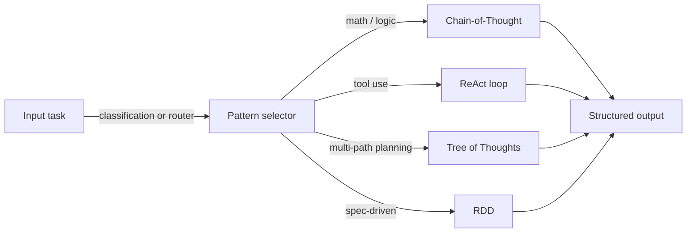
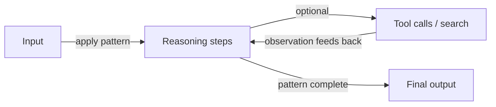

# Modèles de raisonnement

## Définition

Les modèles de raisonnement sont des moyens structurés d'éliciter ou d'organiser le raisonnement du modèle : chaîne de pensée (étape par étape), arbre de pensées (explorer les branches), ReAct (raisonner + agir) et RDD (récupération-décision-conception), entre autres. L'utilisation d'un modèle clair améliore la **fiabilité** (raisonnement plus cohérent) et la **capacité de débogage** (vous pouvez inspecter les étapes ou les actions).

Ils sont utilisés dans l'[ingénierie de prompts](/docs/prompt-engineering) (p. ex. CoT) et à l'intérieur des [agents](/docs/agents) (p. ex. ReAct, RDD). Sans modèle de raisonnement, les modèles ont tendance à produire des réponses plates et non structurées qui sautent des étapes — un modèle de raisonnement agit comme un échafaudage qui rend le processus de réflexion du modèle explicite, inspeciable et corrigeable. Les modèles peuvent aussi être combinés : CoT peut s'exécuter dans l'étape de pensée d'un agent ReAct, et ToT peut alimenter des candidats dans une boucle de décision RDD.

Le choix d'un modèle dépend de la complexité de la tâche, du calcul disponible et de la question de savoir si le système a accès à des outils ou des connaissances externes. CoT est le point de départ le moins coûteux ; ReAct ajoute l'utilisation d'outils ; ToT ajoute la recherche sur plusieurs chemins ; RDD ajoute la conformité basée sur les spécifications. La plupart des systèmes de production combinent au moins deux modèles.

## Fonctionnement

### Sélection du modèle



### Boucle de raisonnement générique



Vous fournissez un **input** (question, tâche) à un **modèle** : le modèle contraint la façon dont le modèle raisonne ou agit (p. ex. « pense étape par étape », ou boucles pensée–action–observation). Le modèle produit un **output** (réponse, séquence d'actions). Les prompts ou la conception du système encouragent le modèle à montrer le raisonnement ou à entrelacer pensée et action. Les modèles peuvent être combinés (p. ex. [CoT](/docs/reasoning-patterns/cot) dans une boucle d'[agent](/docs/agents)). Voir les pages liées pour les détails de chaque modèle.

## Quand utiliser / Quand NE PAS utiliser

| Scénario | Utiliser des modèles de raisonnement | Ne pas utiliser |
|---|---|---|
| Mathématiques, logique ou programmation en plusieurs étapes | Oui — CoT améliore significativement la précision | Non — le prompting en un seul essai échoue souvent sur le raisonnement complexe |
| Agents utilisant des outils | Oui — ReAct structure chaque action avec une pensée | Non — les appels directs aux outils sans raisonnement augmentent les erreurs |
| Planification sur de nombreuses branches de solution | Oui — ToT explore et note les alternatives | Non — CoT est moins cher si un chemin est généralement correct |
| Tâches nécessitant une conformité aux spécifications | Oui — RDD fait appliquer les spécifications récupérées | Non — génération libre pour les tâches créatives ouvertes |
| Recherches factuelles simples | Non — les modèles de raisonnement ajoutent un coût inutile | Oui — la récupération ou la recherche directe est plus rapide |

## Comparaisons

| Modèle | Mécanisme central | Coût | Meilleur type de tâche | Combinable avec |
|---|---|---|---|---|
| Chain-of-Thought (CoT) | Étapes de raisonnement séquentielles | Faible (1 appel) | Mathématiques, logique, déduction | ReAct, ToT, RDD |
| Tree of Thoughts (ToT) | Bifurquer, noter, développer | Élevé (N appels) | Planification, recherche, créatif | CoT par branche |
| ReAct | Boucle pensée–action–observation | Moyen (1 appel + outils) | Agents avec outils | CoT, RDD |
| RDD | Récupérer spec → décider → générer → valider | Moyen–élevé | Conformité, gen. basée sur spec | ReAct, RAG |

## Avantages et inconvénients

| Avantages | Inconvénients |
|---|---|
| Rend le raisonnement du modèle explicite et inspeciable | Ajoute des tokens (coût et latence) |
| Améliore significativement la précision sur les tâches structurées | Le mauvais modèle de raisonnement pour la tâche peut nuire à la qualité |
| Permet le débogage en inspectant les étapes intermédiaires | Tous les modèles ne suivent pas les patterns de manière fiable |
| Composable — les patterns peuvent être imbriqués ou combinés | Les combinaisons complexes augmentent l'effort d'ingénierie de prompts |

## Exemples de code

```python
from openai import OpenAI

client = OpenAI()

def chain_of_thought(question: str) -> str:
    """Zero-shot CoT: append 'Let's think step by step' to elicit reasoning."""
    response = client.chat.completions.create(
        model="gpt-4o-mini",
        messages=[
            {
                "role": "user",
                "content": f"{question}\n\nLet's think step by step.",
            }
        ],
    )
    return response.choices[0].message.content

answer = chain_of_thought("If a train travels 60 km/h for 2.5 hours, how far does it go?")
print(answer)
```

## Ressources pratiques

- [Chain-of-Thought Prompting (Wei et al.)](https://arxiv.org/abs/2201.11903) — Article CoT original établissant le raisonnement étape par étape
- [ReAct: Synergizing Reasoning and Acting (Yao et al.)](https://arxiv.org/abs/2210.03629) — Article ReAct introduisant les boucles pensée–action–observation
- [Tree of Thoughts (Yao et al.)](https://arxiv.org/abs/2305.10601) — Article ToT sur le raisonnement multi-chemin et la recherche
- [Anthropic – Prompt engineering overview](https://docs.anthropic.com/en/docs/build-with-claude/prompt-engineering/overview) — Guide pratique sur CoT et le raisonnement structuré

## Voir aussi

- [Chain-of-thought](/docs/reasoning-patterns/cot)
- [Tree of thoughts](/docs/reasoning-patterns/tot)
- [ReAct](/docs/reasoning-patterns/react)
- [RDD](/docs/reasoning-patterns/rdd)
