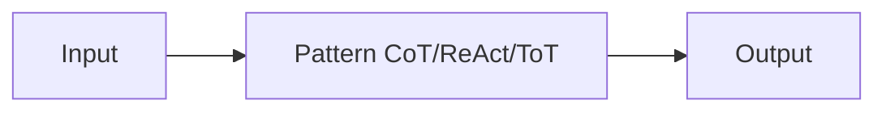

# Modèles de raisonnement

## Définition

Les patterns de raisonnement sont des moyens structurés pour susciter ou organiser le raisonnement du modèle: chain-of-thought (step-by-step), tree-of-thoughts (explore branches), ReAct (reason + act), and RDD (récupération-décision-conception), among others. Using a clear pattern improves **reliability** (more consistent raisonnement) and **debuggability** (you can inspect steps or actions).

Ils sont used in [prompt engineering](/docs/llms/prompt-engineering) (par ex. CoT) and inside [agents](/docs/agents) (par ex. ReAct, RDD). Choosing a pattern depends on the task: CoT for math/raisonnement, ReAct for tool use, ToT for search/planning, RDD for spec compliance.

## Comment ça fonctionne

You feed **input** (question, task) into a **pattern**: the pattern constrains how the model reasons or acts (par ex. “think étape par étape”, or thought–action–observation loops). The model produces an **output** (answer, action sequence). Prompts or system conception encourage the model to show raisonnement (par ex. “Think étape par étape”) or to interleave thought and action. Patterns can be combined (par ex. [CoT](/docs/reasoning-patterns/cot) inside an [agent](/docs/agents) loop). See the linked pages for each pattern’s details.

## Cas d'utilisation

Different patterns suit different needs: CoT for stepwise raisonnement, ReAct for tool use, ToT for search and planning.

- CoT: math, logic, and multi-step raisonnement tasks
- ReAct: tool-using agents that reason before each action
- ToT: search and planning over multiple solution branches

## Documentation externe

- [Chain-of-Thought Prompting (Wei et al.)](https://arxiv.org/abs/2201.11903) — CoT paper
- [ReAct: Synergizing Reasoning and Acting (Yao et al.)](https://arxiv.org/abs/2210.03629) — ReAct paper
- [Tree of Thoughts (Yao et al.)](https://arxiv.org/abs/2305.10601) — ToT paper

## Voir aussi

- [Chain-of-thought](/docs/reasoning-patterns/cot)
- [Tree of thoughts](/docs/reasoning-patterns/tot)
- [ReAct](/docs/reasoning-patterns/react)
- [RDD](/docs/reasoning-patterns/rdd)
