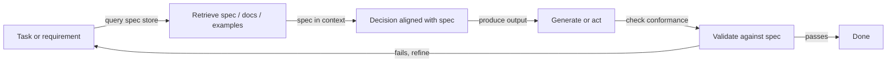
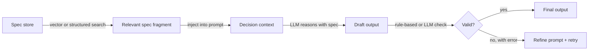

# Récupération-décision-conception (RDD)

## Définition

**RDD (récupération-décision-conception)** est un modèle de raisonnement qui unit la **récupération** (obtention de spécifications, documents ou exemples pertinents), la **décision** (prise de décisions alignées sur des spécifications ou politiques) et la **conception** (production de sorties qui satisfont des exigences). Il est souvent utilisé dans le développement piloté par spécifications : le comportement est guidé par des spécifications explicites récupérées et appliquées pendant la génération.

Contrairement à [CoT](/docs/reasoning-patterns/cot), qui génère du raisonnement à partir de la connaissance interne du modèle, ou à [ReAct](/docs/reasoning-patterns/react), qui entrelace le raisonnement avec des appels d'outils arbitraires, RDD contraint chaque décision par rapport à une source de vérité récupérée. Cela le rend particulièrement adapté aux domaines réglementés (juridique, conformité, sécurité) ou aux flux de travail d'ingénierie où le code ou les configurations doivent se conformer aux spécifications documentées.

RDD peut être implémenté comme un pipeline en une seule étape (récupérer → décider → générer → valider) ou comme une boucle dans un [agent](/docs/agents), où la validation échouée déclenche une nouvelle récupération et un raffinement. Le modèle est composable : l'étape de récupération de RDD peut être alimentée par un pipeline [RAG](/docs/rag), et sa boucle d'agent peut utiliser [ReAct](/docs/reasoning-patterns/react) pour le raisonnement au niveau des étapes.

## Fonctionnement

### Cycle RDD



### Étapes en détail



1. **Récupération :** Étant donné la tâche actuelle, récupérer les fragments de spécification pertinents, les exemples ou les contraintes (p. ex. depuis un magasin vectoriel ou des spécifications structurées).
2. **Décision :** Utiliser le contexte récupéré pour décider des prochaines étapes, des actions autorisées ou du format de sortie — la spécification est toujours en contexte pendant le raisonnement.
3. **Conception :** Générer ou exécuter en accord avec la spécification ; valider optionnellement les sorties contre la spécification avant de retourner.

Cela peut être implémenté dans une boucle d'[agent](/docs/agents) : récupérer la spécification → raisonner avec la spécification en contexte → agir ou générer → valider → répéter. La validation échouée déclenche une nouvelle récupération (possiblement avec une requête différente) ou un raffinement du prompt.

## Quand utiliser / Quand NE PAS utiliser

| Scénario | Utiliser RDD | Ne pas utiliser RDD |
|---|---|---|
| Générer du code qui doit se conformer à une spécification d'API | Oui — récupérer la spec, générer, valider | Non — codage libre sans contraintes formelles |
| Génération de documents pilotée par la conformité | Oui — récupérer la politique, générer une sortie alignée | Non — écriture créative sans règles strictes |
| Agents opérant dans des domaines réglementés (juridique, sécurité) | Oui — chaque décision est ancrée dans la politique récupérée | Non — Q&A informel sans exigences de conformité |
| Ingénierie avec des documents de conception versionnés | Oui — les specs changent ; RDD récupère toujours la plus récente | Non — CRUD simple sans spécification formelle |
| Inférence en temps réel avec des budgets de latence serrés | Non — la récupération + validation ajoute de la latence | Oui — la génération directe est plus rapide pour les tâches sans contraintes |

## Comparaisons

| Modèle | Utilise des connaissances récupérées | Valide la sortie | Piloté par spec | Meilleur pour |
|---|---|---|---|---|
| CoT | Non (connaissance interne du modèle) | Non | Non | Mathématiques, logique |
| ReAct | Via appels d'outils | Non | Non | Agents à usage général avec outils |
| RAG | Oui (documents) | Non | Non | Q&A de connaissances |
| RDD | Oui (specs et documents) | Oui | Oui | Conformité, génération pilotée par spec |

## Avantages et inconvénients

| Avantages | Inconvénients |
|---|---|
| Les sorties s'alignent sur les specs explicitement récupérées | Nécessite un magasin de specs bien maintenu et interrogeable |
| Réduit la dérive et le comportement ad-hoc | La récupération supplémentaire et la validation augmentent les coûts et la latence |
| Piste d'audit : les fragments de spec sont traçables dans la sortie | Les lacunes dans la couverture des specs conduisent à des décisions insuffisamment contraintes |
| Composable avec RAG et ReAct | La conception et la maintenance des specs constituent une charge de travail continue |
| S'adapte aux flux réglementés ou critiques pour la sécurité | La logique de validation doit être maintenue synchronisée avec les mises à jour des specs |

## Exemples de code

```python
from openai import OpenAI
from langchain_community.vectorstores import Chroma
from langchain_openai import OpenAIEmbeddings

client = OpenAI()
# Assume a Chroma vector store pre-loaded with spec fragments
spec_store = Chroma(
    collection_name="api_spec",
    embedding_function=OpenAIEmbeddings(),
)

def rdd_generate(task: str) -> str:
    # 1. Retrieve relevant spec fragments
    spec_docs = spec_store.similarity_search(task, k=3)
    spec_context = "\n\n".join(d.page_content for d in spec_docs)

    # 2. Decision + Design: generate with spec in context
    prompt = (
        f"You must follow the specifications below exactly.\n\n"
        f"SPECIFICATIONS:\n{spec_context}\n\n"
        f"TASK: {task}\n\n"
        f"Generate an output that strictly complies with the specifications."
    )
    response = client.chat.completions.create(
        model="gpt-4o-mini",
        messages=[{"role": "user", "content": prompt}],
    )
    draft = response.choices[0].message.content

    # 3. Validate (simple: ask model to check conformance)
    validation_prompt = (
        f"Check if the following output complies with the spec. "
        f"Reply with PASS or FAIL and a brief reason.\n\n"
        f"SPEC:\n{spec_context}\n\nOUTPUT:\n{draft}"
    )
    validation = client.chat.completions.create(
        model="gpt-4o-mini",
        messages=[{"role": "user", "content": validation_prompt}],
    ).choices[0].message.content

    if "FAIL" in validation.upper():
        return f"[Validation failed: {validation}]\nDraft:\n{draft}"
    return draft

result = rdd_generate("Generate a JSON API request to create a new user.")
print(result)
```

## Ressources pratiques

- [RAG paper (Lewis et al.)](https://arxiv.org/abs/2005.11401) — Composant de récupération utilisé comme base pour l'étape de récupération de specs de RDD
- [LangChain – Agents and tools](https://python.langchain.com/docs/concepts/agents/) — Modèles d'orchestration pour construire des boucles de type RDD
- [Constitutional AI (Anthropic)](https://arxiv.org/abs/2212.08073) — Idée connexe : utiliser des principes récupérés pour guider et valider les sorties du modèle

## Voir aussi

- [Développement piloté par spécifications](/docs/spec-driven-development)
- [RAG](/docs/rag)
- [Agents](/docs/agents)
- [ReAct](/docs/reasoning-patterns/react)
