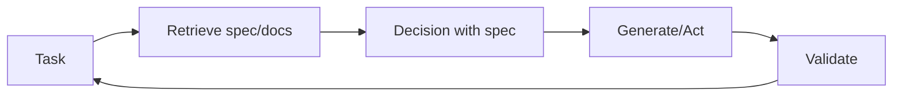

# Récupération-décision-conception (RDD)

## Définition

**RDD (récupération-décision-conception)** est un schéma de raisonnement qui relie **récupération** (fetching relevant specs, docs, or examples), **décision** (making choices aligned with specs or policies), and **conception** (producing outputs that satisfy requirements). C'est often used in spec-driven development: behavior is guided by explicit specifications that are retrieved and enforced during generation.

## Comment ça fonctionne

1. **Retrieval:** Given the current task, retrieve relevant specification fragments, examples, or constraints (par ex. from a vector store or structured specs).
2. **Decision:** Use the retrieved context to decide next steps, allowed actions, or output format.
3. **Conception :** Générer ou exécuter conformément à la spécification ; optionnellement valider les sorties par rapport à la spécification.

Cela peut être implémenté dans une boucle d'[agent](/docs/agents) : récupérer la spécification → raisonner avec la spécification en contexte → agir ou générer → validate → repeat. The diagram below shows the cycle: **task** triggers **retrieve**; retrieved spec feeds **décision**; **generate/act** produces output; **validate** checks against the spec and can loop back to the task (par ex. retry or refine).

## Cas d'utilisation

RDD is a fit when outputs must align with retrievable specs (compliance, policy, or documented requirements).

- Spec-driven agents that retrieve requirements and validate outputs
- Compliance and policy-aware generation (par ex. legal, safety)
- Code or config generation aligned with documented specs

## Avantages et inconvénients

| Pros | Cons |
|------|------|
| Outputs align with specs | Requires good spec coverage and récupération |
| Reduces drift and ad-hoc behavior | Extra récupération and validation cost |
| Fits regulated or safety-critical flows | Spec conception and maintenance overhead |

## Documentation externe

- [RAG paper (Lewis et al.)](https://arxiv.org/abs/2005.11401) — Retrieval component used in RDD
- [LangChain – Agents and tools](https://python.langchain.com/docs/concepts/agents/) — Orchestration patterns

## Voir aussi

- [Spec-driven development](/docs/spec-driven-development)
- [RAG](/docs/rag)
- [Agents](/docs/agents)
- [ReAct](/docs/reasoning-patterns/react)
