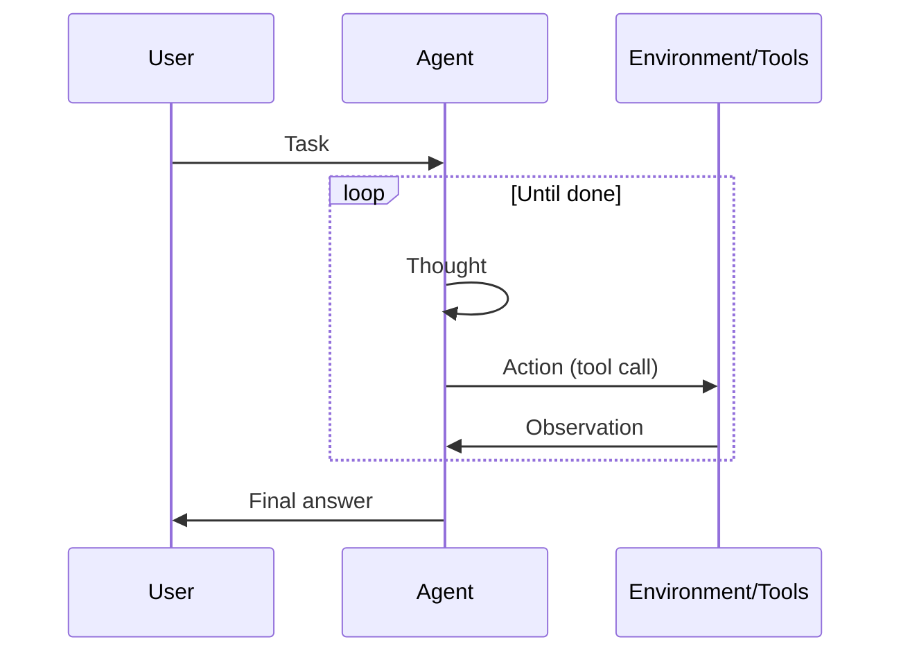

# ReAct (Reasoning + Acting)

## Définition

ReAct est un paradigme où le modèle alterne **raisonnement** (quoi faire ensuite, pourquoi) et **action** (appels d'outils). L'observation de l'environnement feeds back into the next raisonnement step, forming a loop until the task is done.

C'est the standard pattern for [agents](/docs/agents) that use tools: each action is preceded by a thought, which reduces blind or repetitive tool use. Often combined with [chain-of-thought](/docs/reasoning-patterns/cot) (raisonnement inside the thought) and with [RDD](/docs/reasoning-patterns/rdd) when specs guide décisions.

## Comment ça fonctionne

Format du prompt : **Pensée → Action → Observation → Pensée → … → Réponse Finale**. L'**utilisateur** donne une **tâche** ; l'**agent** produces a **thought** (raisonnement about what to do), then an **action** (par ex. tool call). The **environment/tools** return an **observation**, which is appended to the context for the next thought. The loop continues until the agent outputs a final answer. The model decides when to call tools and when to conclude, which reduces arbitrary or repetitive actions. The sequence diagram below summarizes this flow; frameworks like LangChain implement ReAct-style agents with tool registration and message handling.

## Cas d'utilisation

ReAct fits agent workflows where each tool call should be preceded by a clear raisonnement step.

- Agents that use tools (search, calculator, API) with explicit raisonnement
- Reducing arbitrary or repetitive appels d'outils by interleaving thought
- Debuggable agent behavior via visible thought–action–observation traces

## Documentation externe

- [ReAct: Synergizing Reasoning and Acting in LLMs (Yao et al.)](https://arxiv.org/abs/2210.03629) — Original ReAct paper
- [LangChain – ReAct agent](https://python.langchain.com/docs/concepts/agents/) — ReAct-style agents in LangChain

## Voir aussi

- [Agents](/docs/agents)
- [Chain-of-thought](/docs/reasoning-patterns/cot)
- [RDD](/docs/reasoning-patterns/rdd)
