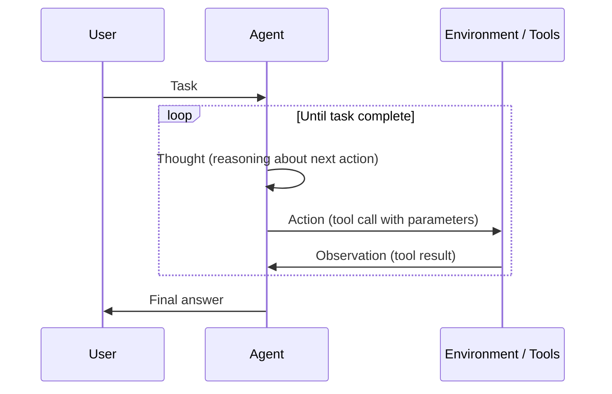
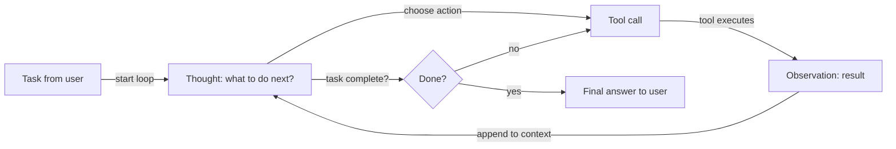

# ReAct (Reasoning + Acting)

## Définition

ReAct est un paradigme où le modèle alterne **raisonnement** (quoi faire ensuite, pourquoi) et **action** (appels d'outils). L'observation de l'environnement est renvoyée dans l'étape de raisonnement suivante, formant une boucle jusqu'à ce que la tâche soit terminée. Cet entrelacement réduit les erreurs causées par une utilisation aveugle ou répétitive des outils, car chaque action est précédée d'une justification explicite.

La contribution centrale de l'article ReAct est de montrer que la combinaison de traces de raisonnement et d'étapes d'action dans un seul appel au LLM surpasse chacun séparément : le raisonnement pur (CoT) manque d'ancrage factuel, et l'action pure (appel d'outil sans réflexion) est sujette aux erreurs et difficile à déboguer. En rendant les pensées visibles, ReAct produit également des traces d'agent interprétables que les humains peuvent inspecter et corriger.

C'est le modèle standard pour les [agents](/docs/agents) qui utilisent des outils. Souvent combiné avec le [chain-of-thought](/docs/reasoning-patterns/cot) (raisonnement à l'intérieur de l'étape de réflexion) et avec [RDD](/docs/reasoning-patterns/rdd) quand des spécifications récupérées doivent guider chaque décision.

## Comment ça fonctionne

### Boucle pensée–action–observation



### Flux de décision de l'agent



Le format du prompt est **Pensée → Action → Observation → Pensée → … → Réponse Finale**. L'**utilisateur** donne une **tâche** ; l'**agent** produit une **pensée** (raisonnement sur ce qu'il faut faire), puis une **action** (p. ex., appel d'outil). L'**environnement/les outils** retournent une **observation**, qui est ajoutée au contexte pour la pensée suivante. Le modèle décide quand appeler des outils et quand conclure. Des frameworks comme LangChain et LlamaIndex implémentent des agents de style ReAct avec enregistrement des outils et gestion des messages.

## Quand utiliser / Quand NE PAS utiliser

| Scénario | Utiliser ReAct | Ne pas utiliser ReAct |
|---|---|---|
| Agent utilisant plusieurs outils (recherche, calculatrice, API) | Oui — la réflexion avant l'action réduit les mauvais usages d'outils | Non — si un seul outil est nécessaire, un simple appel de fonction suffit |
| Comportement d'agent déboguable requis | Oui — les traces de réflexion sont inspectables et enregistrables | Non — pour les pipelines boîte noire où les traces ne sont pas nécessaires |
| Recherche multi-étapes avec contexte évolutif | Oui — chaque observation informe la prochaine réflexion | Non — la récupération et la génération en une seule fois sont plus rapides et moins chères |
| Tâches à haute fiabilité (p. ex., exécution de code) | Oui — raisonner avant d'agir capture les erreurs probables | Non — pour les tâches CRUD simples sans ambiguïté |
| Exigences de très faible latence | Non — la génération de réflexions ajoute des tokens par étape | Oui — l'appel de fonction direct est plus rapide quand le raisonnement est inutile |

## Comparaisons

| Modèle | A une réflexion explicite | A l'utilisation d'outils | Boucle | Meilleur pour |
|---|---|---|---|---|
| CoT | Oui | Non | Non | Tâches de raisonnement statique |
| ReAct | Oui | Oui | Oui | Agents utilisant des outils |
| Appel de fonction (sans réflexion) | Non | Oui | Non | Invocations d'outils simples et déterministes |
| RDD | Oui (guidé par spécification) | Oui | Oui | Agents de conformité et orientés spécification |

## Avantages et inconvénients

| Avantages | Inconvénients |
|---|---|
| Réduit les appels d'outils aveugles ou répétitifs | Tokens supplémentaires par étape (surcoût de réflexion) |
| Produit des traces interprétables et déboguables | La boucle peut trop durer si les critères d'arrêt sont faibles |
| Fonctionne bien avec LangChain/LlamaIndex nativement | Nécessite des schémas d'outils bien définis et une gestion des erreurs |
| Gère naturellement les tâches multi-étapes | La qualité de la réflexion dépend du modèle sous-jacent |

## Exemples de code

```python
from langchain_openai import ChatOpenAI
from langchain.agents import create_react_agent, AgentExecutor
from langchain_community.tools import DuckDuckGoSearchRun
from langchain import hub

# Load a pre-built ReAct prompt template
prompt = hub.pull("hwchase17/react")

# Define tools
tools = [DuckDuckGoSearchRun()]

# Create ReAct agent
llm = ChatOpenAI(model="gpt-4o-mini", temperature=0)
agent = create_react_agent(llm=llm, tools=tools, prompt=prompt)
executor = AgentExecutor(agent=agent, tools=tools, verbose=True, max_iterations=5)

# Run — the agent will produce Thought/Action/Observation traces
result = executor.invoke({"input": "What is the current population of Tokyo?"})
print(result["output"])
```

## Ressources pratiques

- [ReAct: Synergizing Reasoning and Acting in LLMs (Yao et al.)](https://arxiv.org/abs/2210.03629) — Article original ReAct avec benchmarks sur HotpotQA, Fever et ALFWorld
- [LangChain – ReAct agent](https://python.langchain.com/docs/concepts/agents/) — Agents de style ReAct avec enregistrement des outils dans LangChain
- [Anthropic – Tool use guide](https://docs.anthropic.com/en/docs/build-with-claude/tool-use) — Utilisation native des outils de Claude, suivant les modèles pensée-action de style ReAct

## Voir aussi

- [Agents](/docs/agents)
- [Modèles de raisonnement](/docs/reasoning-patterns)
- [Chain-of-thought](/docs/reasoning-patterns/cot)
- [RDD](/docs/reasoning-patterns/rdd)
