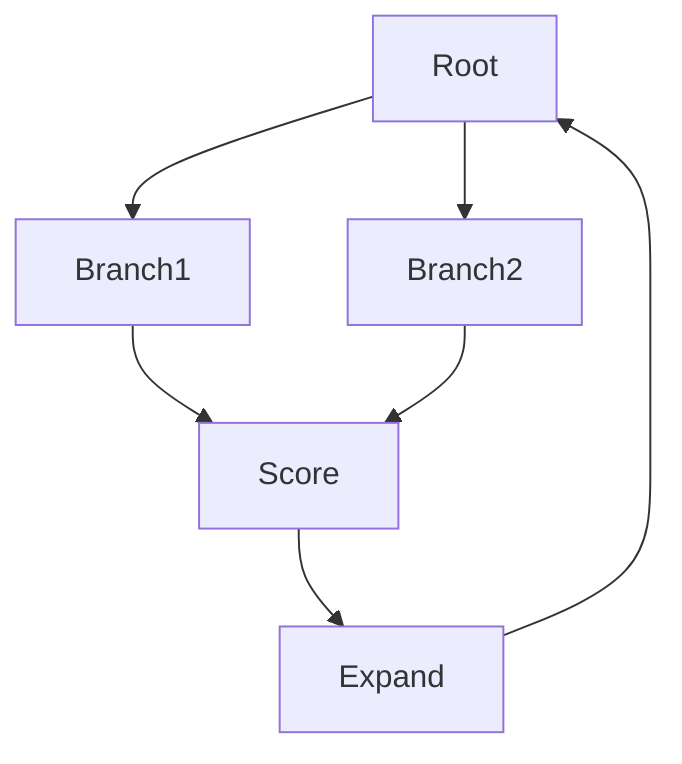

# Tree of thoughts (ToT)

## Définition

Tree of thoughts extends CoT by maintaining multiple raisonnement branches. At each step, the model generates several continuations; a heuristic (or another model) scores them and guides search (par ex. best-first, beam).

Utilisez-le quand a single [chain-of-thought](/docs/reasoning-patterns/cot) path might get stuck (par ex. game moves, multi-step planning) and you can afford multiple LLM calls. It trades compute for better search over the space of solutions. See [raisonnement patterns](/docs/reasoning-patterns) for the full set of options.

## Comment ça fonctionne

Start from a **root** (par ex. the question or initial state). **Branch**: at each step, generate several continuations (par ex. next raisonnement steps or moves). **Score** each branch with a heuristic or a separate model (par ex. “how promising is this partial solution?”). **Expand** the best node(s) and repeat; prune low-scoring branches to limit cost. Search strategy (best-first, beam, BFS) and branching factor control exploration vs compute. The tree is built incrementally until a solution is found or a depth/budget limit is reached.

## Cas d'utilisation

Tree-of-thoughts is useful when you want to explore and score multiple solution paths instead of a single chain.

- Game playing and planning where multiple moves need evaluation
- Math or logic with several solution paths to explore
- Creative or conception tasks where generating and scoring options helps

## Documentation externe

- [Tree of Thoughts (Yao et al.)](https://arxiv.org/abs/2305.10601) — ToT paper
- [LangChain – Tree of thoughts](https://python.langchain.com/docs/concepts/agents/) — ToT and related patterns

## Voir aussi

- [Chain-of-thought](/docs/reasoning-patterns/cot)
- [Reasoning patterns](/docs/reasoning-patterns)
