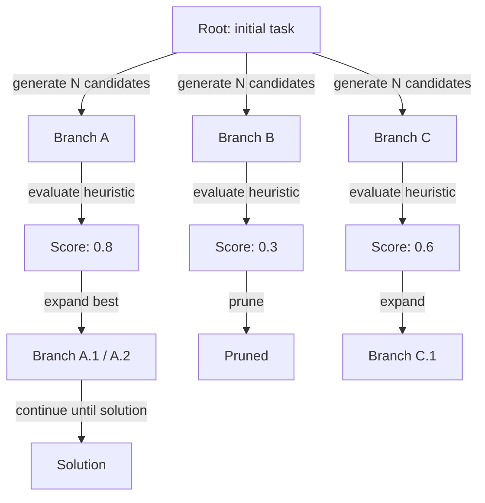
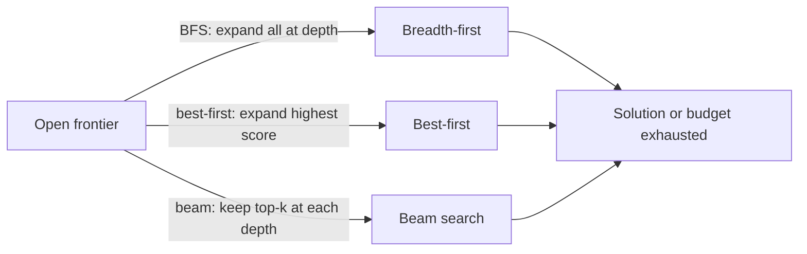

# Tree of thoughts (ToT)

## Définition

Tree of Thoughts (ToT) étend CoT en maintenant simultanément plusieurs branches de raisonnement. À chaque étape, le modèle génère plusieurs continuations candidates ; une heuristique ou un modèle d'évaluation séparé les note, et un algorithme de recherche (meilleur d'abord, recherche en faisceau ou BFS) décide quelles branches développer davantage.

L'idée clé est que les problèmes difficiles — planification, jeu, preuves complexes — peuvent nécessiter un retour en arrière ou l'exploration d'alternatives avant de s'engager. Un seul chemin de [chain-of-thought](/docs/reasoning-patterns/cot) n'a pas de mécanisme pour récupérer d'une mauvaise étape intermédiaire ; ToT maintient explicitement une frontière de branches prometteuses et élague les non prometteuses, similaire aux algorithmes classiques de recherche arborescente (MCTS, A*) appliqués à la génération de langage.

Utilisez-le quand un seul chemin de [chain-of-thought](/docs/reasoning-patterns/cot) pourrait se bloquer (p. ex., coups de jeu, planification multi-étapes) et que vous pouvez vous permettre plusieurs appels au LLM. Il échange du calcul contre une meilleure recherche dans l'espace des solutions. Consultez les [modèles de raisonnement](/docs/reasoning-patterns) pour l'ensemble complet des options.

## Comment ça fonctionne

### Expansion et élagage de l'arbre



### Stratégies de recherche



Partir d'une **racine** (p. ex., la question ou l'état initial). **Ramifier** : à chaque étape, générer plusieurs continuations (p. ex., prochaines étapes de raisonnement ou coups). **Noter** chaque branche avec une heuristique ou un appel de modèle séparé (p. ex., « Quelle est la promesse de cette solution partielle sur une échelle de 1 à 10 ? »). **Développer** le ou les meilleurs nœuds et répéter ; élaguer les branches à faible score pour limiter le coût. L'arbre est construit de façon incrémentale jusqu'à ce qu'une solution soit trouvée ou qu'une limite de profondeur/budget soit atteinte. Le facteur de ramification et la profondeur maximale sont des hyperparamètres clés contrôlant le compromis coût/qualité.

## Quand utiliser / Quand NE PAS utiliser

| Scénario | Utiliser ToT | Ne pas utiliser ToT |
|---|---|---|
| Jeu ou résolution d'énigmes avec de nombreux coups | Oui — explorer les branches est essentiel | Non — CoT suffit pour les énigmes à chemin unique |
| Planification multi-étapes complexe avec retour en arrière | Oui — ToT peut se remettre des impasses | Non — les tâches plus simples n'ont pas besoin de retour en arrière |
| Génération créative avec de nombreuses options valides | Oui — générer et noter plusieurs ébauches | Non — la sortie créative unique n'en a pas besoin |
| Inférence de production à volume élevé | Non — plusieurs appels au LLM sont coûteux | Oui — utiliser CoT ou prompting direct à la place |
| Contraintes de temps réel strictes | Non — la latence de ToT est élevée | Oui — non adapté aux réponses inférieures à la seconde |

## Comparaisons

| Approche | Chemins explorés | Notation | Coût | Meilleur pour |
|---|---|---|---|---|
| CoT | 1 | Aucune | Faible (1 appel) | Tâches linéaires multi-étapes |
| Auto-cohérence | N (parallèle) | Vote majoritaire | Moyen (N appels) | Tâches avec réponses vérifiables |
| ToT | N (séquentiel, élagué) | Heuristique / modèle | Élevé (N+ appels) | Planification, recherche, créativité |
| MCTS (classique) | N (simulation) | Signal de récompense | Très élevé | IA de jeux avec récompense claire |

## Avantages et inconvénients

| Avantages | Inconvénients |
|---|---|
| Explore et se remet des impasses | Coût très élevé en tokens et API |
| Produit des solutions de meilleure qualité sur des tâches difficiles | Nécessite une bonne fonction de notation/évaluation |
| Reflète la recherche classique — rigoureuse et adaptable | Complexe à implémenter par rapport à CoT |
| Le facteur de ramification est ajustable pour le compromis coût/qualité | Toutes les tâches ne bénéficient pas de la recherche multi-chemins |

## Exemples de code

```python
from openai import OpenAI

client = OpenAI()

def generate_thoughts(state: str, n: int = 3) -> list[str]:
    """Generate N candidate next steps from the current state."""
    response = client.chat.completions.create(
        model="gpt-4o-mini",
        messages=[
            {
                "role": "user",
                "content": (
                    f"Current reasoning state:\n{state}\n\n"
                    f"Generate {n} distinct possible next reasoning steps. "
                    "Number each one."
                ),
            }
        ],
    )
    raw = response.choices[0].message.content
    # Simple parse: split on numbered lines
    return [line.strip() for line in raw.split("\n") if line.strip() and line[0].isdigit()]

def score_thought(state: str, thought: str) -> float:
    """Score a thought's promise on a 0-1 scale."""
    response = client.chat.completions.create(
        model="gpt-4o-mini",
        messages=[
            {
                "role": "user",
                "content": (
                    f"Rate how promising this reasoning step is for solving the task "
                    f"(0 = dead end, 1 = very promising).\n\n"
                    f"State: {state}\nThought: {thought}\n\nScore (0.0–1.0):"
                ),
            }
        ],
    )
    try:
        return float(response.choices[0].message.content.strip())
    except ValueError:
        return 0.5

# Simple best-first ToT (depth 2, branching factor 3)
task = "Plan 3 steps to build a minimal RAG chatbot."
candidates = generate_thoughts(task, n=3)
scored = [(thought, score_thought(task, thought)) for thought in candidates]
best = max(scored, key=lambda x: x[1])
print("Best next step:", best[0])
```

## Ressources pratiques

- [Tree of Thoughts (Yao et al.)](https://arxiv.org/abs/2305.10601) — Article original ToT avec benchmarks game-of-24 et écriture créative
- [LangChain – Agents and planning](https://python.langchain.com/docs/concepts/agents/) — ToT et modèles de planification associés
- [Princeton NLP – ToT repository](https://github.com/princeton-nlp/tree-of-thought-llm) — Implémentation de référence des auteurs de l'article

## Voir aussi

- [Chain-of-thought](/docs/reasoning-patterns/cot)
- [Modèles de raisonnement](/docs/reasoning-patterns)
- [Agents](/docs/agents)
