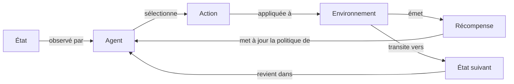

# Reinforcement learning (RL)

## Définition

Le reinforcement learning (RL) est un paradigme d'apprentissage automatique où un agent apprend à prendre des décisions en interagissant avec un environnement et en recevant des retours sous forme de récompenses ou de pénalités. Contrairement à l'apprentissage supervisé, il n'y a pas de paires entrée-sortie étiquetées ; l'agent doit découvrir quelles actions génèrent la plus grande récompense cumulative par essai et erreur. L'objectif principal est de trouver une **politique** — un mapping d'états vers des actions — qui maximise la récompense à long terme.

Le cadre mathématique sous-tendant la plupart des problèmes RL est le **processus de décision markovien (MDP)** : un tuple d'états, d'actions, de probabilités de transition et de récompenses. À chaque pas de temps, l'agent observe l'état actuel, sélectionne une action, et transite vers un nouvel état tout en recevant un signal de récompense. Parce que le retour est épars et différé (une récompense peut arriver longtemps après l'action responsable), l'agent doit raisonner sur l'**attribution de crédit** dans le temps.

Le RL diffère fondamentalement de l'apprentissage [supervisé](/docs/fundamentals/machine-learning) et [non supervisé](/docs/fundamentals/machine-learning) parce que les actions de l'agent influencent les observations futures, nécessitant des stratégies d'exploration (par ex. epsilon-greedy, bonus d'entropie) pour découvrir de meilleures politiques. Il est appliqué dans les jeux, la robotique, l'ordonnancement et l'alignement des [LLM](/docs/llms) via RLHF. Quand les espaces d'état ou d'action deviennent à haute dimensionnalité, le [deep RL](/docs/drl) utilise des réseaux de neurones pour l'approximation de fonctions.

## Comment ça fonctionne

### La boucle MDP

À chaque étape, l'**agent** observe un **état**, sélectionne une **action**, et l'**environnement** retourne une **récompense** et l'**état suivant**. Ce cycle se répète jusqu'à la terminaison ou la convergence.



### Méthodes basées sur la valeur

Des méthodes comme Q-learning et DQN apprennent une **fonction de valeur** Q(s, a) — la récompense cumulative espérée en prenant l'action *a* dans l'état *s* — et dérivent la politique en agissant de façon greedy par rapport à Q. L'équation de Bellman est utilisée pour mettre à jour itérativement les estimations Q en utilisant les transitions observées.

### Méthodes de gradient de politique

Des algorithmes comme PPO et SAC paramétrisent et optimisent directement la politique en utilisant la montée de gradient sur le retour espéré. Ils gèrent les espaces d'action continus naturellement et sont préférés en robotique et dans l'affinement des LLM (RLHF). Les méthodes acteur-critique (par ex. A3C, SAC) combinent une fonction de valeur (critique) avec une politique directe (acteur) pour réduire la variance.

### Exploration

Parce que les récompenses ne sont observées que pour les actions effectivement prises, l'agent doit **explorer** : visiter des états qu'il n'a pas vus pour découvrir des politiques potentiellement meilleures. Les stratégies courantes incluent epsilon-greedy (action aléatoire avec probabilité ε), borne de confiance supérieure (UCB) et bonus basés sur l'entropie.

## Quand utiliser / Quand NE PAS utiliser

| Scénario | Utiliser RL | Éviter RL |
|---|---|---|
| Décisions séquentielles avec retour différé | Oui — RL est conçu pour ça | Non — préférer le supervisé si des étiquettes existent |
| Simulateur ou environnement disponible pour l'entraînement | Oui — exploration sûre en simulation | Non — uniquement monde réel avec coût de défaillance élevé |
| Signal de récompense clairement définissable | Oui — une récompense bien spécifiée guide l'apprentissage | Non — quand la récompense est ambiguë ou multi-objectif sans mise en forme soigneuse |
| Grand ensemble de données étiquetées existant | Non — l'apprentissage supervisé est plus simple et rapide | — |
| Prédiction en un coup (pas de dimension temporelle) | Non — la régression ou la classification suffit | — |

## Comparaisons

| Paradigme | Type de retour | Source de données | Exploration nécessaire |
|---|---|---|---|
| Apprentissage supervisé | Paires étiquetées | Ensemble de données statique | Non |
| Apprentissage non supervisé | Pas d'étiquettes | Ensemble de données statique | Non |
| Reinforcement learning | Signal de récompense | Interactions de l'agent | Oui |
| Apprentissage par imitation | Démonstrations d'expert | Trajectoires humaines | Minimal |

## Avantages et inconvénients

| Avantages | Inconvénients |
|---|---|
| Apprend par interaction sans données étiquetées | Inefficace en échantillons — nécessite de nombreuses étapes d'environnement |
| Peut découvrir des stratégies surhumaines (par ex. AlphaGo) | La mise en forme des récompenses est non triviale ; une récompense mal spécifiée entraîne un mauvais comportement |
| S'applique aux problèmes séquentiels à long horizon | Instabilité d'entraînement ; sensible aux hyperparamètres |
| Permet une amélioration continue à partir de l'expérience | L'exploration dans des environnements réels dangereux est coûteuse |

## Exemples de code

Q-learning de base sur un environnement de grille simple en Python :

```python
import numpy as np

# Environnement : chaîne de 5 états, action 0 = gauche, action 1 = droite
n_states, n_actions = 5, 2
Q = np.zeros((n_states, n_actions))
alpha, gamma, epsilon = 0.1, 0.9, 0.1

def step(state, action):
    """Retourne (état_suivant, récompense)."""
    next_state = max(0, state - 1) if action == 0 else min(n_states - 1, state + 1)
    reward = 1.0 if next_state == n_states - 1 else 0.0
    return next_state, reward

for episode in range(500):
    state = 0
    for _ in range(20):
        # Sélection d'action epsilon-greedy
        if np.random.rand() < epsilon:
            action = np.random.randint(n_actions)
        else:
            action = np.argmax(Q[state])

        next_state, reward = step(state, action)

        # Mise à jour de Bellman
        td_target = reward + gamma * np.max(Q[next_state])
        Q[state, action] += alpha * (td_target - Q[state, action])
        state = next_state

print("Table Q apprise :\n", Q)
```

## Ressources pratiques

- [Reinforcement Learning: An Introduction (Sutton & Barto)](http://incompleteideas.net/book/the-book-2nd.html) — Le manuel gratuit canonique couvrant la théorie MDP, l'apprentissage TD et les gradients de politique
- [Spinning Up in Deep RL (OpenAI)](https://spinningup.openai.com/) — Guide pratique avec des implémentations de PPO, SAC et DDPG
- [Gymnasium (anciennement OpenAI Gym)](https://gymnasium.farama.org/) — API Python standard pour les environnements RL
- [Stable-Baselines3](https://stable-baselines3.readthedocs.io/) — Implémentations prêtes pour la production de PPO, SAC, DQN et plus

## Voir aussi

- [Deep RL](/docs/drl)
- [Apprentissage automatique](/docs/fundamentals/machine-learning)
- [Agents](/docs/agents)
