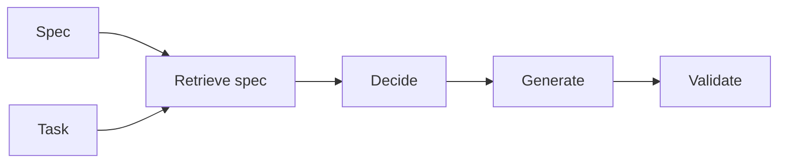

# Développement piloté par les spécifications

## Définition

Spec-driven development construit des systèmes d'IA (agents, pipelines, tools) à partir de spécifications explicites: requirements, output formats, allowed actions, and constraints. Specs are retrieved and used at runtime (par ex. in RDD) so behavior stays aligned with intent.

C'est especially useful for [agents](/docs/agents) and [RDD](/docs/reasoning-patterns/rdd): instead of encoding all rules in weights or prompts, you maintain specs (par ex. in docs or a knowledge base) and retrieve them at runtime. Fits regulated domains and teams that want behavior to be auditable and updatable sans réentraînement.

## Comment ça fonctionne

You **write specs** (natural language, schemas, or structured rules) and index them for récupération (par ex. in a vector store or structured repo). At runtime, the **task** (and optionally the current state) is used to **retrieve** relevant spec fragments. The model or agent **decides** (par ex. next step, allowed actions) and **generates** (output, tool call) with the spec in context. **Validate** checks the output against the spec (par ex. schema, rules); if validation fails, you can retry or surface an error. This keeps generation and décisions aligned with the spec without baking everything into [prompt engineering](/docs/llms/prompt-engineering) or [fine-tuning](/docs/llms/fine-tuning).

## Cas d'utilisation

Spec-driven development fits when behavior must stay aligned with retrievable requirements (RDD, compliance, or safety).

- Building agents that retrieve and follow specs (par ex. RDD pattern)
- Enforcing output format and constraints (JSON, allowed actions)
- Regulated or safety-critical flows where behavior must match requirements

## Documentation externe

- [LangChain – Structured output](https://python.langchain.com/docs/concepts/output_parsers/) — Enforcing output format from LLMs
- [OpenAI – Structured outputs](https://platform.openai.com/docs/guides/structured-outputs)

## Voir aussi

- [RDD](/docs/reasoning-patterns/rdd)
- [Agents](/docs/agents)
- [Prompt engineering](/docs/llms/prompt-engineering)
