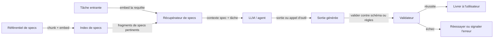

# Développement piloté par les spécifications

## Définition

Le développement piloté par les spécifications est une approche pour construire des systèmes IA — agents, pipelines, outils et workflows — où le comportement est ancré dans des spécifications explicites et lisibles plutôt qu'encodé entièrement dans les poids du modèle ou des chaînes d'invite manuellement codées. Une spécification définit ce que le système doit faire, quelles sorties sont autorisées, quelles actions sont permises, quelles contraintes doivent tenir, et à quoi ressemble le succès. Ces spécifications peuvent prendre de nombreuses formes : documents en langage naturel, schémas JSON, définitions OpenAPI, règles formelles ou ensembles d'exigences structurées — et elles sont traitées comme des artefacts de première classe qui sont versionnés, testés et récupérés au moment de l'exécution.

L'idée centrale est de séparer la définition du comportement de son implémentation. Au lieu d'incorporer toutes les règles dans une invite système monolithique ou un modèle affiné, vous maintenez une spécification en direct qui peut être mise à jour, auditée et récupérée indépendamment. Dans le modèle [RDD (Retrieval-Driven Development)](/docs/reasoning-patterns/rdd), les spécifications sont indexées dans un magasin vectoriel ou un référentiel de documents ; au moment de l'exécution, l'agent récupère les fragments de spec pertinents pour la tâche actuelle et fonde ses décisions sur eux. Cela rend le comportement auditable, corrigeable sans réentraînement, et aligné avec la spécification que les experts du domaine ou les équipes de conformité peuvent lire et approuver.

Le développement piloté par les spécifications est particulièrement précieux pour les [agents](/docs/agents) opérant dans des domaines réglementés ou à enjeux élevés pour la sécurité, où le coût d'un comportement mal aligné est élevé et où les équipes de conformité doivent vérifier ce que le système est autorisé à faire. Il complète également l'[ingénierie de prompt](/docs/prompt-engineering) — les specs fournissent le contenu sémantique stable ; les invites orchestrent comment le modèle raisonne à leur sujet et les applique. L'approche contraste avec le [vibe coding](/docs/vibe-coding), où le comportement émerge itérativement d'une intention vague plutôt que d'exigences explicites.

## Comment ça fonctionne

### Rédaction et indexation des specs

Les spécifications sont rédigées dans un format structuré mais lisible par les humains. Pour un agent, une spec pourrait définir les appels d'outils autorisés, le format de sortie requis, les contraintes sur quelles informations peuvent être divulguées, et les critères de succès. Ces specs sont fragmentées et indexées — dans un magasin vectoriel pour la récupération sémantique, ou dans une base de données structurée pour la recherche exacte — afin que les fragments pertinents puissent être récupérés au moment de l'inférence.

### Récupération, génération et validation



### Validation et correction

Le validateur vérifie que la sortie ou l'action générée est conforme à la spec : validation de schéma pour les sorties structurées (JSON Schema, Pydantic), vérifications basées sur des règles pour les contraintes, ou un appel de modèle secondaire qui vérifie la conformité. Si la validation échoue, le système peut réessayer avec la description de la violation ajoutée au contexte, escalader à un humain, ou signaler une erreur structurée. Cette boucle fermée maintient le comportement aligné avec la spec même quand le modèle dévierait autrement.

## Quand utiliser / Quand NE PAS utiliser

| Utiliser quand | Éviter quand |
|----------|------------|
| Le comportement de l'agent doit être auditable et correspondre aux exigences documentées | Les exigences sont entièrement inconnues et doivent être découvertes itérativement |
| Les équipes de conformité ou de sécurité doivent approuver et examiner le comportement du système | La tâche est un prototypage exploratoire où la spec changerait à chaque itération |
| Le comportement doit être mis à jour sans réentraînement (en changeant la spec) | La spec est trop complexe ou ambiguë pour qu'un modèle la applique de façon fiable au moment de l'exécution |
| Le format de sortie et les contraintes doivent être appliqués de façon fiable | La latence de récupération spec + validation est inacceptable pour le cas d'usage |

## Comparaisons

| Approche | Comportement défini par | Mise à jour sans réentraînement | Auditable |
|----------|-------------------|------------------------------|-----------|
| Piloté par spec (RDD) | Specs explicites récupérées au moment de l'exécution | Oui | Oui |
| Ingénierie de prompt | Invite système et exemples | Partiel (changements d'invite) | Limité |
| Affinement | Poids du modèle | Non | Difficile |
| Vibe coding | Dialogue itératif utilisateur-modèle | N/A (exploratoire) | Non |

## Avantages et inconvénients

| Avantages | Inconvénients |
|------|------|
| Le comportement est auditable et lisible par les humains sans inspecter les poids | La récupération des specs et la validation ajoutent de la latence et de la complexité d'infrastructure |
| Les specs peuvent être mises à jour par les experts du domaine sans réentraînement | Le modèle peut mal interpréter ou appliquer incomplètement les fragments de specs récupérés |
| Permet la revue de conformité et la validation du comportement du système | Nécessite de la discipline pour maintenir la qualité et la couverture des specs à mesure que les exigences évoluent |
| La validation détecte les violations de spec avant qu'elles n'atteignent les utilisateurs | Ne convient pas aux tâches où les exigences sont intrinsèquement floues ou émergentes |

## Exemples de code

### Sortie structurée avec validation de spec utilisant Pydantic et OpenAI (Python)

```python
from pydantic import BaseModel, field_validator
from openai import OpenAI
import json

client = OpenAI()

# Définir la spec de sortie comme modèle Pydantic
class SupportResponse(BaseModel):
    category: str  # "billing", "technical", "account", "other"
    priority: str  # "low", "medium", "high"
    summary: str
    suggested_action: str

    @field_validator("category")
    @classmethod
    def validate_category(cls, v: str) -> str:
        allowed = {"billing", "technical", "account", "other"}
        if v not in allowed:
            raise ValueError(f"category must be one of {allowed}")
        return v

    @field_validator("priority")
    @classmethod
    def validate_priority(cls, v: str) -> str:
        allowed = {"low", "medium", "high"}
        if v not in allowed:
            raise ValueError(f"priority must be one of {allowed}")
        return v

# Spec système récupérée au moment de l'exécution
spec = """
Vous êtes un classificateur de tickets de support. Classifiez le ticket selon ces règles :
- category: billing (problèmes de paiement), technical (bugs/erreurs), account (connexion/accès), other
- priority: high (perte de données, panne de service), medium (fonctionnalité dégradée), low (cosmétique/mineur)
- summary: une phrase décrivant le problème
- suggested_action: une phrase recommandant les prochaines étapes
Produisez UNIQUEMENT du JSON valide correspondant au schéma.
"""

ticket = "Je ne peux pas me connecter à mon compte et mon paiement d'abonnement a échoué ce matin."

response = client.chat.completions.create(
    model="gpt-4o-mini",
    messages=[
        {"role": "system", "content": spec},
        {"role": "user", "content": ticket},
    ],
    response_format={"type": "json_object"},
)

raw = response.choices[0].message.content
parsed = SupportResponse(**json.loads(raw))
print(parsed.model_dump_json(indent=2))
```

## Ressources pratiques

- [OpenAI – Sorties structurées](https://platform.openai.com/docs/guides/structured-outputs) — Application native du schéma JSON dans l'API
- [LangChain – Parseurs de sortie](https://python.langchain.com/docs/concepts/output_parsers/) — Analyse et validation des sorties LLM contre des schémas
- [Documentation Pydantic](https://docs.pydantic.dev/) — Validation de données et définition de schéma en Python
- [Bibliothèque Instructor](https://python.useinstructor.com/) — Sorties LLM structurées avec Pydantic, logique de réessai et validation
- [Guardrails AI](https://www.guardrailsai.com/) — Framework pour la validation et la correction de sortie pilotée par spec

## Voir aussi

- [RDD](/docs/reasoning-patterns/rdd)
- [Agents](/docs/agents)
- [Ingénierie de prompt](/docs/prompt-engineering)
