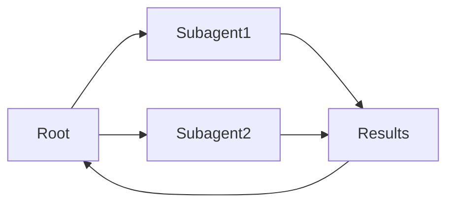

# Sous-agents

## Définition

Les **sous-agents** sont des agents qui se situent dans une hiérarchie: a parent agent delegates sub-tasks to child agents (subagents), qui peuvent à leur tour déléguer à d'autres subagents. Cela structure la complexix work and keeps each agent focused.

Ils sont un moyen d'implémenter des systèmes [multi-agents](/docs/agents/multi-agent-systems) avec une chaîne claire de responsabilitty. The root [agent](/docs/agents) owns the user-facing goal; subagents handle focused sub-tasks (par ex. [récupération](/docs/rag), code execution, validation). Often used with [spec-driven development](/docs/spec-driven-development) or [RDD](/docs/reasoning-patterns/rdd) so subagents receive and follow specs.

## Comment ça fonctionne

L'agent **racine** reçoit la tâche, la divise en sous-tâches et les attribue au **Subagent1**, **Subagent2**, etc. (par rôle ou capacité). Chaque subagent exécute sa propre boucle (possiblement avec des outils et un LLM) and returns **results** to the root. The root **aggregates** results (par ex. merges, selects, or passes to another subagent) and either continues the loop or returns to the user. Subagents can be specialized (par ex. récupération, code, critique) and use the same or different models. Clear contracts (inputs/outputs or tools) and error handling make the hierarchy debuggable and reusable.

## Cas d'utilisation

Subagents aident quand une tâche se divise naturellement en sous-tâches ciblées pouvant être déléguées et agrégées.

- Root agent delegating récupération, generation, and validation to subagents
- Complex workflows (par ex. research, code review) with focused sub-tasks
- Reusing the same subagent in different parent workflows

## Documentation externe

- [From Prototypes to Agents with ADK – Google Codelabs](https://codelabs.developers.google.com/your-first-agent-with-adk#0) — ADK multi-agent systems with hierarchy
- [LangChain – Multi-agent workflows](https://python.langchain.com/docs/concepts/multi_agent/) — Workflow and subagent patterns

## Avantages et inconvénients

| Pros | Cons |
|------|------|
| Clear separation of concerns | Coordination and latency |
| Scalable to complex tasks | Need clear contracts and error handling |
| Reusable subagent capabilities | Debugging across hierarchy can be hard |

## Voir aussi

- [Agents](/docs/agents)
- [Multi-agent systems](/docs/agents/multi-agent-systems)
- [RDD](/docs/reasoning-patterns/rdd)
- [Spec-driven development](/docs/spec-driven-development)
