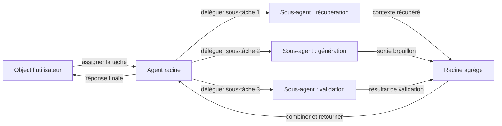
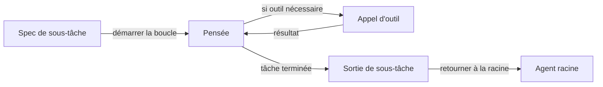

# Sous-agents

## Définition

Les **sous-agents** sont des agents qui se situent dans une hiérarchie : un agent parent délègue des sous-tâches à des agents enfants (sous-agents), qui peuvent à leur tour déléguer à d'autres sous-agents. Cette structure hiérarchique garde chaque agent concentré sur une responsabilité étroite et bien définie plutôt que d'essayer de tout gérer dans une seule boucle.

Ils sont une façon d'implémenter des systèmes [multi-agents](/docs/agents/multi-agent-systems) avec une chaîne claire de responsabilité et de propriété. L'[agent](/docs/agents) racine possède l'objectif côté utilisateur et est responsable de la réponse finale ; les sous-agents gèrent des sous-tâches concentrées telles que la [récupération](/docs/rag), l'exécution de code, la validation ou le formatage. L'agent racine coordonne le timing, agrège les résultats et décide quand réessayer ou escalader.

Souvent utilisé avec le [développement piloté par les spécifications](/docs/spec-driven-development) ou [RDD](/docs/reasoning-patterns/rdd) pour que les sous-agents reçoivent des spécifications explicites et testables pour leurs sorties. Le modèle de sous-agent s'adapte naturellement : à mesure qu'un workflow devient plus complexe, de nouveaux sous-agents peuvent être ajoutés pour de nouvelles responsabilités sans restructurer la logique de l'agent racine.

## Comment ça fonctionne

### Délégation hiérarchique



### Boucle interne du sous-agent



L'agent **racine** reçoit la tâche, la décompose en sous-tâches et les assigne au **Sous-agent 1**, **Sous-agent 2**, etc. (par rôle ou capacité). Chaque sous-agent exécute sa propre boucle (éventuellement avec des outils et un LLM) et retourne les **résultats** à la racine. La racine **agrège** les résultats (par ex. fusionne, sélectionne ou passe à un autre sous-agent) et continue soit la boucle soit retourne à l'utilisateur. Les sous-agents peuvent être spécialisés (par ex. récupération, code, critique) et utiliser les mêmes ou différents modèles. Des contrats clairs (entrées/sorties ou schémas d'outils) et la gestion des erreurs rendent la hiérarchie débogage et réutilisable.

## Quand utiliser / Quand NE PAS utiliser

| Scénario | Utiliser les sous-agents | Ne pas utiliser les sous-agents |
|---|---|---|
| La tâche se décompose en sous-tâches parallèles indépendantes | Oui — les sous-agents peuvent s'exécuter simultanément | Non — si les sous-tâches sont étroitement couplées et séquentielles, la racine peut les gérer en ligne |
| Réutilisation de la même capacité dans les workflows | Oui — le même sous-agent peut être appelé depuis différentes racines | Non — les tâches ponctuelles ne bénéficient pas de l'abstraction |
| Les sous-tâches nécessitent différents outils ou modèles | Oui — chaque sous-agent peut avoir sa propre configuration | Non — si un modèle avec tous les outils est suffisant |
| Débogage et test de la logique de sous-tâche individuelle | Oui — les sous-agents ont des entrées/sorties claires, faciles à tester unitairement | Non — si la tâche est assez simple pour tester de bout en bout |
| Prototypage rapide ou workflows simples | Non — la hiérarchie ajoute une surcharge de coordination | Oui — une seule boucle d'agent est plus simple et plus rapide à itérer |

## Comparaisons

| Approche | Structure | Délégation | Réutilisabilité | Débogage |
|---|---|---|---|---|
| Agent unique | Boucle plate | Aucune | Faible | Tracer une boucle |
| Multi-agent (pair) | Plat / maillage | Pair à pair | Moyenne | Tracer plusieurs boucles |
| Sous-agent (hiérarchique) | Arbre | Racine → enfants | Élevée | Tracer par niveau |
| Pipeline / chaîne | Séquentiel | Étape à étape | Moyenne | Inspection de sortie d'étape |

## Avantages et inconvénients

| Avantages | Inconvénients |
|---|---|
| Séparation claire des préoccupations — chaque sous-agent fait une chose | Surcharge de coordination (latence, coût en tokens, transmission d'état) |
| Évolutif — ajouter de nouveaux sous-agents pour de nouvelles responsabilités | Nécessite des contrats d'entrée/sortie clairs et la gestion des erreurs |
| Réutilisable — le même sous-agent branché dans différents workflows racine | Le débogage à travers les niveaux de hiérarchie peut être complexe |
| La logique de l'agent racine reste propre et de haut niveau | Plusieurs appels LLM augmentent le coût total |

## Exemples de code

```python
from langchain_openai import ChatOpenAI
from langchain_core.messages import HumanMessage, SystemMessage

llm = ChatOpenAI(model="gpt-4o-mini")

# --- Définir les sous-agents ---

def retrieval_subagent(query: str) -> str:
    """Récupérer le contexte pertinent (simulé ici)."""
    # En production : interroger un magasin vectoriel
    return f"[Contexte pour '{query}' : RAG signifie Génération Augmentée par Récupération...]"

def generation_subagent(query: str, context: str) -> str:
    """Générer une réponse en fonction du contexte."""
    response = llm.invoke([
        SystemMessage(content="Répondez à la question en utilisant uniquement le contexte fourni."),
        HumanMessage(content=f"Contexte :\n{context}\n\nQuestion : {query}"),
    ])
    return response.content

def validation_subagent(answer: str, context: str) -> str:
    """Vérifier si la réponse est fondée dans le contexte."""
    response = llm.invoke([
        SystemMessage(content="Vérifiez si la réponse est entièrement supportée par le contexte. Répondez PASS ou FAIL avec une raison."),
        HumanMessage(content=f"Contexte :\n{context}\n\nRéponse :\n{answer}"),
    ])
    return response.content

# --- L'agent racine orchestre ---

def root_agent(user_query: str) -> str:
    context = retrieval_subagent(user_query)
    draft = generation_subagent(user_query, context)
    validation = validation_subagent(draft, context)

    if "FAIL" in validation.upper():
        # Réessayer une fois avec une instruction explicite
        draft = generation_subagent(
            user_query + " (soyez précis et fondé)",
            context,
        )

    return draft

print(root_agent("Qu'est-ce que RAG ?"))
```

## Ressources pratiques

- [From Prototypes to Agents with ADK – Google Codelabs](https://codelabs.developers.google.com/your-first-agent-with-adk#0) — Systèmes multi-agents ADK avec composition d'agents hiérarchique
- [LangChain – Workflows multi-agents](https://python.langchain.com/docs/concepts/multi_agent/) — Modèles de workflow et de sous-agents avec LangGraph
- [Anthropic – Frameworks multi-agents](https://docs.anthropic.com/en/docs/build-with-claude/tool-use#multi-agent-frameworks) — Guidance sur la construction de systèmes d'agents hiérarchiques avec Claude

## Voir aussi

- [Agents](/docs/agents)
- [Systèmes multi-agents](/docs/agents/multi-agent-systems)
- [RDD](/docs/reasoning-patterns/rdd)
- [Développement piloté par les spécifications](/docs/spec-driven-development)
