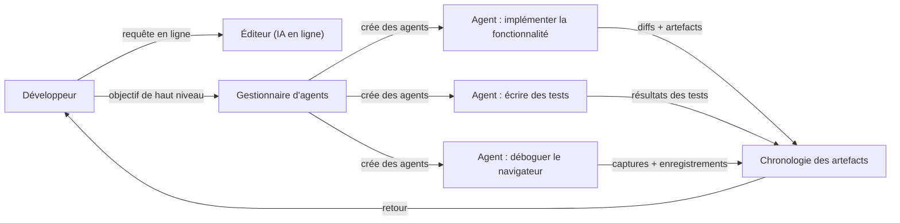
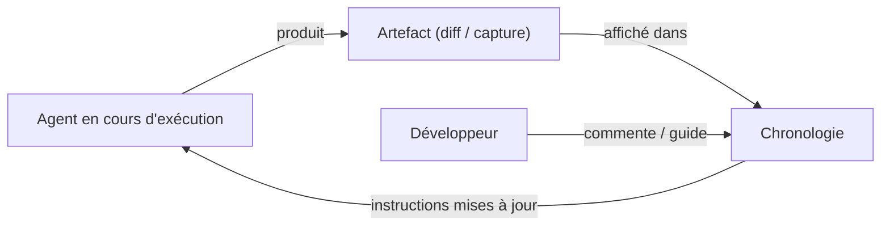

# Antigravity

## Définition

Antigravity est un **IDE agent-first** construit sur le principe que les [agents](/docs/agents) autonomes alimentés par des [LLM](/docs/llms) doivent être des composants de première classe de l'environnement de développement, et non des fonctionnalités ajoutées a posteriori. Plutôt que d'afficher des complétions pendant la frappe, Antigravity expose un **Gestionnaire d'agents** qui crée, coordonne et surveille plusieurs agents s'exécutant en parallèle à travers les panneaux d'éditeur, de terminal et de navigateur. Chaque agent peut implémenter une fonctionnalité, exécuter une suite de tests, déboguer un échec ou interagir avec une interface web pendant que le développeur observe et guide.

Une fonctionnalité distinctive est la **Chronologie des artefacts** : chaque action significative de l'agent — plans, diffs de code, captures d'écran, enregistrements de navigateur et résultats de tests — est capturée et affichée dans une chronologie. Ce journal d'audit rend l'exécution autonome vérifiable : vous pouvez rejouer ce qui s'est passé, inspecter les états intermédiaires et commenter des artefacts spécifiques pour rediriger les prochaines étapes de l'agent. Cette conception rend Antigravity particulièrement adapté aux flux de travail de [développement piloté par spécifications](/docs/spec-driven-development) où la traçabilité et la supervision humaine sont importantes.

La plateforme prend en charge les modèles à grande fenêtre de contexte (Gemini et autres), fonctionne sous Windows, macOS et Linux, et fournit une assistance IA en ligne (similaire à Cmd+K de Cursor) et une autonomie gérée dans un seul environnement. La combinaison de la journalisation granulaire des artefacts et de l'exécution parallèle des agents la positionne comme une plateforme de « vibe coding » où les développeurs spécifient l'intention à un niveau élevé et vérifient les résultats à travers le journal des artefacts.

## Fonctionnement

### Architecture à double interface



### Boucle de rétroaction humain-dans-la-boucle



### Fonctionnalités clés

**Gestionnaire d'agents** — créer et surveiller plusieurs agents simultanément. **Chronologie des artefacts** — journal chronologique des plans, diffs, captures et enregistrements. **IA en ligne** — assistance directe dans l'éditeur pour la refactorisation et la génération. **Boucle de rétroaction** — commenter les artefacts pour guider les agents en temps réel. **Multiplateforme** — Windows, macOS, Linux. **Grand contexte** — prend en charge les modèles avec de grandes fenêtres de contexte pour la compréhension à l'échelle du dépôt.

## Quand utiliser / Quand NE PAS utiliser

| Scénario | Utiliser Antigravity | NE PAS utiliser Antigravity |
|----------|----------------|------------------------|
| Implémentation multi-agents autonome avec supervision | Oui — Gestionnaire d'agents + Chronologie des artefacts | |
| Flux de travail pilotés par spécifications nécessitant des pistes d'audit | Oui — chaque artefact est journalisé et inspecrable | |
| Flux de travail parallèles (implémenter + tester + déboguer simultanément) | Oui — création d'agents en parallèle | |
| Complétions en ligne légères avec configuration minimale | | [GitHub Copilot](/docs/tools/github-copilot) ou [Cursor](/docs/tools/cursor) sont plus légers |
| Intégration profonde avec les issues et PRs GitHub | | [GitHub Copilot Workspace](/docs/tools/github-copilot) est mieux intégré |
| Développement centré sur le terminal ou CLI | | [Claude Code](/docs/tools/claude-code) est conçu spécifiquement pour cela |

## Avantages et inconvénients

| Avantages | Inconvénients |
|------|------|
| Exécution d'agents en parallèle à travers l'éditeur, le terminal et le navigateur | Plateforme plus récente avec une communauté plus petite que les outils VS Code |
| La Chronologie des artefacts fournit des sorties vérifiables et inspecrables | Une forte autonomie augmente le risque de modifications importantes non révisées |
| Prend en charge le vibe coding à un niveau d'abstraction plus élevé | Nécessite une familiarité avec les modèles de développement agent-first |
| Guidage en temps réel via les commentaires sur les artefacts | La maturité et la stabilité de la plateforme sont encore en évolution |

## Exemples de code

```yaml
# Fichier de guidage Antigravity — définir le comportement des agents et les standards du projet
project:
  name: my-web-app
  stack: [TypeScript, React, Node.js, PostgreSQL]

agents:
  default_model: gemini-2.0-flash
  context_window: large

standards:
  - "Follow existing file and folder structure conventions"
  - "Add tests for every new function using Vitest"
  - "Document all exported functions with JSDoc"
  - "Never modify database schema without a migration file"

artifacts:
  retain: 30d           # keep artifact timeline for 30 days
  require_approval:     # require human approval before applying
    - schema_changes
    - dependency_additions
```

## Conseils pour une utilisation efficace

- Commencez avec un énoncé d'objectif clair pour chaque agent — les objectifs vagues produisent des artefacts vagues.
- Révisez la Chronologie des artefacts après chaque exécution d'agent avant d'accepter les modifications ; utilisez les commentaires pour guider la prochaine itération.
- Configurez des portes d'approbation dans le fichier de guidage pour les opérations à haut risque (modifications de schéma, nouvelles dépendances).
- Exécutez les agents sur des branches isolées pour que la branche principale reste stable pendant le travail parallèle des agents.
- Utilisez l'IA en ligne pour les petites modifications précises et réservez le Gestionnaire d'agents pour les tâches plus grandes en plusieurs étapes.

## Ressources pratiques

- [Antigravity — IDE agent-first](https://www.antigravityai.io/) — Présentation du produit, fonctionnalités et téléchargement
- [Antigravity IDE](https://antigravityaiide.com/) — Capacités de la plateforme et documentation

## Voir aussi

- [Agents](/docs/agents)
- [Développement piloté par spécifications](/docs/spec-driven-development)
- [Cursor](/docs/tools/cursor)
- [Kiro](/docs/tools/kiro)
- [Claude Code](/docs/tools/claude-code)
- [LLMs](/docs/llms)
