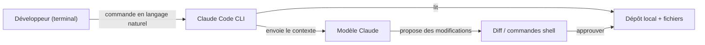
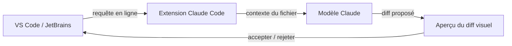

# Claude Code

## Définition

Claude Code est l'assistant de codage alimenté par l'IA d'Anthropic qui intègre [Claude](/docs/case-studies/claude) dans chaque couche du flux de travail de développement. Contrairement aux extensions d'éditeur qui ajoutent l'IA à un IDE existant, Claude Code est conçu comme un **outil multi-environnement** : il fonctionne comme un CLI dans le terminal, comme une extension dans VS Code et JetBrains, dans le navigateur, sur iOS et dans Slack. Cela en fait le choix naturel quand le développement s'étend sur plusieurs environnements ou quand les flux de travail centrés sur le terminal sont importants.

L'outil donne à Claude un accès direct au système de fichiers local, aux commandes shell et au contexte du projet. Dans le terminal, vous pouvez demander à Claude d'explorer une base de code, d'expliquer l'architecture, de générer du code, d'exécuter des tests et d'appliquer des diffs — le tout sans quitter la ligne de commande. Dans l'IDE, Claude Code affiche des modifications en ligne et des diffs visuels identiques à ceux de Cursor. Le fichier `CLAUDE.md` (ou `.claude/CLAUDE.md`) joue le même rôle que `.cursorrules` : il fournit des instructions persistantes au niveau du projet qui orientent le style, les conventions et la connaissance de la base de code de Claude.

Comparé à [Cursor](/docs/tools/cursor), Claude Code est verrouillé au modèle Claude mais ajoute la profondeur du terminal et l'accès mobile/web. Comparé à [GitHub Copilot](/docs/tools/github-copilot), il offre une édition d'agent multi-fichiers plus profonde et des flux de travail CLI-first, mais nécessite un abonnement Claude (Pro, Teams ou Enterprise) ou un accès API via Amazon Bedrock ou Google Vertex AI.

## Fonctionnement

### Flux de travail en terminal



### Flux de travail dans l'IDE



### Fonctionnalités clés

**CLI** — exécutez `claude` dans n'importe quel terminal pour poser des questions ou appliquer des modifications. **Extension IDE** — modifications en ligne et diffs dans VS Code et JetBrains. **`CLAUDE.md`** — instructions persistantes du projet pour orienter Claude. **Sous-agents** — tâches en arrière-plan s'exécutant de manière autonome via l'Anthropic Agent SDK. **MCP** — Protocole de Contexte de Modèle pour l'utilisation d'outils (bases de données, APIs). **Skills** — programmes de prompts réutilisables pour les tâches récurrentes.

## Quand utiliser / Quand NE PAS utiliser

| Scénario | Utiliser Claude Code | NE PAS utiliser Claude Code |
|----------|----------------|------------------------|
| Développement centré sur le terminal et flux de travail CLI | Oui — agent CLI conçu spécifiquement | |
| Utilisation multi-environnement (terminal, IDE, web, mobile) | Oui — un seul outil dans tous les environnements | |
| Refactorisation profonde de plusieurs fichiers avec diffs | Oui — terminal + IDE les supportent tous les deux | |
| IA en ligne pour JetBrains ou VS Code | Oui — extensions officielles disponibles | |
| Rester dans une configuration VS Code existante avec moins de friction | | [GitHub Copilot](/docs/tools/github-copilot) a un coût de migration plus faible |
| Neovim ou IDEs qui ne sont pas VS Code / JetBrains | | [GitHub Copilot](/docs/tools/github-copilot) couvre plus d'éditeurs |
| Sélection de backend multi-modèle | | [Cursor](/docs/tools/cursor) permet de basculer entre Claude, GPT-4o et les modèles locaux |

## Comparaisons

| Fonctionnalité | Claude Code | Cursor | GitHub Copilot |
|---------|------------|--------|---------------|
| Interface principale | Terminal + extension IDE | Fork VS Code | Extension IDE |
| Terminal / CLI | Oui (principal) | Non | Non |
| Support IDE | VS Code, JetBrains | VS Code uniquement | VS Code, JetBrains, Neovim |
| Modèle | Claude (Anthropic) | Multiples (Claude, GPT-4o) | OpenAI / GitHub |
| Règles de projet | `CLAUDE.md` | `.cursorrules` | Aucune |
| Profondeur d'agent | Élevée (sous-agents, SDK) | Composer | Copilot Workspace (aperçu) |
| Accès | Abonnement ou Bedrock/Vertex | Abonnement | Abonnement |

## Avantages et inconvénients

| Avantages | Inconvénients |
|------|------|
| CLI-first permet le scripting et l'automatisation sans interface | Verrouillé au modèle Claude ; pas de sélection multi-modèle |
| Multi-environnement (terminal, IDE, web, iOS, Slack) | Nécessite un abonnement Claude ou un accès API |
| `CLAUDE.md` fournit un contexte de projet persistant | Écosystème moins mature que les extensions VS Code |
| Les sous-agents permettent des tâches autonomes en arrière-plan | Courbe d'apprentissage CLI pour les développeurs novices en flux de travail terminal |

## Exemples de code

```bash
# Flux de travail en terminal : explorer une base de code et appliquer une modification
claude "Explain the authentication flow in this project"

# Générer et appliquer une refactorisation
claude "Refactor the UserService class to use dependency injection"

# Exécuter avec un contexte CLAUDE.md déjà chargé
# Exemple de CLAUDE.md :
# This is a Python FastAPI project using PostgreSQL and SQLAlchemy.
# Follow PEP 8, use type hints everywhere, and write tests with pytest.
# The database session is managed via get_db() in app/database.py.
claude "Add an endpoint to list users with pagination"
```

## Conseils pour une utilisation efficace

- Rédigez un `CLAUDE.md` à la racine du dépôt décrivant la pile, les conventions et les fichiers clés — Claude le lit au début de chaque session.
- Utilisez `claude --dangerously-skip-permissions` uniquement dans des environnements CI sandboxés, jamais sur des machines de production.
- Pour les grandes bases de code, mentionnez explicitement les chemins de fichiers dans votre requête (`"Dans src/auth/service.ts, refactorisez..."`) pour concentrer le contexte.
- Combinez Claude Code en terminal avec l'extension IDE : explorez et planifiez dans le terminal, appliquez les diffs visuellement dans VS Code.
- Utilisez les sous-agents pour les tâches en arrière-plan (par ex. exécuter des tests, générer de la documentation) pendant que vous continuez d'autres travaux.

## Ressources pratiques

- [Anthropic — Claude Code](https://www.anthropic.com/claude-code) — Présentation du produit et points forts des fonctionnalités
- [Claude Code — Démarrage rapide](https://docs.anthropic.com/en/docs/claude-code/quickstart) — Installation, configuration et premières commandes
- [Claude Code — Intégrations IDE](https://docs.anthropic.com/en/docs/claude-code/ide-integrations) — Configuration VS Code et JetBrains
- [Claude Code — CLAUDE.md](https://docs.anthropic.com/en/docs/claude-code/memory) — Instructions au niveau du projet et mémoire
- [Anthropic Agent SDK](https://docs.anthropic.com/en/docs/agents) — Construire des sous-agents et des flux de travail autonomes
- [Dépôt de Skills](https://github.com/EmersonBraun/skills) — Collection organisée de skills IA réutilisables pour Claude Code et autres assistants de codage IA

## Voir aussi

- [Claude](/docs/case-studies/claude)
- [Cursor](/docs/tools/cursor)
- [GitHub Copilot](/docs/tools/github-copilot)
- [Agents](/docs/agents)
- [Développement piloté par spécifications](/docs/spec-driven-development)
- [LLMs](/docs/llms)
