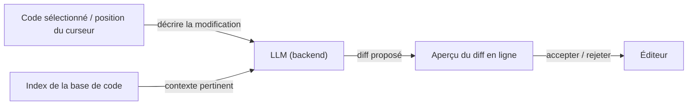

# Cursor

## Définition

Cursor est un éditeur de code alimenté par l'IA, fork de VS Code, qui intègre les [LLMs](/docs/llms) directement dans chaque partie de l'expérience d'édition. Contrairement aux extensions ajoutées à un éditeur existant, Cursor contrôle toute la surface de l'éditeur, ce qui lui permet de construire des fonctionnalités telles que les aperçus de diffs multi-fichiers, la recherche sémantique à l'échelle de la base de code et le chat avec le contexte complet du projet, difficiles à reproduire uniquement via des APIs d'extension.

L'éditeur prend en charge plusieurs backends de modèles (Claude 3.5/3.7, GPT-4o, modèles locaux via Ollama) et permet aux utilisateurs de définir des instructions au niveau du projet via des fichiers `.cursorrules`, orientant le style, les conventions et les hypothèses d'outillage du modèle. Le contexte est géré via un index de base de code basé sur des embeddings qui met les fichiers pertinents à la disposition du modèle sans sélection manuelle, permettant des flux de travail plus proches de la programmation en binôme que de l'autocomplétion en ligne.

Comparé à [GitHub Copilot](/docs/tools/github-copilot), Cursor offre un contexte de projet plus profond, des modifications en ligne basées sur des diffs et un panneau de chat complet ; comparé à [Claude Code](/docs/tools/claude-code), c'est une expérience centrée sur l'interface graphique dans l'éditeur plutôt que dans le terminal. Les trois outils utilisent des [LLMs](/docs/llms) pour la génération de code, mais diffèrent par l'interface, la gestion du contexte et la profondeur de l'agent.

## Fonctionnement

### Modification en ligne (Cmd+K)



### Panneau de chat (Cmd+L)


### Fonctionnalités clés

**Index de base de code** — intègre le dépôt pour la recherche sémantique. **Composer** — modifications de style agent sur plusieurs fichiers. **Complétion par Tab** — complétion de ligne suivante et de bloc consciente du contexte. **`.cursorrules`** — instructions persistantes du projet pour le modèle. **Support MCP** — utilisation d'outils via le Protocole de Contexte de Modèle.

## Quand utiliser / Quand NE PAS utiliser

| Scénario | Utiliser Cursor | NE PAS utiliser Cursor |
|----------|-----------|-------------------|
| Codage dans l'éditeur avec contexte complet du projet | Oui — l'indexation de la base de code fournit un contexte approfondi | |
| Refactorisation multi-fichiers avec diffs visuels | Oui — Composer et vues de diffs | |
| Programmation en binôme avec explications en chat | Oui — panneau de chat persistant | |
| Environnements centrés sur le terminal ou sans interface | | Utilisez le CLI [Claude Code](/docs/tools/claude-code) à la place |
| Complétion agnostique à l'IDE dans JetBrains ou Neovim | | Utilisez [GitHub Copilot](/docs/tools/github-copilot) pour une couverture IDE plus large |
| Extension légère sur VS Code existant | | Les extensions Copilot ou Codeium ont moins de surcharge |

## Comparaisons

| Fonctionnalité | Cursor | GitHub Copilot | Claude Code |
|---------|--------|---------------|-------------|
| Interface de base | Fork VS Code complet | Extension IDE | Terminal + extension IDE |
| Contexte du projet | Index de base de code (embeddings) | Fichiers ouverts uniquement | Dépôt complet via CLI |
| Modifications multi-fichiers | Oui (Composer) | Limité | Oui (terminal + IDE) |
| Capacités d'agent | Composer, MCP | Copilot Workspace | Agents Claude |
| Choix de modèle | Multiples (Claude, GPT-4o, local) | OpenAI / GitHub | Claude (Anthropic) |
| Règles / config | Fichier `.cursorrules` | Pas de règles de projet | `CLAUDE.md` |
| Tarification | Abonnement (niveau gratuit hobby) | Abonnement | Abonnement (Pro+) |

## Avantages et inconvénients

| Avantages | Inconvénients |
|------|------|
| Contexte de projet approfondi via l'indexation de la base de code | Nécessite de migrer depuis la configuration VS Code existante |
| Prend en charge plusieurs backends LLM | L'indexation de la base de code peut exposer le code à des serveurs tiers |
| Les règles au niveau du projet orientent le comportement du modèle | Utilisation élevée des ressources par rapport aux extensions légères |
| Les aperçus de diffs visuels rendent les modifications révisables | Les limites de contexte s'appliquent toujours ; les très grands dépôts nécessitent une inclusion sélective |

## Exemples de code

```jsonc
// .cursorrules — instructions du projet pour le modèle
{
  "rules": [
    "This is a TypeScript/React project using Tailwind CSS.",
    "Prefer functional components and hooks over class components.",
    "Always add JSDoc comments to exported functions.",
    "Use the existing `api/` client for all HTTP calls; do not use fetch directly.",
    "Tests are written with Vitest; always add a test for new utility functions."
  ]
}
```

## Conseils pour une utilisation efficace

- Gardez `.cursorrules` court et spécifique — les règles longues diluent l'attention du modèle.
- Utilisez les mentions `@file` ou `@folder` dans le chat pour épingler le contexte pertinent.
- Pour les grands dépôts, excluez les fichiers générés (`node_modules`, `dist`, `.next`) de l'index de la base de code pour réduire le bruit.
- Acceptez les suggestions de Composer de manière incrémentielle — révisez chaque diff avant d'accepter la prochaine modification.
- Associez Cursor à un linter et à un vérificateur de types pour que le modèle obtienne un retour immédiat sur la qualité du code généré.

## Ressources pratiques

- [Cursor — Documentation](https://docs.cursor.com/) — Guides officiels incluant la configuration, les fonctionnalités et `.cursorrules`
- [Cursor — Modèles](https://docs.cursor.com/settings/models) — Configurer les backends LLM et les clés API
- [Cursor — MCP](https://docs.cursor.com/context/mcp) — Intégrations d'outils du Protocole de Contexte de Modèle
- [Journal des modifications de Cursor](https://cursor.com/changelog) — Sorties de fonctionnalités et mises à jour

## Voir aussi

- [Agents](/docs/agents)
- [GitHub Copilot](/docs/tools/github-copilot)
- [Claude Code](/docs/tools/claude-code)
- [Développement piloté par spécifications](/docs/spec-driven-development)
- [LLMs](/docs/llms)
