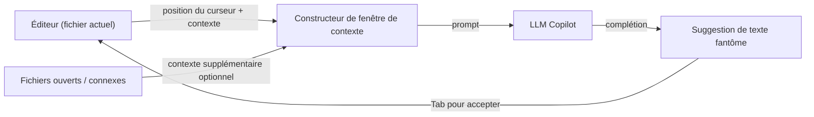

# GitHub Copilot

## Définition

GitHub Copilot est un assistant de codage alimenté par l'IA développé par GitHub et Microsoft, propulsé par des [grands modèles de langage](/docs/llms) entraînés sur de grandes quantités de code public. Il s'intègre dans les éditeurs existants comme une extension légère et présente l'assistance IA principalement via des **complétions en ligne** : pendant que le développeur tape, Copilot suggère la ligne ou le bloc suivant sous forme de texte fantôme qui peut être accepté d'une seule touche.

Au-delà de l'autocomplétion en ligne, Copilot Chat ajoute une interface conversationnelle dans l'IDE pour poser des questions, générer du code à partir du langage naturel, expliquer du code inconnu et écrire des tests. Copilot Workspace (aperçu) étend cela aux flux de travail d'issue à code où Copilot propose un plan et une implémentation pour une issue GitHub. L'outil est agnostique à l'IDE, avec des extensions pour VS Code, les IDEs JetBrains, Visual Studio, Neovim et l'éditeur web GitHub.

Comparé à [Cursor](/docs/tools/cursor), Copilot est une extension plus légère qui fonctionne dans votre IDE existant plutôt que de le remplacer, et se concentre sur le contexte au niveau du fichier ou de la sélection plutôt que sur l'indexation complète de la base de code. Comparé à [Claude Code](/docs/tools/claude-code), Copilot manque d'un flux de travail centré sur le terminal et d'une édition d'agent multi-fichiers profonde. Le bon choix dépend si vous préférez rester dans votre éditeur actuel (Copilot), migrer vers un éditeur IA profondément intégré (Cursor), ou combiner le travail terminal et IDE (Claude Code).

## Fonctionnement

### Complétion en ligne



### Copilot Chat


### Fonctionnalités clés

**Texte fantôme** — complétions en ligne déclenchées par la frappe. **Copilot Chat** — aide conversationnelle avec explications de code et génération de tests. **Copilot Edits** — appliquer des modifications multi-fichiers depuis une instruction de chat. **Copilot Workspace** — planifier et implémenter depuis une issue GitHub. **Support IDE** — VS Code, JetBrains, Visual Studio, Neovim.

## Quand utiliser / Quand NE PAS utiliser

| Scénario | Utiliser GitHub Copilot | NE PAS utiliser GitHub Copilot |
|----------|--------------------|--------------------------|
| Complétion en ligne sans changer d'éditeur | Oui — extension légère pour tout IDE supporté | |
| Génération de code répétitif et de boilerplate | Oui — excelle dans les complétions basées sur des motifs | |
| Environnements JetBrains, Neovim ou Visual Studio | Oui — large couverture IDE | |
| Contexte profond à l'échelle du projet et refactorisation | | [Cursor](/docs/tools/cursor) ou [Claude Code](/docs/tools/claude-code) gèrent mieux cela |
| Flux de travail centrés sur le terminal ou basés sur CLI | | [Claude Code](/docs/tools/claude-code) est conçu spécifiquement pour cela |
| Choisir le backend LLM (par ex. modèles Claude) | | [Cursor](/docs/tools/cursor) permet la sélection de backend multi-modèle |

## Comparaisons

| Fonctionnalité | GitHub Copilot | Cursor | Claude Code |
|---------|---------------|--------|-------------|
| Interface de base | Extension IDE | Fork VS Code | Terminal + extension IDE |
| Support IDE | VS Code, JetBrains, Neovim, etc. | VS Code uniquement | VS Code, JetBrains, terminal |
| Contexte au niveau du projet | Fichiers ouverts (limité) | Index de base de code | Dépôt complet via CLI |
| Modifications multi-fichiers | Copilot Edits (limité) | Composer | Oui |
| Modèle | OpenAI / GitHub | Multiples (Claude, GPT-4o) | Claude (Anthropic) |
| Intégration GitHub | Profonde (issues, PRs) | Minimale | Via commandes git CLI |
| Tarification | Abonnement (gratuit pour étudiants) | Abonnement (hobby gratuit) | Abonnement (Pro+) |

## Avantages et inconvénients

| Avantages | Inconvénients |
|------|------|
| Fonctionne dans les éditeurs existants sans migration | Contexte limité à l'échelle du projet vs Cursor |
| Large couverture des langages et frameworks | Pas de règles de projet personnalisées ni de fichiers de guidage |
| Intégration GitHub profonde (issues, PRs) | Moins de contrôle sur la sélection des modèles |
| Faible friction — le texte fantôme complète pendant la frappe | La qualité des complétions varie selon le langage et la tâche |

## Exemples de code

```python
# Copilot apprend du contexte — rédigez un docstring et laissez Copilot compléter la fonction

def calculate_compound_interest(principal: float, rate: float, periods: int) -> float:
    """
    Calculate compound interest.

    Args:
        principal: Initial amount
        rate: Annual interest rate as a decimal (e.g., 0.05 for 5%)
        periods: Number of compounding periods

    Returns:
        Final amount after compound interest
    """
    # Copilot suggérera : return principal * (1 + rate) ** periods
    return principal * (1 + rate) ** periods
```

## Conseils pour une utilisation efficace

- Rédigez des commentaires et des docstrings descriptifs avant le corps de la fonction — Copilot les utilise comme signaux d'intention.
- Acceptez les complétions partielles avec `Ctrl+Right` (mot par mot) plutôt que d'accepter aveuglément une suggestion complète de plusieurs lignes.
- Utilisez la commande `/explain` de Copilot Chat sur du code inconnu avant de le modifier.
- Activez Copilot dans `.github/copilot-instructions.md` (aperçu) pour ajouter un contexte léger du projet.
- Révisez soigneusement les tests générés — Copilot peut produire des tests syntaxiquement valides mais sémantiquement incorrects.

## Ressources pratiques

- [Documentation GitHub Copilot](https://docs.github.com/en/copilot) — Configuration, utilisation et guides spécifiques aux IDEs
- [GitHub Copilot — Démarrage](https://docs.github.com/en/copilot/getting-started-with-github-copilot) — Installation et premiers pas
- [GitHub Copilot Chat](https://docs.github.com/en/copilot/github-copilot-chat) — Utilisation de l'interface de chat
- [GitHub Copilot Workspace](https://githubnext.com/projects/copilot-workspace) — Agent d'issue à code (aperçu)

## Voir aussi

- [Cursor](/docs/tools/cursor)
- [Claude Code](/docs/tools/claude-code)
- [Agents](/docs/agents)
- [LLMs](/docs/llms)
