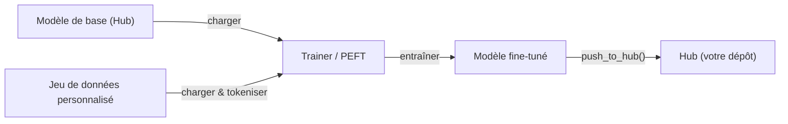

# Hugging Face

## Définition

Hugging Face est la plateforme open-source centrale pour l'apprentissage automatique : elle héberge le **Hub** (plus de 500 000 modèles publics et 50 000 jeux de données), fournit la bibliothèque `transformers` pour charger et exécuter des modèles pré-entraînés, et propose des outils pour le [fine-tuning](/docs/llms/fine-tuning), l'évaluation et le déploiement. Elle couvre les modèles de [NLP](/docs/nlp), de vision par ordinateur, de parole et [multimodaux](/docs/multimodal-ai) via une API unifiée, rendant pratique le passage entre les tâches et les architectures sans apprendre de nouvelles interfaces.

La bibliothèque `transformers` fonctionne sur [PyTorch](/docs/frameworks/pytorch), TensorFlow et JAX. Un appel `from_pretrained("nom-du-modèle")` télécharge automatiquement les poids du modèle, les tokeniseurs et la configuration depuis le Hub. La même abstraction fonctionne pour [BERT](/docs/transformers/bert), les décodeurs de style [GPT](/docs/transformers/gpt), les modèles de diffusion, les vision transformers et les modèles de parole de classe whisper. `datasets` fournit un chargement et un prétraitement efficaces par streaming de grands ensembles de données, et `accelerate` ajoute l'entraînement distribué et à précision mixte avec des modifications minimales du code.

Hugging Face s'intègre également avec l'écosystème IA plus large : les modèles hébergés sur le Hub peuvent être utilisés directement dans [LangChain](/docs/tools/langchain) et [LlamaIndex](/docs/tools/llamaindex) comme backends d'inférence, et la bibliothèque `peft` permet le [fine-tuning](/docs/llms/fine-tuning) efficace en paramètres (LoRA, QLoRA) pour que les [LLMs](/docs/llms) puissent être adaptés avec du matériel grand public. Spaces fournit un hébergement de démos à configuration zéro en utilisant Gradio ou Streamlit, faisant le pont entre la recherche et l'accès public.

## Fonctionnement

### Chargement et inférence


### Flux de travail de fine-tuning



### Bibliothèques clés

**`transformers`** — chargement de modèles, inférence, tokenisation. **`datasets`** — chargement et prétraitement efficaces des données. **`accelerate`** — entraînement distribué et précision mixte. **`peft`** — fine-tuning efficace en paramètres LoRA et QLoRA. **`evaluate`** — métriques (BLEU, ROUGE, précision). **`diffusers`** — pipelines de modèles de diffusion.

## Quand utiliser / Quand NE PAS utiliser

| Scénario | Utiliser Hugging Face | NE PAS utiliser Hugging Face |
|----------|-----------------|------------------------|
| Chargement et exécution d'un modèle NLP ou vision pré-entraîné | Oui — `from_pretrained` fournit une API unifiée | |
| Fine-tuning d'un LLM sur un jeu de données personnalisé | Oui — Trainer + PEFT (LoRA/QLoRA) | |
| Partage de modèles et jeux de données avec la communauté | Oui — Hub avec fiches de modèles et versionnage | |
| Service de production à haut débit | | Utiliser vLLM, TGI ou TorchServe pour une inférence optimisée |
| Déploiement edge en temps réel | | TFLite ou ONNX Runtime sont mieux adaptés |
| Entraînement depuis zéro d'un grand modèle propriétaire | | Les outils des fournisseurs cloud (pods TPU, SLURM) peuvent être préférés |

## Avantages et inconvénients

| Avantages | Inconvénients |
|------|------|
| API unifiée sur des centaines d'architectures | Grande empreinte de dépendances pour des cas d'usage simples |
| Le Hub fournit des fiches de modèles, versionnage et découvrabilité | Certains modèles sont de qualité recherche avec un support limité |
| PEFT permet le fine-tuning avec du matériel limité | Le débit d'inférence n'est pas optimisé vs les serveurs spécialisés |
| Communauté active et mises à jour fréquentes | Les changements fréquents d'API peuvent casser le code existant |

## Exemples de code

```python
# Load a pretrained text-classification model and run inference
from transformers import pipeline

classifier = pipeline("sentiment-analysis", model="distilbert-base-uncased-finetuned-sst-2-english")
result = classifier("Hugging Face makes NLP accessible to everyone.")
print(result)  # [{'label': 'POSITIVE', 'score': 0.9998}]

# Fine-tune with PEFT (LoRA) on a custom dataset
from transformers import AutoModelForCausalLM, AutoTokenizer, TrainingArguments, Trainer
from peft import get_peft_model, LoraConfig, TaskType
import datasets

model_name = "meta-llama/Llama-3.2-1B"
tokenizer = AutoTokenizer.from_pretrained(model_name)
base_model = AutoModelForCausalLM.from_pretrained(model_name)

lora_config = LoraConfig(task_type=TaskType.CAUSAL_LM, r=8, lora_alpha=32)
model = get_peft_model(base_model, lora_config)
model.print_trainable_parameters()  # shows only ~0.1% of params are trainable
```

## Comparaisons

| Fonctionnalité | Hugging Face Transformers | API directe (OpenAI, Anthropic) |
|---------|--------------------------|-------------------------------|
| Accès aux modèles | Modèles open-source depuis le Hub | Modèles frontières propriétaires |
| Coût | Gratuit à exécuter (vous payez votre matériel) | Coût API par token |
| Contrôle | Accès complet aux poids et aux paramètres internes | Boîte noire, contrôle limité |
| Fine-tuning | Première classe (Trainer, PEFT) | Limité (API fine-tune OpenAI) |
| Déploiement | Auto-géré (vLLM, TGI, TFLite) | Géré par le fournisseur |
| Meilleur pour | Recherche, fine-tuning personnalisé, confidentialité | Intégration production rapide |

## Ressources pratiques

- [Documentation Hugging Face](https://huggingface.co/docs) — Docs complètes de la plateforme incluant Hub, Transformers et Spaces
- [Bibliothèque Transformers](https://huggingface.co/docs/transformers) — Référence API, pipelines et fiches de modèles
- [Cours NLP Hugging Face](https://huggingface.co/learn/nlp-course/) — Cours gratuit de bout en bout couvrant Transformers et fine-tuning
- [Documentation PEFT](https://huggingface.co/docs/peft) — LoRA, QLoRA et autres méthodes efficaces en paramètres
- [Hub Hugging Face](https://huggingface.co/models) — Parcourir et filtrer plus de 500k modèles par tâche, langue et licence

## Voir aussi

- [Transformers](/docs/transformers)
- [LLMs](/docs/llms)
- [Fine-tuning](/docs/llms/fine-tuning)
- [RAG](/docs/rag)
- [Frameworks](/docs/frameworks/pytorch)
