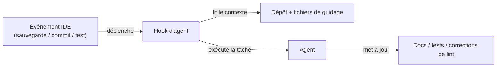

# Kiro

## Définition

Kiro est un **IDE alimenté par l'IA** d'Amazon Web Services qui opérationnalise le [développement piloté par les spécifications](/docs/spec-driven-development) comme un flux de travail de première classe. Plutôt que de fournir une complétion IA en forme libre, Kiro structure l'assistance IA autour d'une progression délibérée : le prompt d'un développeur est étendu en **exigences** structurées, **conceptions système** et une décomposition des **tâches d'implémentation**. Ce processus garde l'intention explicite et auditable, réduisant l'ambiguïté qui vient avec les approches de vibe-coding où un seul prompt pilote une génération non contrainte.

La capacité distinctive sont les **hooks d'agents** : des [agents](/docs/agents) autonomes déclenchés par des événements dans le flux de travail de développement (sauvegardes de fichiers, commits git, exécutions de tests) qui effectuent des tâches de maintenance telles que la mise à jour de la documentation, la régénération des tests ou la vérification du code contre les règles de style. Ce modèle piloté par les événements signifie que les portes de qualité sont automatisées plutôt qu'invoquées manuellement. **Autopilot** étend les hooks aux tâches en plusieurs étapes plus longues qui s'exécutent avec des points de contrôle du développeur, adaptées aux fonctionnalités plus grandes ou aux refactorisations.

Kiro est construit sur une base compatible VS Code (registre d'extensions Open VSX, thèmes et raccourcis clavier familiers) et intègre le **Protocole de Contexte de Modèle (MCP)** pour connecter les agents à des sources de données externes — bases de données, APIs de documentation et outils internes. Un **CLI Kiro** expose les mêmes flux de travail pilotés par les spécifications et d'agents dans le terminal. La combinaison fait de Kiro un choix naturel pour les équipes qui veulent structure et traçabilité en passant du prototype à la production.

## Fonctionnement

### Flux de travail piloté par les spécifications


### Hooks d'agents (pilotés par les événements)



### Fonctionnalités clés

**Pipeline de spécifications** — prompt → exigences → conception → tâches. **Hooks d'agents** — agents déclenchés par des événements pour docs, tests et optimisation. **Autopilot** — exécutions d'agents en plusieurs étapes avec points de contrôle. **Fichiers de guidage** — configuration au niveau du projet pour le comportement des agents. **Intégration MCP** — connexion aux APIs externes, bases de données et docs. **CLI Kiro** — accès en terminal aux flux de travail pilotés par les spécifications et d'agents. **Compatible VS Code** — extensions Open VSX, paramètres familiers.

## Quand utiliser / Quand NE PAS utiliser

| Scénario | Utiliser Kiro | NE PAS utiliser Kiro |
|----------|---------|-----------------|
| Développement piloté par les spécifications avec exigences structurées | Oui — flux de travail principal | |
| Automatiser docs, tests et lint à la sauvegarde de fichiers | Oui — les hooks d'agents sont conçus spécifiquement pour cela | |
| Du prototype à la production avec traçabilité | Oui — piste de spécifications explicite du prompt aux tâches | |
| Complétions en ligne rapides et texte fantôme | | [GitHub Copilot](/docs/tools/github-copilot) ou [Cursor](/docs/tools/cursor) sont plus légers |
| Environnements non VS Code (JetBrains, Neovim) | | Kiro est basé sur VS Code ; utilisez Copilot pour une couverture IDE plus large |
| Flux de travail centrés sur le terminal alimentés par Claude | | [Claude Code](/docs/tools/claude-code) convient mieux |

## Avantages et inconvénients

| Avantages | Inconvénients |
|------|------|
| Transforme les prompts en spécifications structurées, réduisant l'ambiguïté | Le flux de travail plus structuré peut sembler lourd pour les petites tâches |
| Les hooks d'agents automatisent les vérifications de qualité répétitives | Plateforme plus récente ; écosystème plus petit que les extensions VS Code |
| L'intégration MCP connecte les agents à des sources de données réelles | Soutenu par AWS, ce qui peut soulever des questions sur la résidence des données |
| Compatible VS Code, réduisant la friction de migration | Les points de contrôle d'Autopilot nécessitent la disponibilité du développeur |

## Exemples de code

```yaml
# .kiro/steering.yaml — configurer le comportement des agents et les standards du projet
project:
  name: my-api-service
  stack: [Python, FastAPI, PostgreSQL, pytest]

hooks:
  on_save:
    - task: update_docstrings
      scope: changed_files
    - task: lint_and_format
      tools: [ruff, black]

  on_commit:
    - task: generate_missing_tests
      coverage_threshold: 80

  on_test_fail:
    - task: analyze_failure
      suggest_fix: true

autopilot:
  require_approval_on:
    - database_migrations
    - new_dependencies
    - public_api_changes

mcp:
  connections:
    - name: internal_docs
      url: https://docs.internal.example.com/mcp
    - name: postgres_dev
      url: postgresql://localhost:5432/dev
```

## Conseils pour une utilisation efficace

- Révisez les exigences générées et la conception système avant d'exécuter les tâches — les corrections à l'étape de spécification sont moins coûteuses que dans le code.
- Configurez les hooks d'agents de manière conservatrice au départ (une ou deux tâches) et étendez à mesure que vous gagnez confiance dans la qualité de sortie de l'agent.
- Utilisez les fichiers de guidage pour encoder les conventions de l'équipe afin que tous les agents et les exécutions Autopilot suivent des standards cohérents.
- Connectez votre documentation interne via MCP pour que les agents de Kiro aient accès au contexte propriétaire.
- Validez les fichiers de guidage et les artefacts de spécifications dans le contrôle de version pour suivre l'évolution des exigences dans le temps.

## Ressources pratiques

- [Kiro — IDE IA](https://kiro.dev/) — Présentation du produit, fonctionnalités et tarification
- [Kiro — Documentation](https://kiro.dev/docs/chat) — Guides pour le chat, les hooks et les fichiers de guidage
- [Kiro — Hooks d'agents](https://kiro.dev/docs/hooks) — Configuration des agents pilotés par les événements
- [Protocole de Contexte de Modèle](https://modelcontextprotocol.io/) — Spécification MCP pour connecter les agents aux outils externes

## Voir aussi

- [Développement piloté par les spécifications](/docs/spec-driven-development)
- [Agents](/docs/agents)
- [Cursor](/docs/tools/cursor)
- [LLMs](/docs/llms)
