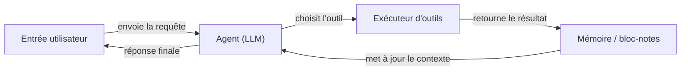

# LangChain

## Définition

LangChain est un framework open source pour créer des applications alimentées par des [grands modèles de langage](/docs/llms). Il fournit des abstractions composables pour les prompts, les chains, les agents et la récupération, permettant aux développeurs de connecter des fournisseurs de modèles, des magasins de mémoire, des outils et des chargeurs de documents avec un minimum de code redondant. Le framework est livré avec des intégrations préconstruites pour des dizaines de fournisseurs LLM (OpenAI, Anthropic, Mistral, local via Ollama) et des magasins de vecteurs (Pinecone, Chroma, FAISS).

En son cœur, LangChain s'articule autour du concept de **chains** : des séquences d'étapes où la sortie d'une étape alimente la suivante. Les **Agents** étendent les chains en donnant au LLM une boucle de raisonnement : il décide quel outil appeler, reçoit le résultat et continue jusqu'à produire une réponse finale. LangSmith, la plateforme d'observabilité complémentaire, fournit le traçage, l'évaluation et la gestion de jeux de données pour les applications LangChain en production.

Il complète [LlamaIndex](/docs/tools/llamaindex) (qui met l'accent sur l'indexation des données et la qualité de la récupération) en se concentrant sur l'orchestration composable et les boucles d'agents. Utilisez LangChain lorsque vous avez besoin d'un chaînage flexible, de flux de travail d'[ingénierie de prompts](/docs/prompt-engineering) en plusieurs étapes, ou d'[agents avec des outils](/docs/agents), et que vous souhaitez un large écosystème d'intégrations prêtes à l'emploi.

## Comment ça fonctionne

### Composants

LangChain décompose une application LLM en composants modulaires : **LLMs / modèles de chat** (le backend d'inférence), **templates de prompts** (construction d'entrée structurée), **parsers de sortie** (extraction structurée), **retrievers** (récupérer des documents pertinents depuis une [base de données vectorielle](/docs/rag/vector-databases)) et **outils** (APIs externes, recherche, exécution de code).

### Chains et LCEL

Le **LangChain Expression Language (LCEL)** compose des composants avec une syntaxe de pipe (`prompt | llm | parser`). La chain résultante est lazy, streamable et traitable en lots. Une chain RAG simple : récupérer des documents → formater en prompt → appeler le LLM → parser la réponse.

### Agents



### Observabilité avec LangSmith

LangSmith enveloppe les chains et les agents avec la journalisation des traces, permettant l'analyse de latence, les tests de prompts et l'évaluation pilotée par les jeux de données sans modifier le code de l'application.

## Quand utiliser / Quand NE PAS utiliser

| Scénario | Utiliser LangChain | NE PAS utiliser LangChain |
|----------|--------------|----------------------|
| Créer des agents qui appellent plusieurs APIs et outils | Oui — les abstractions d'agents et les intégrations d'outils sont de première classe | |
| RAG sur vos propres documents avec une configuration rapide | Oui — nombreux chargeurs et intégrations de retrievers | |
| RAG en production nécessitant un découpage fin et un réglage de récupération | | Préférer [LlamaIndex](/docs/tools/llamaindex) pour un contrôle fin |
| Completions à tour unique sans récupération ni outils | | Le surcoût est inutile ; appeler l'API directement |
| Traçage et évaluation des appels LLM en production | Oui — intégration LangSmith | |
| Budget de latence serré et dépendances minimales | | Le surcoût du framework peut ajouter de la latence ; envisager un client léger |

## Comparaisons

| Fonctionnalité | LangChain | LlamaIndex |
|---------|-----------|------------|
| Focus principal | Orchestration, chains, agents | Indexation des données et récupération |
| Support des agents | Première classe (appel d'outils, LCEL) | Via des query engines comme outils |
| Contrôle RAG | Haut niveau, nombreuses intégrations | Découpage fin, parsers de nœuds |
| Observabilité | LangSmith (traçage, evals) | Via des intégrations |
| Courbe d'apprentissage | Modérée | Modérée |
| Idéal pour | Flux de travail multi-étapes, agents | RAG profond sur de grands corpus de documents |

## Avantages et inconvénients

| Avantages | Inconvénients |
|------|------|
| Large écosystème d'intégrations (100+ LLMs, stores, outils) | Les abstractions peuvent masquer les erreurs et compliquer le débogage |
| LCEL rend les chains composables et streamables | La surface de l'API change fréquemment entre les versions |
| LangSmith fournit un traçage et des évaluations de niveau production | Peut ajouter de la latence et un surcoût de dépendances pour les cas d'usage simples |
| Communauté forte et documentation | Plusieurs façons de faire la même chose peuvent prêter à confusion |

## Exemples de code

```python
# Chain RAG minimale utilisant LangChain Expression Language (LCEL)
from langchain_openai import ChatOpenAI, OpenAIEmbeddings
from langchain_community.vectorstores import FAISS
from langchain_core.prompts import ChatPromptTemplate
from langchain_core.output_parsers import StrOutputParser
from langchain_core.runnables import RunnablePassthrough

# 1. Construire un magasin de vecteurs à partir de documents
texts = ["LangChain composes LLM pipelines.", "LCEL uses pipe syntax."]
vectorstore = FAISS.from_texts(texts, embedding=OpenAIEmbeddings())
retriever = vectorstore.as_retriever()

# 2. Définir le prompt
prompt = ChatPromptTemplate.from_template(
    "Answer based on context:\n{context}\n\nQuestion: {question}"
)

# 3. Composer la chain avec LCEL
chain = (
    {"context": retriever, "question": RunnablePassthrough()}
    | prompt
    | ChatOpenAI(model="gpt-4o-mini")
    | StrOutputParser()
)

print(chain.invoke("What does LCEL use?"))
# -> "LCEL uses pipe syntax."
```

## Conseils pour une utilisation efficace

- Utiliser LCEL (syntaxe de pipe) à la place du `LLMChain` hérité pour tout nouveau code — il est streamable, traitable en lots et plus facile à déboguer.
- Instrumenter chaque chain et agent avec le traçage LangSmith dès le premier jour ; ajouter le traçage rétroactivement est plus difficile.
- Garder les descriptions d'outils courtes et précises — la capacité de l'agent à sélectionner le bon outil dépend de la qualité de la description.
- Utiliser `RunnablePassthrough` et `RunnableParallel` pour faire passer des données à travers la chain sans les transformer.
- Pour le RAG en production, ajouter un reranking (p.ex. Cohere rerank) entre le retriever et le LLM pour améliorer la qualité des réponses.

## Ressources pratiques

- [Documentation LangChain](https://python.langchain.com/docs/) — Référence complète de l'API, guides et tutoriels
- [LangChain — Agents](https://python.langchain.com/docs/concepts/agents/) — Concepts d'agents et comment créer des agents qui appellent des outils
- [LangChain — RAG](https://python.langchain.com/docs/use_cases/question_answering/) — Cas d'utilisation des questions-réponses et de la récupération
- [LangSmith](https://smith.langchain.com/) — Traçage, évaluation et gestion des jeux de données
- [Aperçu de LCEL](https://python.langchain.com/docs/expression_language/) — Composer des chains avec la syntaxe de pipe

## Voir aussi

- [RAG](/docs/rag)
- [Agents](/docs/agents)
- [LlamaIndex](/docs/tools/llamaindex)
