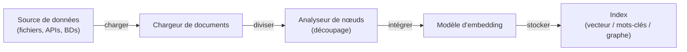

# LlamaIndex

## Définition

LlamaIndex (anciennement GPT Index) est un framework de données qui relie les [grands modèles de langage](/docs/llms) à vos propres sources de données. Son objectif principal est l'ingestion, l'indexation et l'interrogation de documents, bases de données et APIs pour que les LLM puissent répondre à des questions ancrées dans des informations privées ou spécifiques à un domaine. Il fournit un degré élevé de contrôle sur chaque étape de la [génération augmentée par récupération](/docs/rag) : chargement des données, analyse des nœuds (découpage), sélection des embeddings, construction d'index, stratégie de récupération, reclassement et synthèse des réponses.

Là où [LangChain](/docs/tools/langchain) met l'accent sur l'orchestration composable et les boucles d'agents, LlamaIndex est optimisé pour la **couche de données** : vous pouvez échanger les stratégies de découpage, les algorithmes de récupération et les approches de synthèse sans reconstruire le pipeline. Il est livré avec des moteurs de requête, des moteurs de chat et une décomposition de sous-questions prêts à l'emploi. Plusieurs types d'index (vecteur, résumé, graphe de connaissances, mots-clés) peuvent être combinés dans une seule requête pour une récupération hybride.

LlamaIndex prend également en charge les [agents](/docs/agents) : les moteurs de requête peuvent être enregistrés comme outils, et les boucles de raisonnement d'agents (ReAct, appel de fonctions OpenAI) peuvent sélectionner quel moteur interroger. Une suite d'évaluation (fidélité, pertinence, précision du contexte) aide à diagnostiquer la qualité du RAG et guide le découpage ou l'ajustement de la récupération pour la production.

## Fonctionnement

### Pipeline d'ingestion



### Pipeline de requête


### Abstractions clés

Les **nœuds** sont l'unité de récupération — des morceaux d'un document avec des métadonnées. L'**index** stocke les nœuds et prend en charge la recherche basée sur vecteur, mots-clés ou graphe. Le **moteur de requête** enveloppe index + récupérateur + synthétiseur en un seul appelable. Le **moteur de chat** maintient l'historique de la conversation. Le **moteur de sous-questions** décompose les requêtes complexes en requêtes plus simples distribuées sur plusieurs indices.

## Quand utiliser / Quand NE PAS utiliser

| Scénario | Utiliser LlamaIndex | NE PAS utiliser LlamaIndex |
|----------|---------------|----------------------|
| RAG sur de grands corpus de documents avec contrôle du découpage | Oui — analyseurs de nœuds fins et plusieurs types d'index | |
| Connexion des LLM à des bases de données et APIs internes | Oui — connecteurs de données pour SQL, Notion, Slack, S3, etc. | |
| Évaluation de la fidélité et de la pertinence de la récupération | Oui — modules d'évaluation intégrés | |
| Flux de travail d'agents en plusieurs étapes appelant de nombreuses APIs externes | | Préférer [LangChain](/docs/tools/langchain) pour des outils d'agents plus riches |
| Simples complétions en un tour sans récupération | | La surcharge est inutile ; appeler l'API LLM directement |
| Pipeline de production nécessitant le traçage LangSmith | | Intégrer avec LangChain ou utiliser un outil de traçage dédié |

## Comparaisons

| Fonctionnalité | LlamaIndex | LangChain |
|---------|------------|-----------|
| Focus principal | Indexation et récupération de données (RAG) | Orchestration, chaînes, agents |
| Contrôle du découpage | Analyseurs de nœuds fins | Séparateurs de texte de haut niveau |
| Types d'index | Vecteur, mots-clés, graphe, résumé, hybride | Principalement vecteur via récupérateurs |
| Évaluation | Intégrée (fidélité, pertinence) | Via LangSmith |
| Support d'agents | Moteurs de requête comme outils, ReAct | Agent LCEL première classe |
| Meilleur pour | RAG profond sur grands corpus | Orchestration d'agents en plusieurs étapes |

## Avantages et inconvénients

| Avantages | Inconvénients |
|------|------|
| Contrôle fin sur chaque étape RAG | Courbe d'apprentissage plus raide que les simples wrappers LLM |
| Plusieurs types d'index incluant les graphes de connaissances | Moins d'intégrations non-RAG comparé à LangChain |
| Suite d'évaluation intégrée pour RAG en production | Certaines abstractions ajoutent de la verbosité |
| Pipelines composables qui échangent facilement les composants | La documentation peut être en retard sur les sorties rapides |

## Exemples de code

```python
# Simple RAG pipeline with LlamaIndex
from llama_index.core import VectorStoreIndex, SimpleDirectoryReader
from llama_index.llms.openai import OpenAI
from llama_index.core import Settings

# Configure LLM and embedding model
Settings.llm = OpenAI(model="gpt-4o-mini")

# 1. Load documents from a directory
documents = SimpleDirectoryReader("./data").load_data()

# 2. Build a vector index (embeds and stores nodes automatically)
index = VectorStoreIndex.from_documents(documents)

# 3. Create a query engine with top-k retrieval
query_engine = index.as_query_engine(similarity_top_k=3)

# 4. Query
response = query_engine.query("What are the main topics covered?")
print(response)
```

## Conseils pour une utilisation efficace

- Choisissez la taille des morceaux en fonction de vos documents : 256–512 tokens fonctionne bien pour les Q&R factuelles ; 1024+ pour les tâches de résumé.
- Utilisez un reclasseur (par ex. `SentenceTransformerRerank`) pour améliorer la précision de récupération sans changer l'index.
- Combinez un index vecteur pour la recherche sémantique avec un index de mots-clés pour la récupération par correspondance exacte en utilisant un `QueryFusionRetriever`.
- Exécutez la suite d'évaluation intégrée périodiquement pendant le développement pour détecter les régressions dans la qualité de récupération.
- Utilisez `IngestionPipeline` avec un `RedisDocumentStore` pour l'ingestion incrémentielle afin que les documents ne soient pas ré-intégrés à la réexécution.

## Ressources pratiques

- [Documentation LlamaIndex](https://docs.llamaindex.ai/) — Guides complets, référence API et tutoriels
- [LlamaIndex — Guide RAG](https://docs.llamaindex.ai/en/stable/module_guides/deploying/rag/) — Pipelines d'ingestion, d'indexation et de requête
- [LlamaIndex — Agents](https://docs.llamaindex.ai/en/stable/module_guides/deploying/agents/) — Construire des agents avec des moteurs de requête comme outils
- [LlamaIndex — Évaluation](https://docs.llamaindex.ai/en/stable/module_guides/evaluating/) — Métriques de fidélité, pertinence et précision du contexte
- [LlamaHub](https://llamahub.ai/) — Connecteurs de données communautaires, outils et intégrations

## Voir aussi

- [RAG](/docs/rag)
- [LangChain](/docs/tools/langchain)
- [Bases de données vectorielles](/docs/rag/vector-databases)
