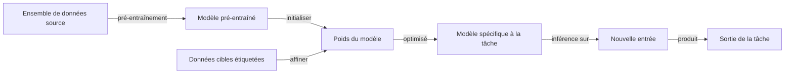

# Apprentissage par transfert

## Définition

L'apprentissage par transfert est une technique d'apprentissage automatique qui exploite les connaissances acquises sur une tâche ou un domaine source pour améliorer les performances sur une tâche cible différente mais liée. Au lieu d'entraîner un modèle de zéro, un **modèle pré-entraîné** — déjà entraîné sur de grandes données (par ex. ImageNet, texte à l'échelle du web) — sert de point de départ. Les représentations apprises du modèle encodent des caractéristiques polyvalentes (bords, textures, syntaxe du langage, sémantique) qui se transfèrent bien entre domaines liés.

La motivation principale est l'efficacité des données : les données étiquetées pour la tâche cible sont souvent rares ou coûteuses à collecter, mais le pré-entraînement sur des données abondantes non étiquetées ou étiquetées ailleurs crée une initialisation forte. L'**affinement** ajuste ensuite les poids pré-entraînés aux spécificités de la tâche cible, nécessitant bien moins d'étapes de gradient et d'exemples étiquetés qu'un entraînement de zéro. Ce paradigme est maintenant standard en [NLP](/docs/nlp) — BERT, GPT et leurs descendants sont pré-entraînés sur des milliards de tokens et affinés sur des tâches en aval — et en [vision par ordinateur](/docs/cv), où les backbones pré-entraînés sur ImageNet sont adaptés à l'imagerie médicale, aux images satellites et plus.

L'efficacité de l'apprentissage par transfert dépend de la **similarité des domaines** : le transfert entre tâches étroitement liées (par ex. NLP anglais-français, images naturelles vers médicales) fonctionne bien, tandis que le transfert entre domaines très différents (par ex. modèles de texte vers données tabulaires) peut nécessiter une adaptation plus spécifique à la tâche. Les techniques modernes efficaces en paramètres — **LoRA**, **adaptateurs** et **ajustement d'invite** — permettent l'affinement de grands modèles avec une fraction du calcul original en ne mettant à jour qu'un petit sous-ensemble de paramètres. Voir [l'apprentissage few-shot](/docs/few-shot-learning) et [l'apprentissage zero-shot](/docs/zero-shot-learning) pour les cas extrêmes où les exemples cibles sont minimaux ou absents.

## Comment ça fonctionne

### Pré-entraînement

Un grand modèle est entraîné sur un **ensemble de données source** en utilisant un objectif général (par ex. prédiction du prochain token pour les LLM, classification ImageNet pour les encodeurs de vision). Cette étape est intensive en calcul et effectuée une fois ; le point de contrôle pré-entraîné est ensuite distribué pour réutilisation.

### Stratégies d'affinement



Trois stratégies courantes diffèrent dans le nombre de paramètres mis à jour :

### Affinement complet

Tous les paramètres du modèle sont mis à jour sur la tâche cible. Le plus expressif mais nécessite un calcul significatif et risque l'**oubli catastrophique** (écraser les connaissances de la source).

### Tête uniquement / extraction de caractéristiques

Geler le backbone pré-entraîné et entraîner uniquement une nouvelle tête spécifique à la tâche (par ex. un classificateur linéaire sur les embeddings BERT gelés). Efficace en calcul mais moins expressif.

### Affinement efficace en paramètres (PEFT)

Des méthodes comme **LoRA** injectent de petites matrices décomposées de faible rang entraînables dans les couches du transformateur. Seulement ces matrices sont mises à jour (~0,1–1% du total des paramètres), préservant les connaissances source tout en adaptant le modèle efficacement. Les **adaptateurs** insèrent de petits modules goulot d'étranglement entre les couches du transformateur. L'**ajustement d'invite** préfixe des tokens souples apprenables à l'entrée tout en gardant le modèle gelé.

## Quand utiliser / Quand NE PAS utiliser

| Scénario | Utiliser l'apprentissage par transfert | Éviter l'apprentissage par transfert |
|---|---|---|
| Données étiquetées limitées pour la tâche cible | Oui — cas d'usage principal ; les caractéristiques pré-entraînées compensent | Non — entraîner de zéro seulement quand les données sont abondantes |
| Domaines source et cible liés | Oui — les représentations se transfèrent efficacement | Non — des domaines très différents peuvent nécessiter un pré-entraînement spécifique au domaine |
| Grand modèle pré-entraîné disponible | Oui — commencer depuis le meilleur point de contrôle disponible | Non — si aucun modèle pré-entraîné approprié n'existe pour la modalité |
| Inférence en temps réel avec latence stricte | Partiel — utiliser PEFT ou des modèles plus petits pour minimiser la surcharge | — |
| Données tabulaires ou structurées (pas de modèle pré-entraîné) | Non — le gradient boosting ou les réseaux spécialement conçus peuvent mieux fonctionner | — |

## Comparaisons

| Stratégie | Paramètres mis à jour | Données nécessaires | Coût de calcul | Risque d'oubli |
|---|---|---|---|---|
| Entraîner de zéro | Tous | Beaucoup | Élevé | Aucun |
| Affinement complet | Tous | Moyen | Moyen | Élevé |
| Tête uniquement / sonde linéaire | Tête seulement | Peu | Faible | Aucun |
| LoRA / adaptateurs (PEFT) | ~0,1–1% | Peu | Faible | Faible |
| Zero-shot (pas d'affinement) | Aucun | Aucun | Minimal | Aucun |

## Avantages et inconvénients

| Avantages | Inconvénients |
|---|---|
| Réduit considérablement les besoins en données et en calcul | L'oubli catastrophique peut dégrader les connaissances de la source |
| Convergence plus rapide — part d'une initialisation forte | Transfert négatif si les domaines source et cible sont trop dissimilaires |
| Prouvé dans le NLP, la vision, l'audio et les tâches multimodales | Les grands modèles pré-entraînés nécessitent une mémoire significative |
| Les techniques PEFT permettent l'affinement sur du matériel standard | L'affinement peut ne pas s'adapter complètement à des domaines très spécialisés |

## Exemples de code

Affinement d'un modèle BERT pré-entraîné pour la classification de texte en utilisant Hugging Face Transformers :

```python
from transformers import AutoTokenizer, AutoModelForSequenceClassification, Trainer, TrainingArguments
from datasets import load_dataset
import numpy as np
from sklearn.metrics import accuracy_score

# Charger un petit ensemble de données de sentiment
dataset = load_dataset("imdb")
tokenizer = AutoTokenizer.from_pretrained("bert-base-uncased")

def tokenize(batch):
    return tokenizer(batch["text"], truncation=True, padding="max_length", max_length=128)

dataset = dataset.map(tokenize, batched=True)
dataset.set_format("torch", columns=["input_ids", "attention_mask", "label"])

# Charger BERT pré-entraîné avec une tête de classification (2 classes)
model = AutoModelForSequenceClassification.from_pretrained(
    "bert-base-uncased", num_labels=2
)

def compute_metrics(pred):
    labels = pred.label_ids
    preds = np.argmax(pred.predictions, axis=1)
    return {"accuracy": accuracy_score(labels, preds)}

training_args = TrainingArguments(
    output_dir="./bert-imdb",
    num_train_epochs=3,
    per_device_train_batch_size=16,
    per_device_eval_batch_size=32,
    evaluation_strategy="epoch",
    save_strategy="epoch",
    load_best_model_at_end=True,
    logging_steps=100,
)

trainer = Trainer(
    model=model,
    args=training_args,
    train_dataset=dataset["train"].select(range(2000)),  # Sous-ensemble pour la démo
    eval_dataset=dataset["test"].select(range(500)),
    compute_metrics=compute_metrics,
)

trainer.train()
```

## Ressources pratiques

- [Hugging Face – Cours d'apprentissage par transfert](https://huggingface.co/course/chapter1/4?fw=pt) — Introduction pratique à l'affinement des transformateurs pour les tâches NLP
- [TensorFlow – Tutoriel d'apprentissage par transfert](https://www.tensorflow.org/tutorials/images/transfer_learning) — Guide étape par étape utilisant MobileNetV2 pour la classification d'images
- [LoRA: Low-Rank Adaptation of Large Language Models (Hu et al., 2022)](https://arxiv.org/abs/2106.09685) — Article PEFT fondateur permettant l'affinement efficace de grands modèles
- [Bibliothèque PEFT (Hugging Face)](https://huggingface.co/docs/peft/) — API unifiée pour LoRA, adaptateurs, ajustement d'invite et autres méthodes PEFT

## Voir aussi

- [Affinement](/docs/llms/fine-tuning)
- [Apprentissage few-shot](/docs/few-shot-learning)
