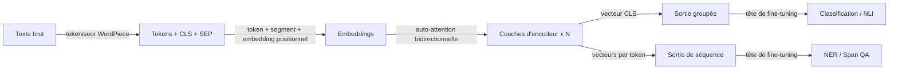

# BERT

## Définition

BERT est un modèle transformer d'**encodeur** pré-entraîné avec la modélisation de langage masqué (MLM) et la prédiction de la phrase suivante. Il produit des embeddings contextuels qui sont fine-tunés pour les tâches NLP en aval.

Contrairement aux décodeurs de style [GPT](/docs/transformers/gpt), BERT utilise un contexte **bidirectionnel** (gauche et droite de chaque token), ce qui aide pour les tâches de compréhension (par ex. classification [NLP](/docs/nlp), NER, QA) plutôt que la génération ouverte. Il est souvent utilisé comme encodeur gelé ou fine-tuné dans les pipelines de [RAG](/docs/rag) et de recherche.

L'objectif de pré-entraînement de BERT est élégamment simple : masquer aléatoirement 15% des tokens dans une entrée et entraîner le modèle à les prédire en utilisant le contexte environnant complet. Cela force l'encodeur à développer des représentations riches et dépendantes du contexte pour chaque token plutôt que de mémoriser des statistiques superficielles. Au moment du fine-tuning, une petite tête de tâche (une ou deux couches linéaires) est ajoutée sur l'encodeur pré-entraîné et entraînée sur des données étiquetées — atteignant souvent de solides performances avec seulement quelques milliers d'exemples. Des variantes comme RoBERTa (recette d'entraînement améliorée), DistilBERT (distillé pour la vitesse) et DeBERTa (attention découplée) ont amélioré l'original tout en préservant le paradigme encodeur seul.

## Fonctionnement



### Tokenisation et embedding

Les **tokens** sont produits par le tokeniseur WordPiece, qui ajoute un token spécial [CLS] au début et [SEP] entre/après les segments. L'embedding de chaque token est la somme de son embedding de token, d'embedding de segment et d'embedding positionnel.

### Encodeur bidirectionnel

Les **couches d'encodeur** appliquent l'auto-attention bidirectionnelle : contrairement aux modèles causaux, chaque token peut se concentrer sur tous les autres tokens dans les deux directions. Cela produit des représentations profondément conscientes du contexte. Empiler 12 ou 24 de ces couches (BERT-Base / BERT-Large) donne de puissantes représentations universelles.

### Sortie et fine-tuning

La sortie peut être **groupée** (le vecteur [CLS] pour les tâches au niveau de la phrase) ou la **séquence** complète (un vecteur par token pour NER, QA). Le **fine-tuning** ajoute une tête de tâche (par ex. classificateur linéaire) et met à jour le modèle entier ou seulement la tête sur des données étiquetées.

## Quand utiliser / Quand NE PAS utiliser

| Scénario | Utiliser BERT ? | Notes |
|---|---|---|
| Classification de texte (sentiment, intention) | Oui | Le token [CLS] + tête linéaire est très efficace |
| Reconnaissance d'entités nommées (NER) | Oui | Les sorties par token conviennent à l'étiquetage de spans |
| Recherche sémantique / récupération | Oui | Variantes fine-tunées ou bi-encodeur (par ex. Sentence-BERT) |
| Génération de texte ouverte | Non | Utiliser le décodeur de style GPT à la place |
| Très longs documents (\> 512 tokens) | Avec précaution | Utiliser Longformer ou des stratégies de segmentation |
| Tâches de génération zero-shot | Non | BERT nécessite un fine-tuning pour la génération |

## Comparaisons

| Aspect | BERT (encodeur seul) | GPT (décodeur seul) |
|---|---|---|
| Direction du contexte | Bidirectionnel | Unidirectionnel (causal) |
| Force principale | Compréhension / classification | Génération |
| Objectif de pré-entraînement | MLM masqué + NSP | Prédiction du token suivant |
| Style de fine-tuning | Ajouter une petite tête de tâche | Prompting ou fine-tuning supervisé |
| Capacité de génération | Faible (pas conçu pour cela) | Excellente |
| Qualité d'embedding (récupération) | Excellente (avec bi-encodeur) | Modérée sans fine-tuning |

## Avantages et inconvénients

| Avantages | Inconvénients |
|---|---|
| Représentations contextuelles solides | Ne peut pas générer du texte de manière autorégressive |
| Fine-tuning efficace sur de petits ensembles de données | Maximum 512 tokens (architecture de base) |
| Variantes pré-entraînées largement disponibles | Nécessite des données étiquetées pour la plupart des tâches |
| Motifs d'attention interprétables | Plus faible que les modèles de classe GPT-4 sur le raisonnement complexe |

## Exemples de code

```python
# Fine-tuning BERT for text classification with Hugging Face Transformers
from transformers import AutoTokenizer, AutoModelForSequenceClassification, Trainer, TrainingArguments
from datasets import Dataset
import torch

# Minimal synthetic dataset for demonstration
texts  = ["I love this product!", "Terrible experience.", "It was okay I guess.", "Absolutely fantastic!"]
labels = [1, 0, 0, 1]  # 1 = positive, 0 = negative

tokenizer = AutoTokenizer.from_pretrained("bert-base-uncased")

def tokenize(batch):
    return tokenizer(batch["text"], truncation=True, padding="max_length", max_length=64)

dataset = Dataset.from_dict({"text": texts, "label": labels})
dataset = dataset.map(tokenize, batched=True)
dataset.set_format("torch", columns=["input_ids", "attention_mask", "label"])

model = AutoModelForSequenceClassification.from_pretrained("bert-base-uncased", num_labels=2)

training_args = TrainingArguments(
    output_dir="./bert-sentiment",
    num_train_epochs=3,
    per_device_train_batch_size=2,
    logging_steps=5,
    save_strategy="no",
)

trainer = Trainer(model=model, args=training_args, train_dataset=dataset)
trainer.train()
print("Fine-tuning complete.")
```

## Ressources pratiques

- [BERT : Pré-entraînement de Transformers Bidirectionnels Profonds (Devlin et al.)](https://arxiv.org/abs/1810.04805) — Article original
- [Hugging Face – BERT](https://huggingface.co/docs/transformers/model_doc/bert) — Référence API et cartes de modèles
- [Sentence-BERT](https://www.sbert.net/) — Variante BERT optimisée pour la similarité sémantique et la récupération dense

## Voir aussi

- [Transformers](/docs/transformers)
- [GPT](/docs/transformers/gpt)
- [NLP](/docs/nlp)
