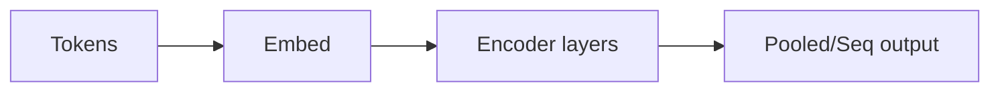

# BERT

## Définition

BERT est un modèle **encodeur** de transformer pré-entraîné avec la modélisation de langage masqué (MLM) et la prédiction de phrase suivante. Il produit des embeddings contextuels qui sont affinés pour des tâches NLP en aval.

Contrairement aux décodeurs style [GPT](/docs/transformers/gpt), BERT utilise un contexte **bidirectionnel** (gauche et droite de chaque token), ce qui aide pour les tâches de compréhension (p. ex. classification [NLP](/docs/nlp), NER, QA) plutôt que la génération ouverte. Il est souvent utilisé comme encodeur gelé ou affiné dans les pipelines [RAG](/docs/rag) et de recherche.

## Comment ça fonctionne

Les **tokens** sont tokenisés et encodés (embeddings de token + position). Les **couches d'encodeur** appliquent l'auto-attention bidirectionnelle et des FFN ; la représentation de chaque token est influencée par tous les autres tokens. La sortie peut être **poolée** (p. ex. [CLS] pour les tâches au niveau de la phrase) ou **séquentielle** (un vecteur par token pour NER, QA). Pré-entraînement : masquer aléatoirement des tokens et les prédire (MLM), et prédire si deux phrases sont consécutives (NSP). L'**affinage** ajoute une tête de tâche (p. ex. classifieur linéaire) et met à jour le modèle (ou seulement la tête) sur des données étiquetées.

## Cas d'utilisation

Les modèles style BERT excellent quand vous avez besoin de représentations contextuelles riches pour la compréhension (classification, NER, QA) plutôt que la génération.

- Reconnaissance d'entités nommées et extraction de relations
- Recherche et récupération (matching sémantique, classement de pertinence)
- Réponse aux questions et inférence en langage naturel

## Documentation externe

- [BERT: Pre-training of Deep Bidirectional Transformers (Devlin et al.)](https://arxiv.org/abs/1810.04805)
- [Hugging Face – BERT](https://huggingface.co/docs/transformers/model_doc/bert)

## Voir aussi

- [Transformers](/docs/transformers)
- [GPT](/docs/transformers/gpt)
- [NLP](/docs/nlp)
