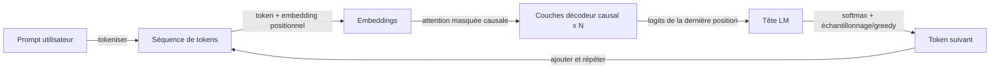

# GPT

## Définition

GPT désigne des modèles transformer décodeur seul entraînés à prédire le token suivant (autorégressif). Mettre à l'échelle ces modèles a conduit aux grands modèles de langage (LLM) actuels capables de tâches few-shot et zero-shot.

La conception décodeur seul convient bien à la **génération** : à chaque étape le modèle conditionne sur les tokens précédents et prédit le suivant. Les [LLMs](/docs/llms) construits sur cette idée sont ensuite ajustés par instructions et alignés (par ex. RLHF) pour le chat et l'utilisation d'outils. Pour les tâches de compréhension seule, les encodeurs de style [BERT](/docs/transformers/bert) peuvent être plus efficaces en paramètres.

La ligne de modèles GPT (GPT-1, GPT-2, GPT-3, GPT-4) a démontré que mettre à l'échelle un objectif simple de prédiction du token suivant sur des corpus toujours plus grands produit des modèles avec des capacités émergentes : raisonnement, génération de code, arithmétique en plusieurs étapes et résolution de tâches few-shot sans aucun entraînement spécifique à la tâche. Les étapes d'ajustement d'instructions et RLHF qui suivent le pré-entraînement de base transforment un prédicteur de token suivant brut en un assistant qui suit de manière fiable les instructions en langage naturel, maintient le contexte de la conversation et refuse les demandes nuisibles. Les déploiements modernes de la famille GPT sont accessibles via des APIs et supportent des fonctionnalités comme les appels de fonctions, les entrées visuelles et le streaming.

## Fonctionnement



### Masquage causal

Les **tokens** sont intégrés et alimentés dans les **couches de décodeur causal** : chaque position ne peut se concentrer que sur elle-même et les positions précédentes (auto-attention masquée via un masque triangulaire supérieur). Cela empêche le modèle de « voir » le futur pendant l'entraînement et l'inférence.

### Tête de modélisation du langage

Le **token suivant** est prédit depuis la représentation de la dernière position via une couche linéaire sur le vocabulaire, suivie d'une softmax. L'**entraînement** maximise la log-vraisemblance du token suivant étant donné tous les tokens précédents (forçage par l'enseignant). La perte est moyennée sur toutes les positions, donc chaque token dans la séquence contribue un signal de gradient.

### Inférence et échantillonnage

L'**inférence** génère de manière autorégressive : échantillonner ou choisir goulûment le token suivant, l'ajouter et répéter jusqu'à une condition d'arrêt (token EOS ou longueur maximale). Les paramètres d'échantillonnage (température, top-k, top-p) contrôlent la diversité vs. le déterminisme. L'[ingénierie de prompts](/docs/prompt-engineering) et le [fine-tuning](/docs/llms/fine-tuning) façonnent le comportement de la tâche sur ce mécanisme.

## Quand utiliser / Quand NE PAS utiliser

| Scénario | Utiliser le style GPT ? | Notes |
|---|---|---|
| Génération de texte, résumé, dialogue | Oui | L'ajustement naturel pour la génération autorégressive |
| Classification few-shot via prompting | Oui | GPT gère bien cela avec quelques exemples |
| Recherche sémantique / récupération dense | Avec précaution | Les bi-encodeurs (style BERT) sont plus efficaces |
| Classification NER ou au niveau du token | Avec précaution | Les modèles encodeurs sont plus efficaces en paramètres |
| Raisonnement de contexte long (\>8K tokens) | Oui | Les modèles GPT modernes supportent de très longs contextes |
| Budget strict / déploiement edge | Non | Les modèles GPT sont grands ; utiliser des alternatives distillées |

## Comparaisons

| Aspect | GPT (décodeur seul) | BERT (encodeur seul) |
|---|---|---|
| Direction du contexte | Unidirectionnel (causal) | Bidirectionnel |
| Force principale | Génération | Compréhension / classification |
| Objectif de pré-entraînement | Prédiction du token suivant | MLM masqué + NSP |
| Capacité zero-shot | Élevée | Faible |
| Qualité d'embedding (récupération) | Modérée sans fine-tuning | Excellente (bi-encodeur) |
| Accès API | OpenAI, Anthropic, Mistral, etc. | Hub HuggingFace |

## Avantages et inconvénients

| Avantages | Inconvénients |
|---|---|
| Forte génération zero-shot et few-shot | Coûteux à exécuter (grand nombre de paramètres) |
| Modèle unifié pour des tâches diverses | Susceptible aux hallucinations |
| Suivi d'instructions via les prompts | Pas de contexte bidirectionnel explicite |
| Facilement extensible avec des outils et RAG | La sortie doit être validée / fondée |

## Exemples de code

```python
# Chat completion with OpenAI API + streaming
from openai import OpenAI

client = OpenAI()  # reads OPENAI_API_KEY from environment

response = client.chat.completions.create(
    model="gpt-4o-mini",
    messages=[
        {"role": "system", "content": "You are a concise technical assistant."},
        {"role": "user",   "content": "Explain the difference between GPT and BERT in two sentences."},
    ],
    temperature=0.3,
    max_tokens=200,
    stream=True,
)

print("Response: ", end="", flush=True)
for chunk in response:
    delta = chunk.choices[0].delta
    if delta.content:
        print(delta.content, end="", flush=True)
print()  # newline at end
```

## Ressources pratiques

- [Améliorer la compréhension du langage par pré-entraînement génératif (OpenAI)](https://cdn.openai.com/research-covers/language-unsupervised/language_understanding_paper.pdf) — Article original GPT-1
- [Hugging Face – GPT-2](https://huggingface.co/docs/transformers/model_doc/gpt2) — Documentation du modèle et poids hébergés
- [Référence API OpenAI](https://platform.openai.com/docs/api-reference/chat) — Référence complète pour le point de terminaison des complétions de chat

## Voir aussi

- [Transformers](/docs/transformers)
- [LLMs](/docs/llms)
- [Ingénierie de prompts](/docs/prompt-engineering)
