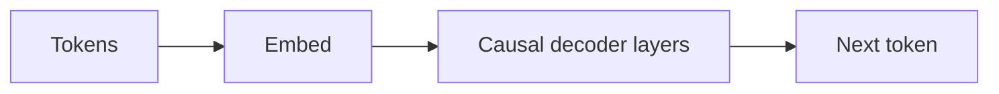

# GPT

## Définition

GPT désigne des modèles transformer décodeur seul entraînés à prédire le token suivant (autorégressif). La mise à l'échelle de ces modèles a conduit aux grands modèles de langage (LLMs) actuels capables de tâches few-shot et zero-shot.

La conception décodeur seul est adaptée à la **génération** : à chaque étape, le modèle se conditionne sur les tokens précédents et prédit le suivant. Les [LLMs](/docs/llms) construits sur cette idée sont ensuite affinés avec des instructions et alignés (p. ex. RLHF) pour le chat et l'utilisation d'outils. Pour les tâches de compréhension uniquement, les encodeurs style [BERT](/docs/transformers/bert) peuvent être plus efficaces en paramètres.

## Comment ça marche

Les **tokens** sont encodés et envoyés dans des **couches de décodeur causales** : chaque position ne peut attendre qu'à elle-même et aux positions précédentes (auto-attention masquée), donc le modèle ne peut pas « voir » le futur. Le **token suivant** est prédit à partir de la représentation de la dernière position (souvent avec une couche linéaire et softmax sur le vocabulaire). L'**entraînement** maximise la probabilité du token suivant étant donné le contexte précédent (teacher forcing). L'**inférence** génère autorégressivement : échantillonner ou choisir avidement le token suivant, l'ajouter et répéter jusqu'à une condition d'arrêt. Le [prompt engineering](/docs/prompt-engineering) et l'[affinage](/docs/llms/fine-tuning) façonnent la façon dont le modèle utilise ce mécanisme pour les tâches.

## Cas d'utilisation

Les modèles décodeur seul sont la base du chat, du code et de toute tâche bénéficiant de la génération autorégressive ou du prompting few-shot.

- Génération de texte et de code (complétion, résumé, dialogue)
- Classification few-shot et zero-shot via prompts
- Assistants et chatbots basés sur des modèles affinés avec instructions

## Documentation externe

- [Improving Language Understanding by Generative Pre-Training (OpenAI)](https://cdn.openai.com/research-covers/language-unsupervised/language_understanding_paper.pdf)
- [Hugging Face – GPT-2](https://huggingface.co/docs/transformers/model_doc/gpt2)

## Voir aussi

- [Transformers](/docs/transformers)
- [LLMs](/docs/llms)
- [Prompt engineering](/docs/prompt-engineering)
