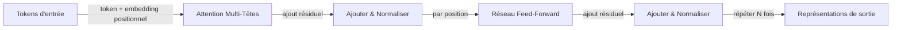

# Transformers

## Définition

Les Transformers sont des architectures neuronales basées sur l'**auto-attention** : chaque token se concentre sur tous les autres pour calculer des représentations contextuelles. Ils évitent la récurrence et permettent la parallélisation, passant à l'échelle vers de très longues séquences et de grands modèles (BERT, GPT, etc.).

Ils sous-tendent les [LLMs](/docs/llms) modernes et ont été étendus aux modèles [multimodaux](/docs/multimodal-ai) et de [vision](/docs/cv). Les variantes encodeur seul ([BERT](/docs/transformers/bert)) et décodeur seul ([GPT](/docs/transformers/gpt)) sont les plus courantes aujourd'hui ; la disposition encodeur-décodeur reste utilisée pour les tâches séquence à séquence.

L'article « Attention Is All You Need » (2017) a introduit le transformer en supprimant entièrement la boucle récurrente et en la remplaçant par une attention produit scalaire mise à l'échelle. Cela a rendu l'entraînement entièrement parallélisable, permettant d'entraîner des modèles sur des ensembles de données bien plus grands que les prédécesseurs basés sur RNN. Les encodages positionnels remplacent l'ordonnancement implicite de la récurrence ; les connexions résiduelles et la normalisation par couches stabilisent le flux de gradient à travers de nombreuses couches. Ces choix de conception, combinés avec la sous-couche feed-forward pour le calcul par position, forment le bloc de construction fondamental qui a passé à l'échelle jusqu'à des centaines de milliards de paramètres.

## Fonctionnement



### Mécanisme d'auto-attention

**Attention :** L'entrée est projetée en matrices Query (Q), Key (K) et Value (V). Les poids d'attention sont calculés comme softmax(QK^T / sqrt(d_k)), puis appliqués à V. La sortie de chaque token est une combinaison pondérée des valeurs de tous les tokens — capturant le contexte global en une seule étape.

### Attention multi-têtes

**Attention multi-têtes :** Plusieurs têtes d'attention fonctionnent en parallèle, chacune apprenant différents modèles relationnels (syntaxe, coréférence, sémantique). Leurs sorties sont concaténées et projetées, donnant au modèle une capacité représentationnelle plus riche qu'une seule tête d'attention.

### Encodeur vs. décodeur

**Encodeur seul (par ex. BERT) :** Tous les tokens se concentrent sur tous les autres (bidirectionnel). Meilleur pour les tâches de compréhension. **Décodeur seul (par ex. GPT) :** Le masquage causal garantit que chaque position ne se concentre que sur les tokens passés, permettant la génération autorégressive. **Encodeur-décodeur :** Utilisé pour des tâches comme la traduction où la séquence d'entrée est entièrement encodée avant de décoder la sortie.

## Quand utiliser / Quand NE PAS utiliser

| Scénario | Utiliser les transformers ? | Notes |
|---|---|---|
| Classification NLP, NER, QA | Oui | L'encodeur seul (style BERT) est la norme |
| Génération de texte, chat, code | Oui | Le décodeur seul (style GPT) est la norme |
| Inférence edge à faibles ressources | Avec précaution | Des variantes distillées ou quantifiées sont recommandées |
| Courtes séquences avec localité claire | Avec précaution | Les CNN ou RNN peuvent être plus efficaces |
| Séquence à séquence (traduction) | Oui | Les transformers encodeur-décodeur excellent ici |
| Tâches de vision | Oui | Les patches Vision Transformer (ViT) fonctionnent bien |

## Comparaisons

| Aspect | RNN / LSTM | CNN | Transformer |
|---|---|---|---|
| Dépendances à longue portée | Modérées | Faibles | Excellentes |
| Entraînement parallélisable | Non | Oui | Oui |
| Fenêtre de contexte | Limitée par le déroulement | Champ réceptif fixe | Configurable (jusqu'à 1M+ tokens) |
| Coût mémoire à l'inférence | Faible (état fixe) | Faible | Élevé (cache KV croît avec le contexte) |
| NLP état de l'art | Non | Non | Oui |

## Avantages et inconvénients

| Avantages | Inconvénients |
|---|---|
| Parallélisable, évolutif | Calcul et mémoire élevés |
| Fort sur les dépendances à longue portée | Nécessite de grandes données |
| Architecture unifiée pour de nombreuses tâches | Défis d'interprétabilité |
| Modèles pré-entraînés largement disponibles | Coût d'attention quadratique avec la longueur de la séquence |

## Exemples de code

```python
# Self-attention from scratch with PyTorch
import torch
import torch.nn as nn
import torch.nn.functional as F
import math

class MultiHeadSelfAttention(nn.Module):
    def __init__(self, d_model: int, num_heads: int):
        super().__init__()
        assert d_model % num_heads == 0
        self.d_k = d_model // num_heads
        self.num_heads = num_heads
        self.W_qkv = nn.Linear(d_model, 3 * d_model, bias=False)
        self.W_o   = nn.Linear(d_model, d_model, bias=False)

    def forward(self, x: torch.Tensor, causal: bool = False) -> torch.Tensor:
        B, T, C = x.shape
        qkv = self.W_qkv(x).split(C, dim=2)
        q, k, v = [t.view(B, T, self.num_heads, self.d_k).transpose(1, 2) for t in qkv]
        scale  = math.sqrt(self.d_k)
        scores = (q @ k.transpose(-2, -1)) / scale         # (B, heads, T, T)
        if causal:
            mask = torch.tril(torch.ones(T, T, device=x.device)).bool()
            scores = scores.masked_fill(~mask, float('-inf'))
        weights = F.softmax(scores, dim=-1)
        out = (weights @ v).transpose(1, 2).contiguous().view(B, T, C)
        return self.W_o(out)

# Test with a dummy batch
attn  = MultiHeadSelfAttention(d_model=64, num_heads=4)
x     = torch.randn(2, 10, 64)   # batch=2, seq_len=10, d_model=64
print(attn(x).shape)             # (2, 10, 64)
```

## Ressources pratiques

- [Attention Is All You Need (Vaswani et al.)](https://arxiv.org/abs/1706.03762) — Article original du transformer
- [Hugging Face – Résumé des modèles](https://huggingface.co/docs/transformers/model_summary) — Vue d'ensemble des familles de modèles transformer
- [Le Transformer Illustré](https://jalammar.github.io/illustrated-transformer/) — Meilleure explication visuelle de l'architecture

## Voir aussi

- [BERT](/docs/transformers/bert)
- [GPT](/docs/transformers/gpt)
- [LLMs](/docs/llms)
