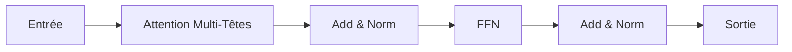

# Transformers

## Définition

Les Transformers sont des architectures neuronales basées sur l'**auto-attention** : chaque token attend tous les autres pour calculer des représentations contextuelles. Ils évitent la récurrence et permettent la parallélisation, s'adaptant à des séquences très longues et des modèles de grande taille (BERT, GPT, etc.).

Ils sous-tendent les [LLMs](/docs/llms) modernes et ont été étendus aux modèles [multimodaux](/docs/multimodal-ai) et de [vision](/docs/cv). Les variantes encodeur seul ([BERT](/docs/transformers/bert)) et décodeur seul ([GPT](/docs/transformers/gpt)) sont les plus courantes aujourd'hui ; la disposition encodeur-décodeur reste utilisée pour les tâches de séquence à séquence.

## Comment ça marche

- **Attention :** Query, Key, Value sont calculés à partir des entrées ; les poids d'attention combinent les valeurs.
- **Attention multi-têtes :** Plusieurs têtes d'attention capturent différentes relations.
- **Encodeur-décodeur ou décodeur seul :** L'encodeur (p. ex. BERT) voit la séquence complète ; le décodeur (p. ex. GPT) utilise un masquage causal pour la génération autorégressive.

Le diagramme montre un bloc : l'entrée passe par l'attention multi-têtes (avec add et norm), puis un réseau feed-forward (FFN), puis add et norm à nouveau. Les piles d'encodeur utilisent l'attention bidirectionnelle ; les piles de décodeur utilisent l'attention causale (masquée) pour que chaque position ne voie que les tokens passés. Les connexions résiduelles et la normalisation de couche stabilisent l'entraînement. Empiler de nombreux blocs et augmenter largeur et profondeur produit les grands modèles utilisés pour le [NLP](/docs/nlp) et au-delà.

## Cas d'utilisation

Les Transformers sous-tendent la plupart des systèmes NLP et multimodaux modernes ; les variantes encodeur seul, décodeur seul et encodeur-décodeur conviennent à différentes tâches.

- Style BERT : reconnaissance d'entités nommées, pertinence de recherche, réponse aux questions
- Style GPT : génération de texte, complétion de code, chat et dialogue
- Transformers multimodaux pour les tâches vision-langage

## Avantages et inconvénients

| Avantages | Inconvénients |
|-----------|---------------|
| Parallélisable, évolutif | Calcul et mémoire élevés |
| Performant sur les dépendances à longue portée | Nécessite de grandes données |
| Architecture unifiée pour de nombreuses tâches | Défis d'interprétabilité |

## Documentation externe

- [Attention Is All You Need (Vaswani et al.)](https://arxiv.org/abs/1706.03762) — Article original du Transformer
- [Hugging Face – Résumé des modèles](https://huggingface.co/docs/transformers/model_summary) — Familles de modèles Transformer
- [The Illustrated Transformer](https://jalammar.github.io/illustrated-transformer/) — Explication visuelle de l'architecture

## Voir aussi

- [BERT](/docs/transformers/bert)
- [GPT](/docs/transformers/gpt)
- [LLMs](/docs/llms)
