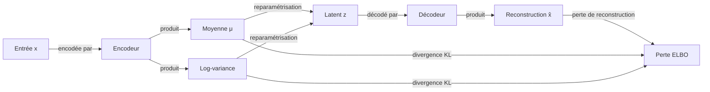

# Auto-encodeurs variationnels (VAE)

## Définition

Les auto-encodeurs variationnels (VAE), introduits par Kingma & Welling en 2013, sont une classe de modèle génératif qui apprend un **espace latent** structuré en combinant une architecture d'auto-encodeur avec l'inférence bayésienne variationnelle. L'encodeur mappe les données d'entrée vers une distribution de probabilité sur les codes latents (plutôt qu'un seul point), et le décodeur mappe les codes latents échantillonnés vers les sorties reconstruites. Cette formulation probabiliste force l'espace latent à être lisse et continu, permettant une interpolation significative et une génération inconditionnelle.

L'objectif d'entraînement est la **Borne Inférieure de l'Evidence (ELBO)** : un terme de reconstruction qui pousse les sorties décodées à correspondre aux entrées, plus un terme de divergence KL qui régularise la distribution latente vers un prior (typiquement une normale standard). Le **truc de reparamétrisation** — échantillonner z = μ + σ·ε où ε ~ N(0, I) — permet aux gradients de traverser l'opération d'échantillonnage, rendant possible l'entraînement de bout en bout avec la rétropropagation.

Comparés aux [GAN](/docs/gans), les VAE sont plus faciles à entraîner (pas de dynamique adversariale), fournissent une vraisemblance explicite (bien qu'approximative) et offrent un espace latent bien structuré adapté à l'interpolation et à l'apprentissage de représentations. Cependant, la régularisation KL et la perte de reconstruction (typiquement MSE ou BCE) ont tendance à produire des échantillons plus flous que les GAN ou les [modèles de diffusion](/docs/diffusion-models). Les VAE restent l'outil de travail pour la détection d'anomalies, la génération contrôlable et comme backbone de compression dans la **diffusion latente** (Stable Diffusion utilise un encodeur/décodeur VAE autour de son processus de diffusion).

## Comment ça fonctionne

### Encodeur

L'**encodeur** q(z|x) mappe l'entrée **x** vers les paramètres d'une distribution gaussienne sur la variable latente z : un vecteur moyen **μ** et un vecteur de log-variance **log σ²**. Cela est implémenté comme un réseau de neurones avec deux têtes de sortie.

### Reparamétrisation et échantillonnage

Un vecteur latent **z** est échantillonné comme z = μ + σ · ε, où ε ~ N(0, I). Cela garde l'échantillonnage différentiable pour que les gradients traversent μ et σ jusqu'aux poids de l'encodeur.

### Décodeur

Le **décodeur** p(x|z) mappe **z** vers l'espace des données, produisant la **sortie reconstruite** x̂. La qualité de reconstruction est mesurée par une perte de reconstruction (MSE pour les données continues, BCE pour le binaire).

### Objectif d'entraînement (ELBO)

```
Perte = Perte de reconstruction + β · KL(q(z|x) || p(z))
```

Le terme KL pénalise l'encodeur pour s'être écarté du prior N(0, I), assurant que l'espace latent est compact et lisse. β-VAE utilise β > 1 pour augmenter le découplage.



### Génération à l'inférence

Pour générer de nouveaux échantillons, **z est tiré du prior** N(0, I) — en contournant complètement l'encodeur — et passé par le décodeur. Parce que le terme KL assure que l'espace latent est dense et lisse, la plupart des vecteurs z aléatoires produisent des sorties cohérentes.

## Quand utiliser / Quand NE PAS utiliser

| Scénario | Utiliser VAE | Éviter VAE |
|---|---|---|
| Interpolation latente lisse nécessaire | Oui — espace latent continu et structuré | Non — les GAN ne garantissent pas une interpolation lisse |
| Détection d'anomalies via l'erreur de reconstruction | Oui — une erreur de reconstruction élevée signale des anomalies | Non — si un seuil discriminatif est plus simple |
| Apprentissage de représentation avec incertitude | Oui — l'encodeur probabiliste capture l'incertitude d'entrée | Non — si un encodeur déterministe (par ex. SimCLR) suffit |
| Génération d'images photoréalistes | Non — les sorties tendent à être floues par rapport aux GAN/diffusion | — |
| Applications nécessitant une vraisemblance exacte | Partiel — ELBO est une borne inférieure, pas exacte | — |

## Comparaisons

| Modèle | Structure latente | Netteté des échantillons | Entraînement | Vraisemblance |
|---|---|---|---|---|
| VAE | Lisse, régularisée | Floue | Stable | Approximative (ELBO) |
| GAN | Pas de latent explicite | Nette | Instable | Aucune |
| Diffusion | Implicite (calendrier de bruit) | Très nette | Stable | Approximative |
| AE (simple) | Non régularisée | Nette | Stable | Aucune |

## Avantages et inconvénients

| Avantages | Inconvénients |
|---|---|
| Entraînement stable et fondé via ELBO | Les échantillons sont souvent plus flous que les GAN ou la diffusion |
| Vraisemblance explicite (borne inférieure) pour l'évaluation | Le terme KL peut sur-régulariser, réduisant l'expressivité |
| L'espace latent lisse supporte l'interpolation | Effondrement du posterior — l'encodeur ignore z quand le décodeur est trop puissant |
| Utile pour la détection d'anomalies et l'apprentissage de représentation | La perte de reconstruction est un proxy ; peut ne pas correspondre à la qualité perceptuelle |

## Exemples de code

VAE minimal sur MNIST utilisant PyTorch :

```python
import torch
import torch.nn as nn
import torch.nn.functional as F
from torchvision import datasets, transforms
from torch.utils.data import DataLoader

class VAE(nn.Module):
    def __init__(self, latent_dim=20):
        super().__init__()
        # Encodeur
        self.fc1 = nn.Linear(784, 400)
        self.fc_mu = nn.Linear(400, latent_dim)
        self.fc_logvar = nn.Linear(400, latent_dim)
        # Décodeur
        self.fc3 = nn.Linear(latent_dim, 400)
        self.fc4 = nn.Linear(400, 784)

    def encode(self, x):
        h = F.relu(self.fc1(x))
        return self.fc_mu(h), self.fc_logvar(h)

    def reparameterize(self, mu, logvar):
        std = torch.exp(0.5 * logvar)
        eps = torch.randn_like(std)
        return mu + eps * std

    def decode(self, z):
        h = F.relu(self.fc3(z))
        return torch.sigmoid(self.fc4(h))

    def forward(self, x):
        mu, logvar = self.encode(x.view(-1, 784))
        z = self.reparameterize(mu, logvar)
        return self.decode(z), mu, logvar

def elbo_loss(recon_x, x, mu, logvar):
    bce = F.binary_cross_entropy(recon_x, x.view(-1, 784), reduction="sum")
    kl = -0.5 * torch.sum(1 + logvar - mu.pow(2) - logvar.exp())
    return bce + kl

model = VAE()
optimizer = torch.optim.Adam(model.parameters(), lr=1e-3)
loader = DataLoader(
    datasets.MNIST(".", download=True, transform=transforms.ToTensor()),
    batch_size=128, shuffle=True
)

for epoch in range(5):
    total_loss = 0
    for x, _ in loader:
        recon, mu, logvar = model(x)
        loss = elbo_loss(recon, x, mu, logvar)
        optimizer.zero_grad(); loss.backward(); optimizer.step()
        total_loss += loss.item()
    print(f"Époque {epoch+1} | Perte : {total_loss / len(loader.dataset):.2f}")

# Générer de nouveaux échantillons
with torch.no_grad():
    z = torch.randn(16, 20)
    samples = model.decode(z).view(16, 1, 28, 28)
```

## Ressources pratiques

- [Auto-Encoding Variational Bayes (Kingma & Welling, 2013)](https://arxiv.org/abs/1312.6114) — Article VAE original introduisant ELBO et le truc de reparamétrisation
- [PyTorch – Exemple VAE](https://github.com/pytorch/examples/tree/main/vae) — Implémentation minimale officielle
- [β-VAE (Higgins et al., 2017)](https://openreview.net/forum?id=Sy2fchgYl) — Extension pour des représentations latentes découplées
- [Latent Diffusion Models (Rombach et al.)](https://arxiv.org/abs/2112.10752) — Comment la compression VAE sous-tend Stable Diffusion

## Voir aussi

- [GAN](/docs/gans)
- [Modèles de diffusion](/docs/diffusion-models)
