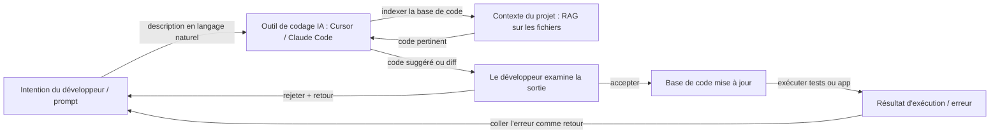

# Vibe Coding

## Définition

Le vibe coding est un style de développement logiciel où l'on travaille **de manière itérative avec l'assistance de l'IA** : on décrit son intention en langage naturel, on obtient du code ou des modifications d'un [LLM](/docs/llms) ou d'un outil de codage, puis on affine par retours et contexte plutôt qu'en écrivant chaque ligne from scratch. Le « vibe » est le flux détendu et exploratoire — on dirige par intention et ressenti, et le modèle remplit les détails d'implémentation. L'objectif est de réduire la friction : les idées passent de la pensée au code fonctionnel en quelques minutes plutôt qu'en heures, le développeur jouant le rôle de directeur et réviseur plutôt que de dactylographe.

Le vibe coding contraste avec les approches entièrement spec-first ou plan-then-code (p. ex. [développement guidé par spécifications](/docs/spec-driven-development)) : on commence souvent avec une idée approximative et on laisse l'[ingénierie de prompts](/docs/prompt-engineering), les [agents](/docs/agents) et les outils (p. ex. [Cursor](/docs/tools/cursor), [Claude Code](/docs/tools/claude-code)) suggérer et modifier le code. Le rôle du développeur passe de l'écriture de syntaxe à la description d'objectifs, l'évaluation des sorties et le guidage vers la correction. C'est le plus productif quand le développeur conserve suffisamment de compréhension du code pour détecter les erreurs — le vibe coding n'élimine pas le besoin de jugement technique, il change où ce jugement est appliqué.

La pratique est rendue possible par une nouvelle génération d'outils de codage IA qui fournissent un contexte au niveau du projet : bases de code indexées, modifications multi-fichiers, accès au terminal et boucles agentiques qui peuvent écrire, exécuter et corriger du code de manière autonome. Des outils comme Cursor, Windsurf et Claude Code vont au-delà de l'autocomplétion pour agir comme des agents collaboratifs qui comprennent l'ensemble du projet. La récupération de style [RAG](/docs/rag) ancre les suggestions dans votre base de code réelle plutôt que dans des exemples génériques. Le résultat est particulièrement utile pour les prototypes, les scripts, le code répétitif, les tests et les refactorisations — des tâches où l'intention est facile à exprimer mais l'implémentation est fastidieuse à écrire.

## Comment ça fonctionne

### La boucle intention-retour

Le cœur du vibe coding est une boucle rapide : exprimer une intention, revoir la sortie, fournir un retour, répéter. Contrairement au développement en cascade, il n'y a pas d'exigence de spécifier complètement les exigences avant de commencer. On peut explorer en demandant au modèle d'« essayer quelques approches » et choisir celle qui semble juste. Les suggestions du modèle deviennent des échafaudages qu'on affine plutôt que des artefacts complétés qu'on accepte en totalité.

### Contexte et outils



### Modes agentiques et autonomes

Les outils modernes prennent en charge le vibe coding agentique : l'IA peut exécuter des commandes de terminal, lire la sortie d'erreurs et s'autocorriger sur plusieurs itérations sans intervention du développeur. C'est utile pour les tâches répétitives (générer des suites de tests, migrer des APIs), mais nécessite que le développeur fixe des limites claires et examine le diff final — les boucles agentiques peuvent effectuer des changements en cascade difficiles à démêler.

## Quand utiliser / Quand NE PAS utiliser

| Utiliser quand | Éviter quand |
|----------------|--------------|
| Prototypage ou scripting où la vitesse compte plus que l'architecture | Systèmes critiques pour la sécurité ou fortement réglementés où le code non examiné est inacceptable |
| Générer du code répétitif, des tests ou des migrations où l'intention est facile à exprimer | La base de code est si complexe que le modèle manque de contexte suffisant pour éviter les bugs subtils |
| Apprendre ou explorer une base de code ou bibliothèque inconnue | Il faut comprendre complètement chaque ligne de code produite (p. ex. pour une revue de sécurité) |
| Itérer rapidement sur la conception UI ou API pour valider des idées | La maintenabilité à long terme nécessite des modèles cohérents et des décisions d'architecture délibérées |

## Comparaisons

| Approche | Point de départ | Spécification requise | Meilleur pour |
|----------|----------------|----------------------|--------------|
| Vibe coding | Intention approximative | Non | Prototypes, scripts, exploration |
| Développement guidé par spécifications | Spécification explicite | Oui | Systèmes réglementés, agents, conformité |
| TDD (test en premier) | Cas de test | Partiellement | Fonctionnalités de production avec critères d'acceptation clairs |
| Programmation en binôme (humain + humain) | Contexte partagé | Varie | Problèmes complexes nécessitant un raisonnement approfondi |

## Avantages et inconvénients

| Avantages | Inconvénients |
|-----------|---------------|
| Itération rapide et moins de frappe | Peut obscurcir la compréhension si on ne lit jamais le code |
| Bon pour l'exploration et l'apprentissage | Peut produire du code fragile ou suroptimisé sans révision |
| Peu de friction pour les petites tâches et les prototypes | Difficile à faire évoluer vers de grands systèmes cohérents sans spécifications |
| Fonctionne bien avec les [agents](/docs/agents) et les intégrations IDE | Dépend fortement de la qualité du modèle, de la fenêtre de contexte et de l'intégration des outils |
| Réduit l'énergie d'activation pour commencer une nouvelle tâche | Les boucles agentiques peuvent effectuer des changements en cascade indésirables |

## Exemples de code

### Session de vibe coding exemple avec Claude Code (shell)

```bash
# Démarrer Claude Code dans le répertoire de votre projet
claude

# Décrivez ce que vous voulez — pas besoin de spécifier l'implémentation exacte
> Ajoute un middleware de limitation de débit à l'application Express.
>  Utilise une fenêtre glissante de 100 requêtes par minute par IP.
>  Renvoie 429 avec un en-tête Retry-After quand la limite est dépassée.

# Claude Code va :
# 1. Lire la configuration Express existante
# 2. Installer la bibliothèque appropriée (p. ex. express-rate-limit)
# 3. Écrire et insérer le middleware
# 4. Mettre à jour les imports

# Examiner le diff, puis itérer
> Utilise plutôt Redis pour le stockage de la limite de débit pour que ça fonctionne sur plusieurs instances.

# Accepter le diff final et exécuter les tests
> Exécute la suite de tests existante et corrige les échecs.
```

## Ressources pratiques

- [Documentation Claude Code](https://docs.anthropic.com/en/docs/claude-code/overview) — Agent de codage IA basé sur le terminal d'Anthropic
- [Documentation Cursor](https://docs.cursor.com/) — IDE IA-first avec suggestions contextuelles de la base de code et édition agentique
- [Kiro – Spec-driven et Autopilot](https://kiro.dev/) — Outil qui équilibre les spécifications structurées avec le flux de développement piloté par IA
- [Andrej Karpathy – Vibe coding (Twitter/X)](https://x.com/karpathy/status/1886192184808149165) — Création et description du terme par son inventeur
- [Windsurf (Codeium)](https://codeium.com/windsurf) — IDE agentique avec Cascade, un flux de codage agentique multi-fichiers

## Voir aussi

- [Développement guidé par spécifications](/docs/spec-driven-development) — Approche plus structurée, spécification en premier
- [Agents](/docs/agents) — IA qui peut écrire et modifier du code
- [Cursor](/docs/tools/cursor) — IDE conçu pour le codage assisté par IA
- [Ingénierie de prompts](/docs/prompt-engineering)
