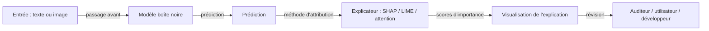

# IA explicable (XAI)

## Définition

L'IA explicable (XAI) est l'ensemble des méthodes et pratiques qui rendent le comportement des modèles d'apprentissage automatique compréhensible pour les humains — identifier quelles entrées ou caractéristiques ont conduit à une décision, révéler la logique interne d'un modèle, ou produire des justifications en langage naturel sur lesquelles les parties prenantes non techniques peuvent agir. L'objectif n'est pas seulement de décrire ce qu'un modèle a fait, mais de fournir des explications fidèles à son raisonnement réel et utiles à la personne qui les reçoit : un auditeur vérifiant les biais, un médecin validant un diagnostic, ou un utilisateur contestant une décision de crédit.

Les explications peuvent être **globales** (décrivant le comportement général du modèle — quelles caractéristiques sont généralement les plus importantes) ou **locales** (expliquant une prédiction spécifique — pourquoi ce prêt particulier a été refusé ?). Elles peuvent être **post-hoc** (appliquées après l'entraînement à un modèle existant, comme SHAP ou LIME) ou **intrinsèques** (modèles interprétables par conception, comme les modèles linéaires, les arbres de décision ou les systèmes basés sur des règles). La distinction post-hoc vs intrinsèque est importante : les explications post-hoc sont flexibles et peuvent être appliquées à n'importe quel modèle, mais peuvent ne pas capturer complètement le mécanisme réel du modèle ; les modèles intrinsèques sont plus fidèles mais souvent moins expressifs.

XAI est un facilitateur critique de l'audit de [sécurité de l'IA](/docs/ai-safety) et des enquêtes sur le [biais dans l'IA](/docs/bias-in-ai). C'est légalement requis ou fortement recommandé dans les domaines réglementés — en vertu de la loi sur l'IA de l'UE et du RGPD, les personnes affectées par des décisions automatisées ont droit à une explication significative. À mesure que les [LLM](/docs/llms) et les [agents](/docs/agents) deviennent plus capables, le défi d'expliquer le comportement émergent et le raisonnement multi-étapes est une frontière de recherche active.

## Comment ça fonctionne

### Méthodes d'attribution de caractéristiques

Les méthodes d'attribution de caractéristiques assignent des scores d'importance à chaque caractéristique d'entrée pour une prédiction donnée. SHAP (SHapley Additive exPlanations) utilise la théorie des jeux coopératifs pour distribuer équitablement la contribution de chaque caractéristique, garantissant la cohérence et la précision locale. LIME (Local Interpretable Model-agnostic Explanations) adapte un simple modèle interprétable autour du voisinage d'une seule prédiction. Les deux fonctionnent avec n'importe quel type de modèle mais peuvent différer l'un de l'autre et du mécanisme réel du modèle.

### Explications visuelles et basées sur l'attention



Pour les modèles de vision, les cartes de saillance et GradCAM mettent en évidence les régions d'image qui ont le plus influencé une prédiction. Pour les modèles de langage, les poids d'attention montrent quels tokens le modèle a retenus ; bien que l'attention ne soit pas toujours une explication fiable du raisonnement causal, elle est largement utilisée pour le débogage.

### Modèles intrinsèquement interprétables

Les modèles linéaires, la régression logistique, les arbres de décision et les listes de règles sont intrinsèquement interprétables : leur logique peut être lue directement dans les paramètres du modèle. Quand l'interprétabilité est primordiale — par exemple dans la cotation du risque clinique ou les modèles de crédit réglementés — ces modèles plus simples peuvent être préférés même au prix d'une certaine précision prédictive.

## Quand utiliser / Quand NE PAS utiliser

| Utiliser quand | Éviter quand |
|----------|------------|
| Le domaine réglementé nécessite des explications pour les décisions automatisées (crédit, recrutement, santé) | Le modèle est à faible enjeu sans impact individuel et sans exigence réglementaire |
| Débogage des défaillances du modèle ou du comportement inattendu | La surcharge d'explication introduirait une latence de production inacceptable |
| Les utilisateurs ont besoin de comprendre ou contester la décision d'un modèle | Le modèle est une référence intrinsèquement interprétable qui ne nécessite pas d'explication séparée |
| Audit des biais ou des problèmes de sécurité avant ou après le déploiement | La méthode d'explication à laquelle vous avez accès est connue pour être peu fiable pour votre type de modèle |

## Comparaisons

| Méthode | Type | Agnostique au modèle | Portée | Fidélité |
|--------|------|---------------|-------|---------|
| SHAP | Post-hoc | Oui | Local + global | Élevée (fondée mathématiquement) |
| LIME | Post-hoc | Oui | Local | Modérée (approximation locale) |
| GradCAM | Post-hoc | Non (basé sur le gradient) | Local (vision) | Modérée |
| Attention | Post-hoc | Non (spécifique aux transformateurs) | Local | Variable |
| Arbre de décision | Intrinsèque | N/A | Global | Parfaite (le modèle EST l'explication) |

## Avantages et inconvénients

| Avantages | Inconvénients |
|------|------|
| Soutient la conformité avec le droit à l'explication du RGPD et de la loi sur l'IA de l'UE | Les explications post-hoc peuvent ne pas refléter le mécanisme réel du modèle |
| Permet la détection des biais en attribuant les décisions à des proxies protégés | Les explications peuvent être manipulées pour paraître équitables même quand le modèle ne l'est pas |
| Renforce la confiance des utilisateurs et soutient la contestabilité | Les modèles intrinsèquement interprétables sacrifient souvent la puissance prédictive |
| Facilite le débogage du modèle et l'amélioration itérative | L'explication du comportement émergent dans les LLM et les réseaux profonds reste un problème ouvert |

## Exemples de code

### Attribution de caractéristiques SHAP pour un classificateur tabulaire (Python)

```python
import shap
import numpy as np
from sklearn.ensemble import GradientBoostingClassifier
from sklearn.datasets import make_classification

# Entraîner un classificateur simple
X, y = make_classification(n_samples=500, n_features=10, random_state=42)
feature_names = [f"caracteristique_{i}" for i in range(X.shape[1])]

model = GradientBoostingClassifier(n_estimators=50, random_state=42)
model.fit(X, y)

# Calculer les valeurs SHAP pour l'ensemble de test
explainer = shap.TreeExplainer(model)
shap_values = explainer.shap_values(X[:10])

# Afficher les importances de caractéristiques pour la première prédiction
print("Valeurs SHAP pour la prédiction 0 (classe positive) :")
for name, value in sorted(
    zip(feature_names, shap_values[0]),
    key=lambda x: abs(x[1]),
    reverse=True,
):
    print(f"  {name} : {value:+.4f}")
```

## Ressources pratiques

- [Interpretable Machine Learning (Molnar)](https://interpretable.ml/) — Livre en ligne gratuit complet couvrant toutes les principales méthodes XAI
- [Documentation SHAP](https://shap.readthedocs.io/) — Docs officiels, tutoriels et galerie de visualisations
- [LIME GitHub](https://github.com/marcotcr/lime) — Implémentation LIME originale avec des exemples
- [Google – What-If Tool](https://pair-code.github.io/what-if-tool/) — Exploration visuelle interactive de l'équité du modèle et des explications
- [Explainability for Large Language Models (survey)](https://arxiv.org/abs/2309.01029) — Enquête récente sur les méthodes XAI pour les LLM

## Voir aussi

- [Sécurité de l'IA](/docs/ai-safety)
- [Biais dans l'IA](/docs/bias-in-ai)
