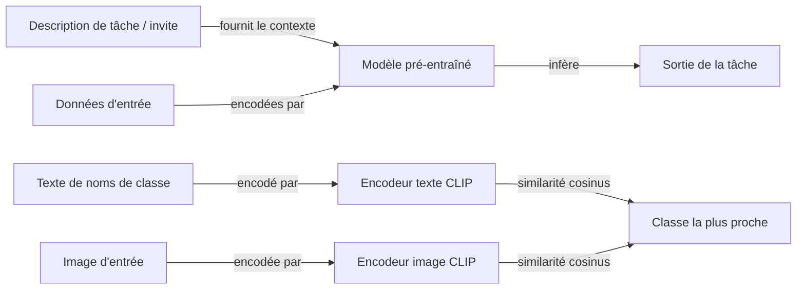

# Apprentissage zero-shot

## Définition

L'apprentissage zero-shot (ZSL) est la capacité d'un modèle à effectuer une tâche pour laquelle il n'a reçu **aucun exemple d'entraînement étiquetés** au moment de l'inférence. Le modèle généralise purement à partir des connaissances acquises pendant le pré-entraînement, guidé uniquement par une description de tâche — une invite en langage naturel, un ensemble de vecteurs d'attributs de classe, ou un espace d'embedding partagé entre modalités. Il n'y a pas de mises à jour de gradient sur la tâche cible ; le modèle doit combler le fossé entre ce qu'il a appris pendant le pré-entraînement et la nouvelle spécification de tâche.

Deux paradigmes majeurs existent. Dans l'approche **basée sur les attributs** — la formulation originale de la vision par ordinateur (Lampert et al., 2009) — les classes non vues sont décrites par des attributs sémantiques (par ex. « a des rayures », « vit dans l'eau »), et le modèle classifie les entrées en faisant correspondre les attributs prédits aux descriptions de classe. Dans l'approche **grand modèle** — maintenant dominante — les LLM pré-entraînés ou les modèles vision-langage généralisent via le **prompting**. Pour les tâches textuelles, le modèle reçoit une instruction décrivant la tâche et le format ; pour les tâches d'image, CLIP intègre à la fois les images et le texte de nom de classe dans un espace partagé et classifie par similarité cosinus.

La qualité des prédictions zero-shot dépend entièrement de la façon dont le pré-entraînement a couvert la tâche cible ou des tâches sémantiquement similaires. Les LLM excellent en zero-shot pour les tâches NLP (classification, résumé, traduction, réponse aux questions) parce que le pré-entraînement à l'échelle du web couvre implicitement la plupart des tâches textuelles. Les modèles vision-langage de style CLIP généralisent en zero-shot à la reconnaissance d'objets sur des centaines de classes ImageNet. Quand la qualité zero-shot est insuffisante, [l'apprentissage few-shot](/docs/few-shot-learning) (ajout d'exemples à l'invite) ou [l'affinement](/docs/llms/fine-tuning) sont les prochaines étapes naturelles.

## Comment ça fonctionne

### Zero-shot basé sur les invites (LLMs)

La tâche est entièrement spécifiée dans l'invite : pas d'exemples, seulement des instructions et un format. Le LLM se conditionne sur l'invite et génère ou complète la réponse. Les modèles ajustés par instruction (par ex. GPT-4, Claude, Llama-3-Instruct) sont spécifiquement entraînés pour suivre les instructions zero-shot de façon fiable.

### Zero-shot vision-langage (CLIP)

CLIP entraîne conjointement un encodeur d'image et un encodeur de texte pour que les paires image-texte correspondantes aient une similarité cosinus élevée dans un espace d'embedding partagé. À l'inférence, les noms de classes (par ex. « une photo d'un chat ») sont intégrés comme texte ; une image d'entrée est intégrée et classifiée par plus proche voisin vers les embeddings de texte de classe — pas d'images étiquetées requises.



### Zero-shot chaîne de pensée (CoT)

Ajouter « Réfléchissons étape par étape » à une invite zero-shot suscite un raisonnement multi-étapes des LLM, améliorant substantiellement la précision sur les tâches arithmétiques, logiques et de bon sens sans fournir d'exemples travaillés.

### Apprentissage zero-shot généralisé (GZSL)

Dans GZSL, le modèle doit classifier les entrées des classes **vues** (entraînement) et **non vues** (zero-shot) simultanément. C'est plus difficile que le ZSL standard car le modèle tend à être biaisé vers les classes vues. Les techniques de calibration et les modèles génératifs (synthétisant des caractéristiques pour les classes non vues) aident.

## Quand utiliser / Quand NE PAS utiliser

| Scénario | Utiliser zero-shot | Éviter zero-shot |
|---|---|---|
| La tâche est bien décrite en langage naturel | Oui — les LLM ajustés par instruction gèrent cela de façon fiable | Non — si la tâche nécessite des connaissances spécialisées du domaine non dans le pré-entraînement |
| Pas de données étiquetées disponibles du tout | Oui — zero-shot est la seule option | Non — collecter même quelques exemples et utiliser few-shot |
| Prototypage rapide sur de nombreuses tâches | Oui — pas de surcharge d'entraînement | Non — systèmes de production avec des exigences de qualité |
| Nouvelles classes d'images décrites par texte | Oui — les modèles de style CLIP généralisent à partir des noms de classe | Non — si la similarité visuelle avec les classes d'entraînement est faible |
| Tâches arithmétiques ou de raisonnement nécessitant une haute précision | Partiel — utiliser avec le prompting chaîne de pensée | Préférer les modèles few-shot ou affinés pour les applications critiques |

## Comparaisons

| Approche | Exemples nécessaires | Adaptation | Potentiel de précision | Vitesse de déploiement |
|---|---|---|---|---|
| Zero-shot | 0 | Invite seulement | Modérée | Instantanée |
| Few-shot (en contexte) | 1–10 | Exemples en contexte | Plus élevée | Très rapide |
| Affinement | 100–10K+ | Mises à jour de gradient | La plus élevée | Plus lente |
| Zero-shot + CoT | 0 | Invite avec raisonnement | Plus élevée que zero-shot | Instantanée |

## Avantages et inconvénients

| Avantages | Inconvénients |
|---|---|
| Pas de données étiquetées ou d'entraînement requis | La qualité dépend fortement de la couverture du pré-entraînement |
| Déploiement instantané — juste écrire une invite | Incohérent pour les tâches de niche ou très spécialisées |
| Flexible — un modèle gère de nombreuses tâches | Pas de garantie de format de sortie structuré |
| CLIP étend le zero-shot à la vision sans étiquettes d'image | Le GZSL est biaisé vers les classes vues |

## Exemples de code

Classification de texte zero-shot en utilisant le pipeline NLI de Hugging Face :

```python
from transformers import pipeline

# Classificateur zero-shot utilisant NLI (pas d'affinement nécessaire)
classifier = pipeline("zero-shot-classification", model="facebook/bart-large-mnli")

text = "La banque centrale a relevé les taux d'intérêt de 50 points de base pour lutter contre l'inflation."
candidate_labels = ["finance", "sports", "technologie", "politique", "science"]

result = classifier(text, candidate_labels=candidate_labels)
print("Étiquette principale :", result["labels"][0])      # finance
print("Confiance :", f"{result['scores'][0]:.2%}")
```

Classification d'images zero-shot avec CLIP :

```python
import torch
from PIL import Image
from transformers import CLIPProcessor, CLIPModel

model = CLIPModel.from_pretrained("openai/clip-vit-base-patch32")
processor = CLIPProcessor.from_pretrained("openai/clip-vit-base-patch32")

# Descriptions de classe en texte (pas d'images étiquetées nécessaires)
class_texts = [
    "une photo d'un chat",
    "une photo d'un chien",
    "une photo d'un oiseau",
    "une photo d'une voiture",
]

image = Image.open("test_image.jpg")  # N'importe quelle image

inputs = processor(
    text=class_texts,
    images=image,
    return_tensors="pt",
    padding=True,
)

with torch.no_grad():
    outputs = model(**inputs)
    probs = outputs.logits_per_image.softmax(dim=1)

predicted_class = class_texts[probs.argmax().item()]
print(f"Prédit : {predicted_class} ({probs.max().item():.2%})")
```

## Ressources pratiques

- [Learning Transferable Visual Models from Natural Language (CLIP, Radford et al., 2021)](https://arxiv.org/abs/2103.00020) — Article CLIP permettant la classification d'images zero-shot à partir de descriptions textuelles
- [Language Models are Few-Shot Learners (GPT-3, Brown et al., 2020)](https://arxiv.org/abs/2005.14165) — Article GPT-3 démontrant le prompting zero-shot et few-shot à grande échelle
- [Large Language Models are Zero-Shot Reasoners (Kojima et al., 2022)](https://arxiv.org/abs/2205.11916) — Prompting zero-shot chaîne de pensée
- [Hugging Face – Pipeline de classification zero-shot](https://huggingface.co/docs/transformers/tasks/zero_shot_classification) — Classificateur de texte zero-shot basé sur NLI prêt à l'emploi

## Voir aussi

- [Apprentissage few-shot](/docs/few-shot-learning)
- [Ingénierie de prompt](/docs/prompt-engineering)
- [LLMs](/docs/llms)
