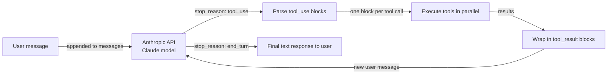

# Anthropic Tool Use

## Definição

**Anthropic Tool Use** (às vezes chamado de "function calling") é o mecanismo nativo do Claude para interagir com sistemas externos de forma estruturada e confiável. Em vez de pedir ao Claude que produza texto que você então analisa para encontrar o nome de uma função e seus argumentos, você descreve suas ferramentas como JSON schemas na requisição da API e o Claude retorna um bloco estruturado `tool_use` com o nome exato da ferramenta e um objeto JSON de argumentos validados. Seu código executa a ferramenta, encapsula o resultado em um bloco `tool_result`, e o envia de volta ao Claude como o próximo turno na conversa — um loop que continua até que o Claude produza uma resposta de texto final.

A filosofia de design é de minimalismo intencional: Anthropic Tool Use é uma capacidade da API do modelo, não um framework. Não há camada de orquestração, memória embutida, nem loop de agente — você escreve isso por conta própria. Isso oferece controle máximo e sobrecarga mínima de abstração. Para casos de uso simples a médios de ferramentas, o resultado é limpo, legível e fácil de depurar. Para sistemas multi-agente complexos, você normalmente combinaria Anthropic Tool Use com um framework como LangGraph ou um orquestrador personalizado.

Os modelos Claude foram especificamente treinados para uso de ferramentas, o que significa que exibem forte desempenho ao decidir *quando* chamar uma ferramenta (sem chamar desnecessariamente), *como* preencher argumentos corretamente a partir da linguagem natural, e *como* lidar com requisições ambíguas ou subespecificadas de forma elegante, pedindo esclarecimentos em vez de alucinar argumentos. Chamadas paralelas de ferramentas (múltiplos blocos `tool_use` em uma única resposta) e uso de ferramentas em múltiplos turnos (várias rodadas de chamadas de ferramentas antes de uma resposta final) são ambos suportados nativamente.

## Como funciona

### Definições de ferramentas: JSON schema

Cada ferramenta é descrita como um objeto JSON com três campos obrigatórios: `name` (um identificador de string), `description` (uma explicação em linguagem natural do que a ferramenta faz e quando usá-la — este é o campo mais importante para orientar a decisão do Claude), e `input_schema` (um objeto JSON Schema definindo os argumentos esperados). O `input_schema` segue o draft padrão do JSON Schema, suportando tipos string, number, boolean, array, object, campos obrigatórios, valores enum e schemas aninhados. O Claude lê as descrições das ferramentas para decidir qual ferramenta chamar; descrições mais precisas levam a uma seleção de ferramentas mais precisa.

### Tipos de mensagem tool_use e tool_result

Quando o Claude decide usar uma ferramenta, ele retorna uma resposta com `stop_reason: "tool_use"` e um array `content` que contém um ou mais blocos `tool_use`. Cada bloco tem um `id` (uma string única como `"toulu_01abc..."`), um `name` (correspondendo a uma das suas definições de ferramentas) e um `input` (um objeto JSON com os argumentos validados). Sua aplicação extrai esses blocos, executa cada chamada de ferramenta e constrói uma nova mensagem com `role: "user"` cujo conteúdo é uma lista de blocos `tool_result` — um por chamada de ferramenta, correspondendo por `tool_use_id`. O bloco `tool_result` carrega a saída como uma string ou um array de conteúdo estruturado. Essa troca continua até que o Claude retorne `stop_reason: "end_turn"` com uma resposta de texto simples.

### Chamadas paralelas de ferramentas

O Claude pode emitir múltiplos blocos `tool_use` em uma única resposta quando determina que várias ferramentas podem ser chamadas simultaneamente — por exemplo, pesquisar dois bancos de dados diferentes ou buscar o clima de três cidades ao mesmo tempo. Sua aplicação deve detectar múltiplos blocos `tool_use` e executá-los em paralelo (por exemplo, com `asyncio.gather` ou um pool de threads) antes de construir a resposta `tool_result`. As chamadas paralelas reduzem significativamente a latência total em comparação com rodadas sequenciais de chamada única, e o Claude foi treinado para usar essa capacidade quando faz sentido.

### Uso de ferramentas em múltiplos turnos

Tarefas complexas geralmente requerem várias rodadas de chamadas de ferramentas antes que o Claude possa produzir uma resposta final: pesquisar uma entidade, depois buscar detalhes sobre ela, depois calcular algo a partir desses detalhes. Cada rodada adiciona uma mensagem do assistente (com blocos `tool_use`) e uma mensagem do usuário (com blocos `tool_result`) ao histórico da conversa. O histórico da conversa é sempre enviado completo em cada chamada da API, dando ao Claude contexto completo sobre o que foi tentado e quais foram os resultados. Esse design sem estado significa que você é responsável por manter e reduzir a lista de mensagens — não há gerenciamento de memória ou estado embutido.



## Quando usar / Quando NÃO usar

| Usar quando | Evitar quando |
|---|---|
| Você quer controle direto sobre o loop de chamada de ferramentas sem sobrecarga de framework | Você precisa de uma camada de coordenação multi-agente — Anthropic Tool Use é de agente único |
| Você precisa da integração mais estreita com recursos específicos do Claude (streaming, extended thinking) | Você precisa de conveniências de framework como memória automática, bibliotecas de ferramentas embutidas ou gerenciamento de papéis |
| Seu caso de uso tem 1-10 ferramentas e um fluxo de conversa bem definido | Seu conjunto de ferramentas é muito grande e você precisa de seleção semântica de ferramentas em escala |
| Você está construindo um sistema de produção e quer dependências mínimas | Você quer prototipagem rápida com integrações pré-construídas (use LangChain ou CrewAI em vez disso) |
| Você precisa de portabilidade máxima — apenas o SDK Anthropic e seu próprio código | Sua equipe prefere configuração declarativa de agentes em vez de escrever código de orquestração |

## Comparações

| Critério | Anthropic Tool Use | OpenAI Function Calling |
|---|---|---|
| **Formato do schema** | JSON Schema com campos `name`, `description`, `input_schema` | JSON Schema com campos `name`, `description`, `parameters` — estrutura quase idêntica |
| **Streaming de chamadas de ferramentas** | Suportado: eventos `input_json_delta` transmitem tokens de argumentos em tempo real | Suportado: streaming de argumentos `function_call` via eventos delta |
| **Chamadas paralelas de ferramentas** | Suportado: múltiplos blocos `tool_use` em uma única resposta | Suportado: múltiplas entradas `tool_calls` em uma única resposta |
| **Confiabilidade / precisão de argumentos** | Forte: modelos Claude são especificamente treinados para uso preciso de ferramentas | Forte: modelos de classe GPT-4 têm chamada de função robusta |
| **Suporte a modelos** | Família Claude 3 e superiores (Haiku, Sonnet, Opus) | GPT-3.5-turbo, GPT-4, GPT-4o e superiores |
| **Formato do resultado da ferramenta** | Bloco de conteúdo `tool_result` com referência `tool_use_id` | Mensagem com papel `tool` com referência `tool_call_id` |
| **Recursos estendidos** | Ferramentas de uso de computador (beta), ferramentas de documentos | Interpretador de código, pesquisa de arquivos (API de Assistentes) |

## Exemplos de código

```python
import anthropic
import json
from typing import Any

# Initialize the Anthropic client
client = anthropic.Anthropic()  # reads ANTHROPIC_API_KEY from environment

# --- Tool definitions using JSON Schema ---
# The 'description' field is critical: Claude uses it to decide when to call each tool.
# The 'input_schema' defines the expected arguments with types and required fields.

tools = [
    {
        "name": "get_weather",
        "description": (
            "Get current weather information for a specific city. "
            "Use this when the user asks about weather conditions, temperature, or forecasts."
        ),
        "input_schema": {
            "type": "object",
            "properties": {
                "city": {
                    "type": "string",
                    "description": "The city name, e.g. 'London' or 'New York'",
                },
                "units": {
                    "type": "string",
                    "enum": ["celsius", "fahrenheit"],
                    "description": "Temperature unit. Defaults to celsius.",
                },
            },
            "required": ["city"],
        },
    },
    {
        "name": "search_knowledge_base",
        "description": (
            "Search an internal knowledge base for information on AI topics. "
            "Use this when the user asks a factual question about AI frameworks, models, or concepts."
        ),
        "input_schema": {
            "type": "object",
            "properties": {
                "query": {
                    "type": "string",
                    "description": "The search query string",
                },
                "max_results": {
                    "type": "integer",
                    "description": "Maximum number of results to return. Default: 3.",
                    "minimum": 1,
                    "maximum": 10,
                },
            },
            "required": ["query"],
        },
    },
    {
        "name": "create_summary",
        "description": (
            "Create a structured summary of provided content. "
            "Use this to format research findings or information into a clean summary."
        ),
        "input_schema": {
            "type": "object",
            "properties": {
                "content": {
                    "type": "string",
                    "description": "The content to summarize",
                },
                "format": {
                    "type": "string",
                    "enum": ["bullet_points", "paragraph", "table"],
                    "description": "Output format for the summary",
                },
            },
            "required": ["content", "format"],
        },
    },
]

# --- Tool execution functions ---
# In production, these would call real APIs. Here they return simulated results.

def get_weather(city: str, units: str = "celsius") -> dict:
    """Simulated weather API call."""
    return {
        "city": city,
        "temperature": 22 if units == "celsius" else 72,
        "units": units,
        "condition": "partly cloudy",
        "humidity": "65%",
    }

def search_knowledge_base(query: str, max_results: int = 3) -> list[dict]:
    """Simulated knowledge base search."""
    return [
        {"title": f"Result {i+1} for '{query}'", "snippet": f"Relevant information about {query}..."}
        for i in range(min(max_results, 3))
    ]

def create_summary(content: str, format: str) -> str:
    """Simulated summary creation."""
    if format == "bullet_points":
        return f"• Key point from: {content[:50]}...\n• Additional insight\n• Conclusion"
    return f"Summary: {content[:100]}..."

def execute_tool(tool_name: str, tool_input: dict) -> Any:
    """Dispatch tool calls to the appropriate function."""
    if tool_name == "get_weather":
        return get_weather(**tool_input)
    elif tool_name == "search_knowledge_base":
        return search_knowledge_base(**tool_input)
    elif tool_name == "create_summary":
        return create_summary(**tool_input)
    else:
        return {"error": f"Unknown tool: {tool_name}"}

# --- Multi-turn tool use loop ---

def run_agent(user_message: str) -> str:
    """
    Run a multi-turn tool use loop until Claude produces a final answer.
    Returns the final text response.
    """
    messages = [{"role": "user", "content": user_message}]

    while True:
        response = client.messages.create(
            model="claude-opus-4-5",
            max_tokens=4096,
            tools=tools,
            messages=messages,
            system=(
                "You are a helpful AI assistant with access to weather data, "
                "a knowledge base, and a summary tool. "
                "Use tools when needed to answer questions accurately."
            ),
        )

        # Append the assistant's response to the conversation history
        messages.append({"role": "assistant", "content": response.content})

        # Check if we're done
        if response.stop_reason == "end_turn":
            # Extract the final text from the response content
            for block in response.content:
                if hasattr(block, "text"):
                    return block.text
            return "No text response found."

        # Handle tool use: execute all tool_use blocks
        if response.stop_reason == "tool_use":
            tool_results = []

            for block in response.content:
                if block.type == "tool_use":
                    print(f"  Calling tool: {block.name}({json.dumps(block.input)})")

                    # Execute the tool and get the result
                    result = execute_tool(block.name, block.input)

                    # Wrap result in a tool_result block
                    # The tool_use_id links this result to the specific tool call
                    tool_results.append({
                        "type": "tool_result",
                        "tool_use_id": block.id,
                        "content": json.dumps(result),  # serialize to string
                    })

            # Add tool results as a user message to continue the conversation
            messages.append({"role": "user", "content": tool_results})

        else:
            # Unexpected stop reason — return what we have
            break

    return "Agent loop ended unexpectedly."

# --- Run examples ---

print("Example 1: Weather + Knowledge base (potential parallel calls)")
answer = run_agent(
    "What is the weather in Paris right now, and also search for information about LangGraph?"
)
print("Answer:", answer)

print("\nExample 2: Multi-turn tool use")
answer = run_agent(
    "Search for information about CrewAI and then create a bullet-point summary of the results."
)
print("Answer:", answer)
```

## Recursos práticos

- [Documentação do Anthropic Tool Use](https://docs.anthropic.com/en/docs/build-with-claude/tool-use) — Guia oficial cobrindo definições de ferramentas, fluxo de mensagens, chamadas paralelas e melhores práticas para descrições de ferramentas.
- [Referência do SDK Python da Anthropic](https://github.com/anthropics/anthropic-sdk-python) — SDK completo com objetos de resposta tipados, suporte assíncrono e streaming para uso de ferramentas.
- [Cookbook da Anthropic: exemplos de uso de ferramentas](https://github.com/anthropics/anthropic-cookbook/tree/main/tool_use) — Notebooks práticos demonstrando padrões de ferramenta única e múltiplas ferramentas, chamadas paralelas e uso de computador.
- [Documentação do OpenAI Function Calling](https://platform.openai.com/docs/guides/function-calling) — Referência útil para comparar as duas abordagens; os conceitos se mapeiam bem apesar das diferenças de nomenclatura.

## Veja também

- [Visão geral dos frameworks de agentes](/docs/agents/frameworks-overview)
- [Agentes de IA](/docs/agents)
- [Sistemas multi-agente](/docs/agents/multi-agent-systems)
- [ReAct](/docs/reasoning-patterns/react)
